This document explains the best way for finding the action you need in ATS. This is done by using six main categories for what you are trying to achieve. Each category explains the generic solution and the widget specific solutions using examples.

1. Finding a widget
2. Clicking a widget
3. Cover an input widget
4. Retrieving a value from a widget
5. Asserting values/information
6. Generating values/information
 
Select the chapter that covers your situation. If you are not sure what covers your situation, use the widget name to search for an action inside ATS and take a look at what pops up.

{}

When the ATS recorder does not record any steps, you can use this best practice to find the right action.

{}

## 1 Finding a Widget
 
In ATS there are many actions for finding a widget. From finding a widget to finding a specific datagrid row. The first chapter explains the generic action for finding a widget. The second chapter explains the actions that conduct a more specific search. The magic word while searching for an action that can find something is "Find".

### 1.1 Generic Action

When you want to find a widget the main choice is always the [_Find/Assert Widget_](../refguide-ats-1/findassert-widget) action. It finds the widget you need using the `mx-name` of the widget. ATS uses the **Widget Name** parameter instead of  `mx-name`.

The **Widget Name** is found using the ATS helper, the value is the **Widget Name**:

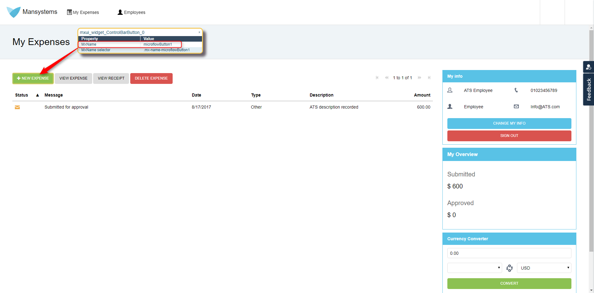

The _Find/Assert Widget_ action works on every widget that has a `mx-name`. 

_The Find/Assert Widget Action_
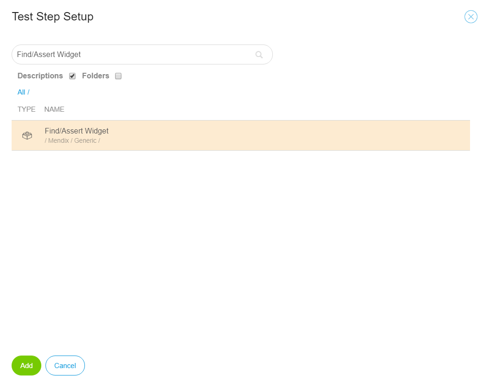  

If the generic action does not work check if there is a specific one.

### 1.2 Specific Action

When you are looking for a specific widget or content of that widget, use the widget name in the search. 

For example, you want to find a row inside a datagrid widget. You can use the _Find/Assert Widget_ action in combination with the column name, but that doesn't work if there are multiple datagrids. 

The solution is to use the following search term, "Find Datagrid". ATS checks all the actions and returns those that match these words. You see there is an action that called [_Find/Assert DataGrid Row_](../refguide-ats-1/findassert-datagrid-row). The _Find/Assert DataGrid Row_ action enables you to search for a datagrid row containing a specific value in a specific column. This action also works on listviews and templategrids.

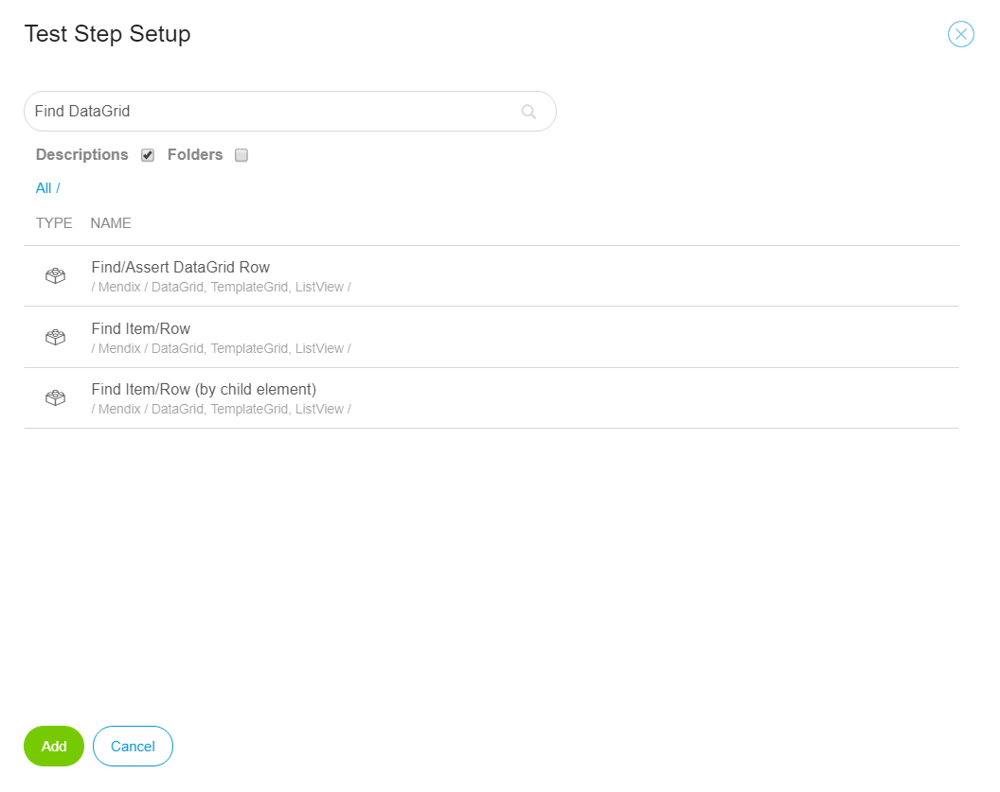

Another example, you want to find the checkbox in a simple checkbox set selector widget. You cannot use the _Find/Assert Widget_ action because the checkbox does not have its own `mx-name`. It is part of the simple checkbox set selector widget.

The solution is to use the following search term, "Find Simple Checkbox Set Selector". ATS checks all the actions and returns those that match these words. You see there is an action called [_Find Simple Checkbox Set Selector_](../refguide-ats-1/find-simple-checkbox-set-selector). The  _Find Simple Checkbox Set Selector_ action finds the checkbox based on the **Widget Name** of the entire widget and the value displayed by the checkbox.

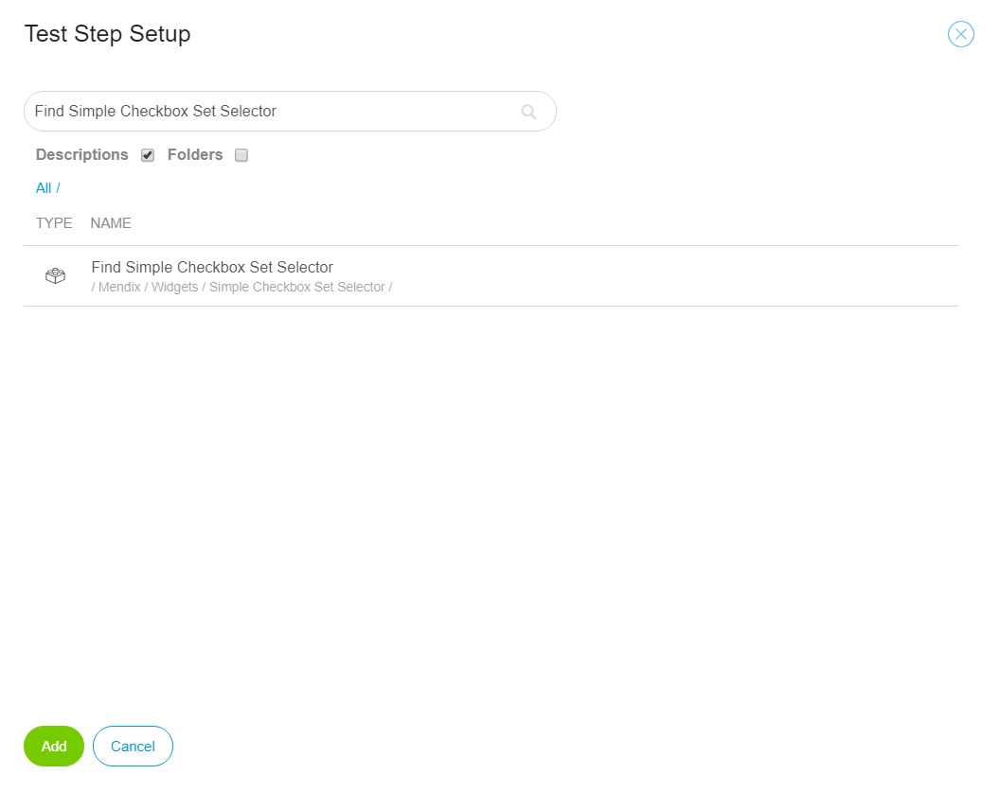

The last example, you want to find a dialog box based on the title or text inside. You cannot use the _Find/Assert Widget_ action because the dialog box does not have a `mx-name`.

The solution is to use the following search term, "Find Dialog". ATS checks all the actions and returns those that match these words. You see there is an action called [_Find/Assert Dialog-](../refguide-ats-1/findassert-dialog). The _Find/Assert Dialog_  action can find a dialog based on title, text or only a dialog. 

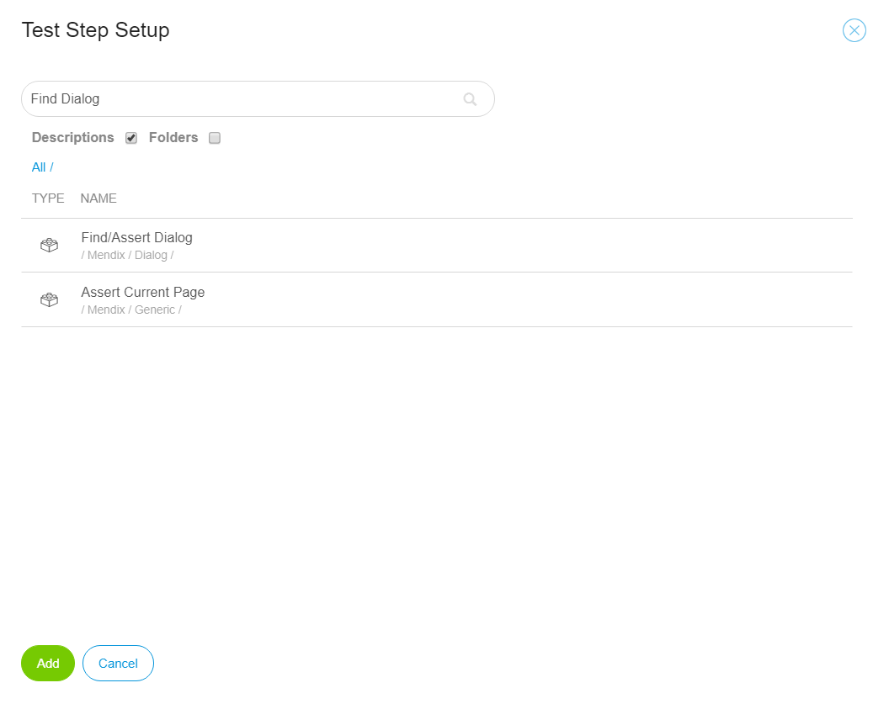

### 1.3 Summary

When you want to find a widget always use the _Find/Assert Widget_ action if possible. 

If you want to find something more specific inside a widget or the widget does not have a `mx-name`. Then use "Find" in combination with the widget name as displayed in the [Mendix App Store](https://appstore.home.mendix.com/), the Mendix modeler. You can also find the name using the ATS helper.

In case you cannot find a widget due to no unique name or because it is not supported, go to [How to Create Custom Actions](../howtos/create-custom-actions).
 
 ## 2 Clicking a widget

 In ATS there are many actions for clicking a widget. From clicking a widget to clicking a specific datagrid row. The first chapter explains the generic action for clicking a widget. The second chapter explains the actions that conduct a more specific click. The magic word while searching for an action that can click something is "Click".

 ### 2.1 Generic Action

 When you want to click a widget the main choice is always the [_Click Widget_](../refguide-ats-1/click-widget) action. It clicks the widget you need using the `mx-name` of the widget. ATS uses the **Widget Name** parameter instead of  `mx-name`.

The **Widget Name** is found using the ATS helper, the value is the **Widget Name**:

The _Click Widget_ action works on every widget that has a `mx-name`. 

_The Click Widget Action_

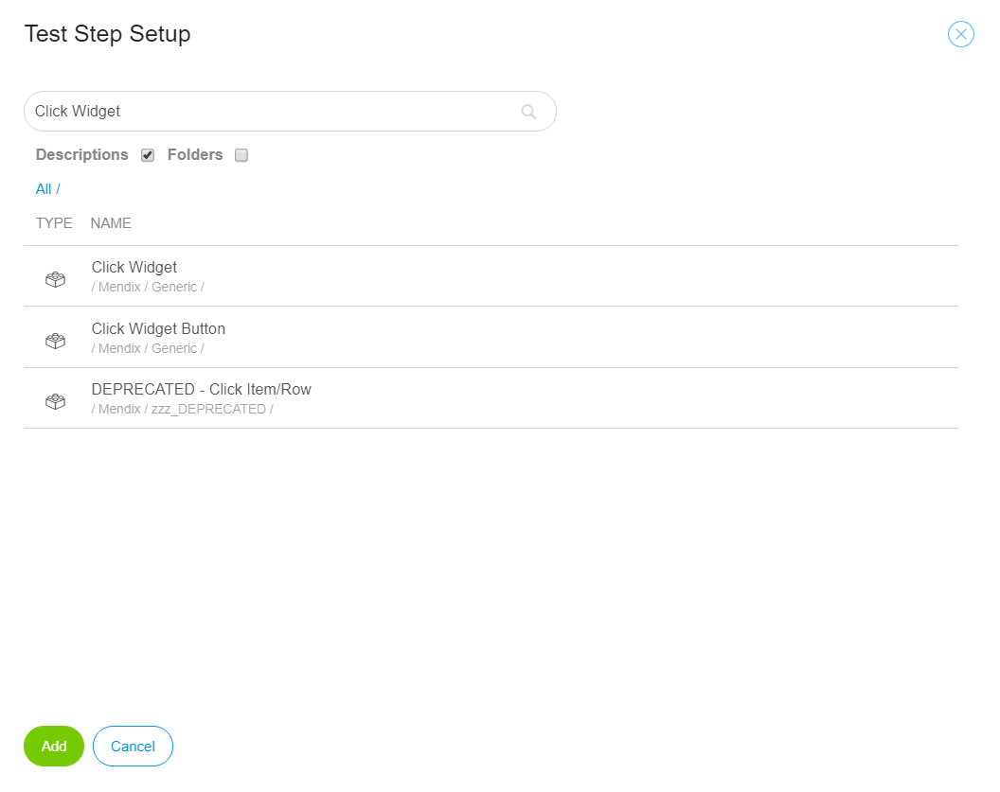

If the generic action does not work check if there is a specific one.

### 2.2 Specific Action

ATS also has a few specific click actions. To find these use the search term, "Click" in combination with the widget name. 

Example 1, you want to click the load more button inside a listview widget. You cannot use the _Click Widget_ action because the load more button does not have its own `mx-name`. It is part of the listview widget.

The solution is to use one of the following search terms, "Click load more" or "Click listview". ATS checks all the actions and returns those that match these words. You see there is an action called [_Click Widget Button_](../refguide-ats-1/click-widget-button). The _Click Widget Button_ action uses the `mx-name` of the widget and the button type to click the right button. In this case, select the "load more" type.

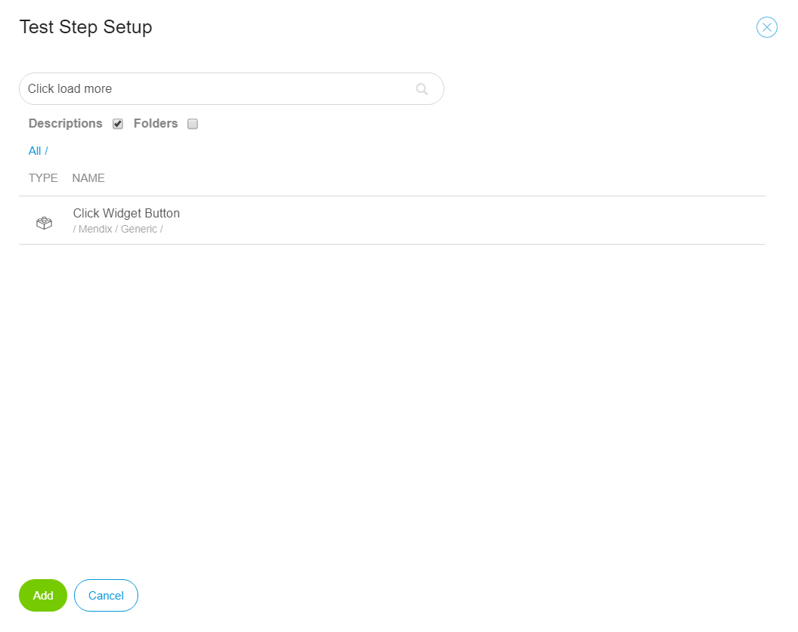

Example 2, you want to click a specific datagrid row inside a datagrid. You can use the _Click Widget_ action in combination with the column name, but if there are multiple datagrids ATS cannot distinguish them.

The solution is to use the following search term, "Click DataGrid".  ATS checks all the actions and returns those that match these words. You see there is an action called [_Click DataGrid Row_](../refguide-ats-1/click-datagrid-row). The _Click DataGrid Row_  action enables you to click a datagrid row containing a specific value in a specific column. This action also works on listviews and templategrids.

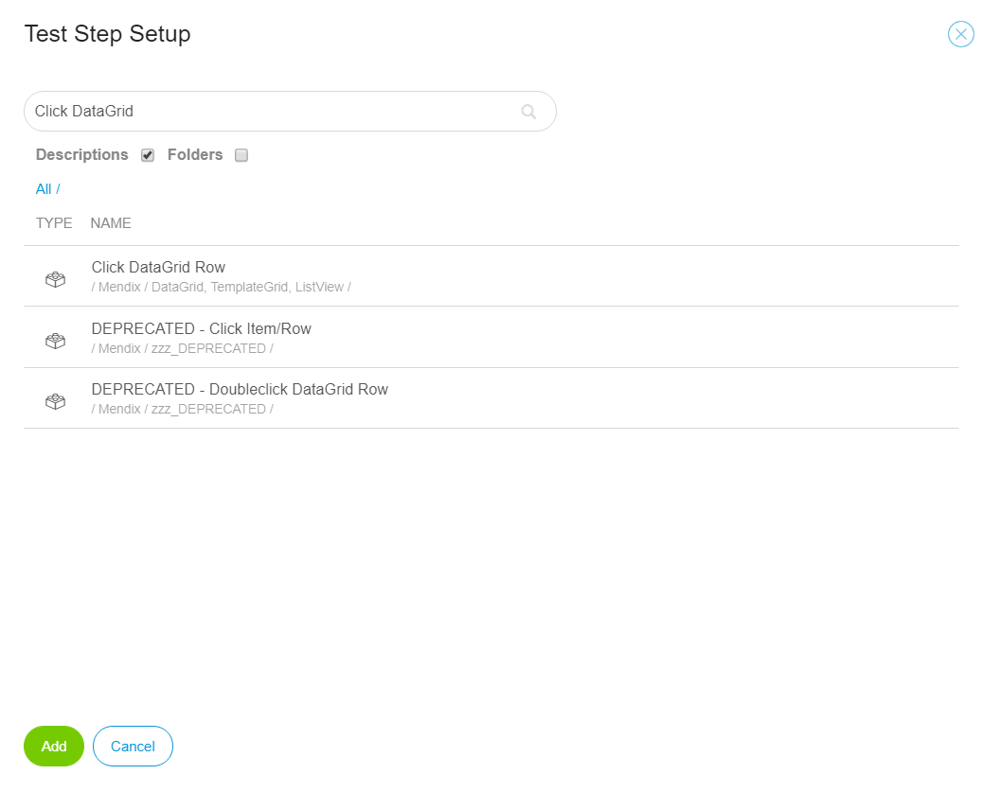

Example 3, you want to click a menu item in a menu bar widget.
You cannot use the _Click Widget_ action because the menu item does not have its own `mx-name`. It is part of the menu bar widget.

The solution is to use the following search term, "Click menu".  ATS checks all the actions and returns those that match these words.  You see there is an action called [_Click Menu Item_](../refguide-ats-1/click-menu-item). The _Click Menu Item_ action clicks on a menu item inside a menubar widget using the caption.

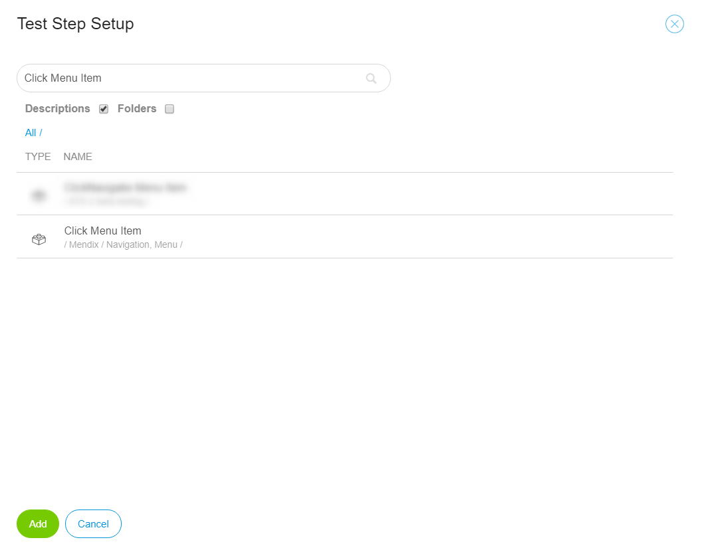

Example 4, you want to click an element you found in a previous step. You cannot use the _Click Widget_ action because it does not accept an element as input.

The solution is to use the following search term, "Click/Doubleclick". ATS checks all the actions and returns those that match these words.  You see there is an action called [_Click/Doubleclick_](../refguide-ats-1/clickdoubleclick). The _Click/Doubleclick_ action is the action to use when you want to click an element found in a previous step.

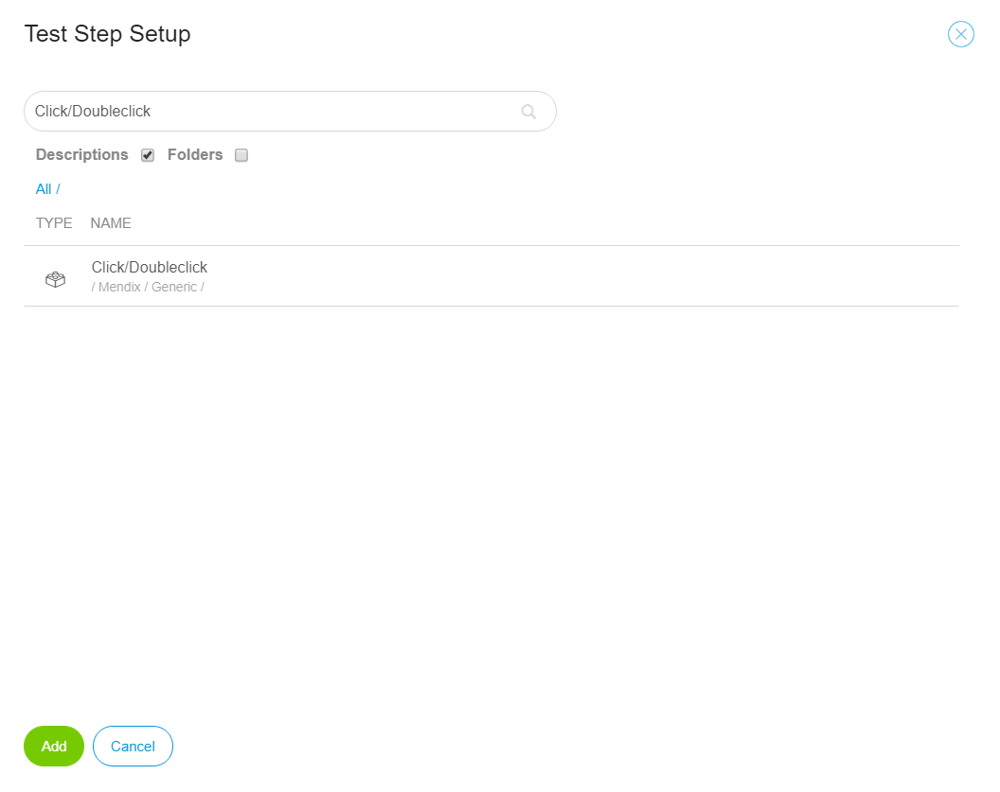

### 2.3 Summary

When you want to click a widget always use the _Click Widget_ action if possible. 

If you want to click something more specific inside a widget or the widget does not have a `mx-name`. Then use "Click" in combination with the widget name as displayed in the [Mendix App Store](https://appstore.home.mendix.com/), the Mendix modeler. You can also find the name using the ATS helper.

In case you cannot click a widget due to no unique name or because it is not supported, go to [How to Create Custom Actions](../howtos/create-custom-actions).

## 3 Set an input widget

In ATS there are several actions for setting an input widget. From a simple action that covers most situations to checkboxes inside tables. The first chapter explains the generic action for setting an input widget. The second chapter explains the actions that set a more specific input widget. The magic word while searching for an action that can handle an input widget is "Set".

### 3.1 Generic Action

When you want to set an input widget the main choice is always the [_Set Value_](../refguide-ats-1/set-value) action. It sets the input widget using the `mx-name` of the widget and the value to set. ATS uses the **Widget Name** parameter instead of  `mx-name`.

The **Widget Name** is found using the ATS helper, the value is the **Widget Name**:

The _Set Value_ action works on almost every widget that is an input widget.
 
_The Set Value Action_

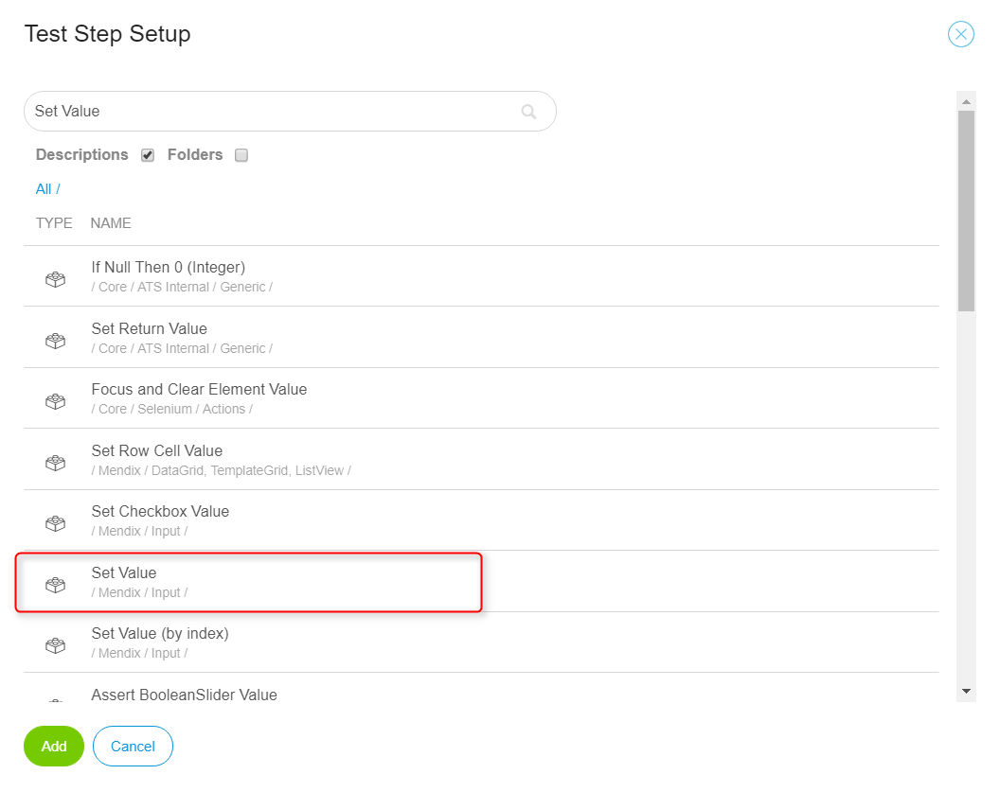

If the generic action does not work check if there is a specific one.

### 3.2 Specific Action

 ATS also has a few specific actions for setting an input widget. To find these use the search term, "Set" in combination with the widget name.

Example 1, you want to set the value of a checkbox widget, but you want to set it to a specific state. You cannot use the _Set Value_ action because it does not work.

The solution is to use the following search term, "Set Checkbox".  
ATS checks all the actions and returns those that match these words. You see there is an action called [_Set Checkbox Value_](../refguide-ats-1/set-checkbox-value). The _Set Checkbox Value_ action uses the `mx-name` of the widget and the boolean value you set to check or uncheck the checkbox.

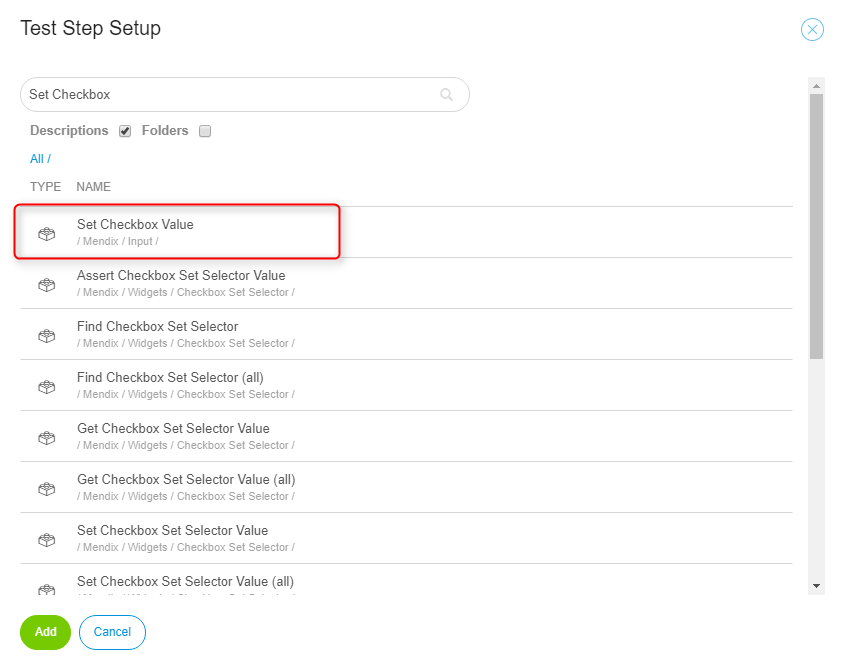

Example 2, you want to set the BooleanSlider widget to certain value. You cannot use the _Set Value_ action because it does not work. 

The solution is to use the following search term, "Set BooleanSlider".  
ATS checks all the actions and returns those that match these words. You see there is an action called [_Set BooleanSlider Value_](../refguide-ats-1/set-booleanslider-value). The _Set BooleanSlider Value_ action uses the `mx-name` of the widget and the value you want to set the slider to.

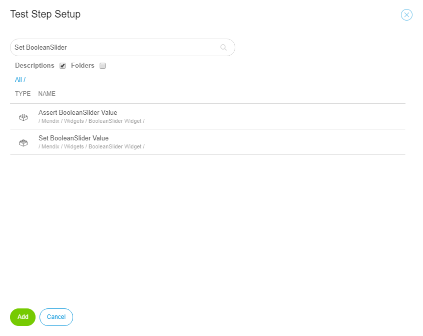

Example 3, you want to set the radiobutton inside a GridSelector widget. You cannot use the _Set Value_ because the radiobutton does not have its own `mx-name`. It is part of the GridSelector widget.

The solution is to use the following search term, "Set Grid Selector".
ATS checks all the actions and returns those that match these words. You see there is an action called [_Set Grid Selector Value_](../refguide-ats-1/set-grid-selector-radiobutton-checked). The _Set Grid Selector Value_ action uses the `mx-name` of the widget, column caption and row caption to locate the radiobutton.

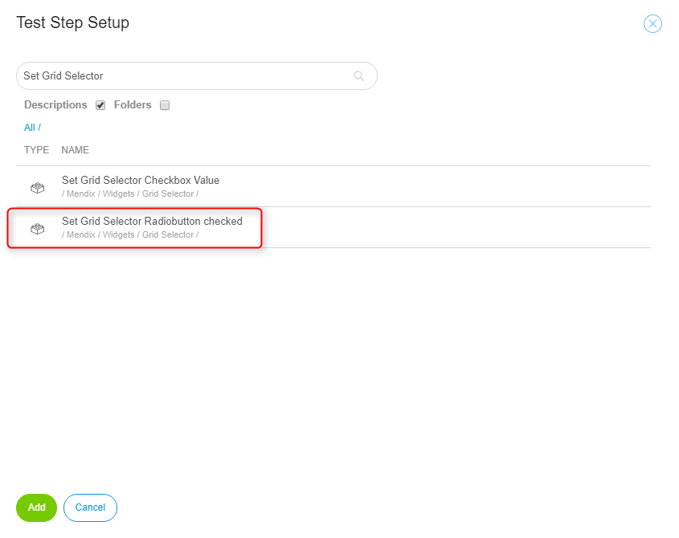

Example 4, you want to set an input reference selector widget. You cannot use the _Set Value_ action because it does not work. 

The solution is to use the following search term, "Set InputReferenceSelector".  ATS checks all the actions and returns those that match these words. You see there is an action called [_Set InputReferenceSelector Value_](../refguide-ats-1/set-inputreferenceselector-value). The _Set InputReferenceSelector Value_ action uses the `mx-name` and the value you set to set the InputReferenceSelector widget.

## 3.3 Summary

When you want to set an input widget always use the _Set Value_ action if possible. 

If you want to set a special input widget or the widget does not have a `mx-name`. Then use "Click" in combination with the widget name as displayed in the [Mendix App Store](https://appstore.home.mendix.com/), the Mendix modeler. You can also find the name using the ATS helper.

In case you cannot set an input widget due to no unique name or because it is not supported, go to [How to Create Custom Actions](../howtos/create-custom-actions).

## 4 Retrieving a value from a widget

In ATS there are several actions for getting a value from a widget. The first chapter explains the generic action for getting a value from a widget. The second chapter explains the actions that get a specific value from a widget. The magic word while searching for an action that can get a value is "Get".

### 4.1 Generic Action

When you want to get a value from a widget the main choice is always the [_Get Value_](../refguide-ats-1/get-value) action. It retrieves the value of a widget using the `mx-name` of the widget. ATS uses the **Widget Name** parameter instead of  `mx-name`.

The **Widget Name** is found using the ATS helper, the value is the **Widget Name**:

The _Get Value_ action works on almost every widget that is an input widget.
 
_The Get Value Action_

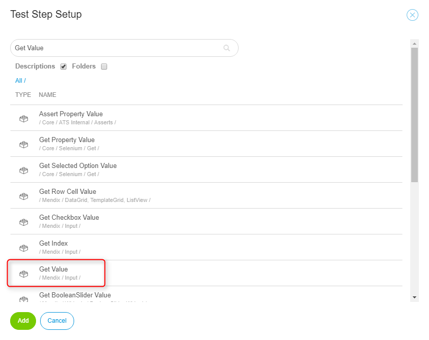

If the generic action does not work check if there is a specific one.

### 4.2 Specific Action

ATS also has a few specific actions for getting a value from an widget. To find these use the search term, "Get" in combination with the widget name.

Example 1, you want to get the value of an Input Reference Selector widget. You cannot use the _Get Value_ action because it does not work. 

The solution is to use the following search term, "Get InputReferenceSelector". ATS checks all the actions and returns those that match these words. You see there is an action called [_ Get InputReferenceSelector_](../refguide-ats-1/get-inputreferenceselector-value). The _Get InputReferenceSelector_ 
action returns the value the InputReferenceSelector widget is set to using the `mx-name`. 

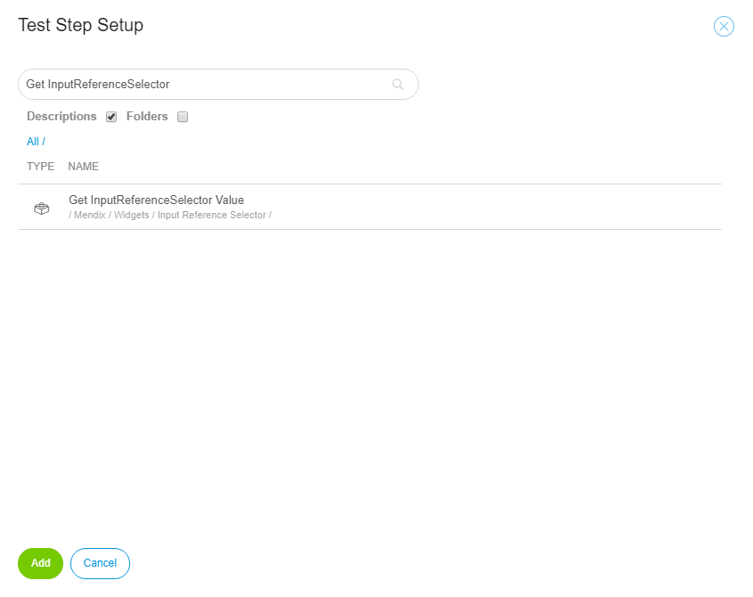

Example 2, you want to get the value displayed in the CKEditor widget. You cannot use the _Get Value_ action because it does not work.  

The solution is to use the following search term, "Get CKEditor". ATS checks all the actions and returns those that match these words. You see there is an action called [_Get CKEditor Value_](../refguide-ats-1/get-ckeditor-value). The  _Get CKEditor Value_ action uses the `mx-name` to return the value displayed in the CKEditor widget.

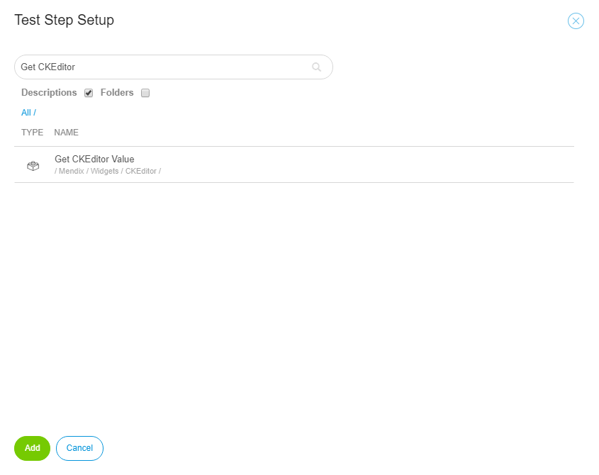

Example 3., you want to get the message displayed in the dialog box widget. You cannot use the _Get Value_ action because there is no `mx-name.

The solution is to use the following search term "Get Dialog".  ATS checks all the actions and returns those that match these words. You see there is an action called [_Get Dialog Message Text_](../refguide-ats-1/get-dialog-message-text). The  _Get Dialog Message Text_ action uses the dialog as a WebElement to retrieve the message text. You use the _Find/Assert Dialog_ action to get the dialog as a WebEelement.

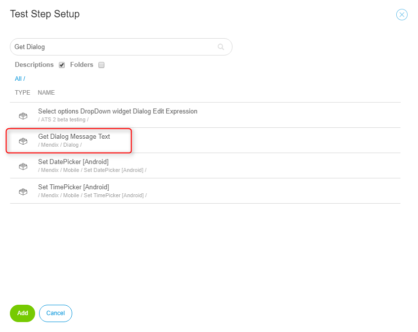

## 4.3 Summary

When you want to get a value from a widget always use the _Get Value_ action if possible. 

If you want to get the value from a specific widget or the widget does not have a `mx-name`. Then use "Click" in combination with the widget name as displayed in the [Mendix App Store](https://appstore.home.mendix.com/), the Mendix modeler. You can also find the name using the ATS helper.

In case you cannot get the value from a widget due to no unique name or because it is not supported, go to [How to Create Custom Actions](../howtos/create-custom-actions).

## 5 Asserting values/information

In ATS there are several actions for asserting values. The first chapter explains the generic action for asserting a value inside your app. The second chapter explains the actions that assert specific values inside your app or inside ATS. The magic word while searching for an action that can assert a value is "Assert".

### 5.1 Generic Action

When you want to assert a value inside a widget the main choice is always the [_Assert Value_](../refguide-ats-1/assert-value) action. It asserts the value of a widget using the `mx-name` of the widget. ATS uses the **Widget Name** parameter instead of  `mx-name`.

The **Widget Name** is found using the ATS helper, the value is the **Widget Name**:

The _Assert Value_ action works on almost every widget that is an input widget.
 
_The Assert Value Action_

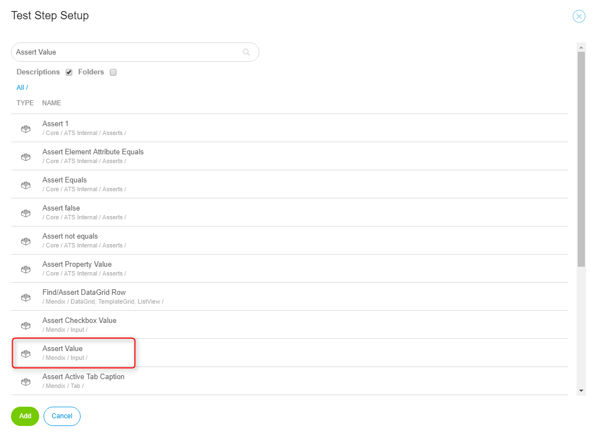

If the generic action does not work check if there is a specific one.

### 5.2 Specific Action
