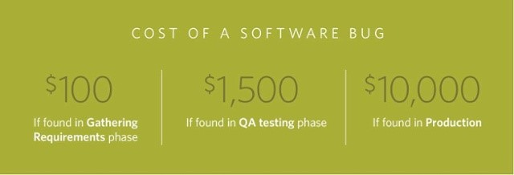

This document contains the frequently asked questions for ATS.

## 1 General Questions

### 1.1 What is ATS and why should I use it?

The Mendix Application Test Suite (ATS) is a suite of tools for embedding (automated) testing in your application lifecycle.  It provides a powerful solution for automation of not only your functional and regression tests but also non-functional tests like availability, security, and performance testing. Furthermore, with functions like a test case recorder and data-driven testing, it provides you with everything you need to make testing your Mendix apps quick, easy and versatile. 

A small investment in setting up ATS, which is very easy to learn, will save a lot of (re)testing time in the long run. This will help the team and its stakeholders to have the right insights into the quality of your app, at any time, at the press of a button.

In short, ATS brings you the following benefits:

1. Faster delivery

2. Find more regressions

3. A more testable product

4. Improved testing morale

## 1.2 

## 1.3 ATS uses selenium, so why should I use ATS in combination with Selenium instead of solely using Selenium?

Advantages of using ATS in combination with Selenium compared to only using Selenium:
- Non-technical usage, no programming knowledge required.
- ATS allows you to focus on your test logic instead of coding. We have solved all technical difficulties to create reliable, efficient and simple test cases for all Mendix apps.
- Integration with Sprintr delivers additional value over the entire lifecycle.
- ATS is integrated into the whole Application Lifecycle (requirements, development, deploy and maintenance/monitoring).
- ATS comes with a library of high-level actions that are easy to understand, thus allowing the user to compose test cases with ease, without having to take care of implementation details. 
· Reusable actions (You can create them yourself as well).
- Easy to use interface for all standard widgets + some appstore widgets.
-  Abstract technical implementation.
·normalizing browser differences for compatibility.
· normalizing Mendix platform version differences.
- All actions do a lot more in the background for reliability and simplification.
· Determine application context (e.g. automatically limit all actions to modal dialog).
· Automatically do visibility checks.
· consider event microflows.
- Maintenance and support (new Mendix versions).
· new Mendix platform release.
· Bugfixes.
- Recorder + ATS Helper.
· Record high-level test steps by with ATS actions.
· Recorder will also support custom actions in a future release.
· Extract information from running application with ATS helper.
- ATS Test cases are easy to maintain and can be re-used in a simple fashion.

## 1.4 What is my Return On Investment (ROI) when I use ATS?

ATS is a test automation tool and one of the benefits is that automation allows you to find more bugs earlier in the development process. A well-known characteristic of software bugs is that the cost of fixing it rises exponentially during the development process. The Systems Sciences Institute at IBM has reported that _“the cost to fix an error found after product release was four to five times as much as one uncovered during design, and **up to 100 times** more than one identified in the maintenance phase.”_
A simple illustration:

