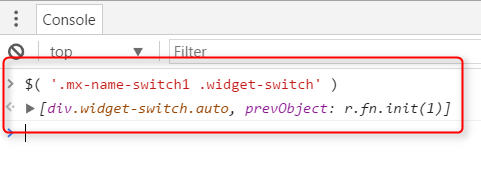
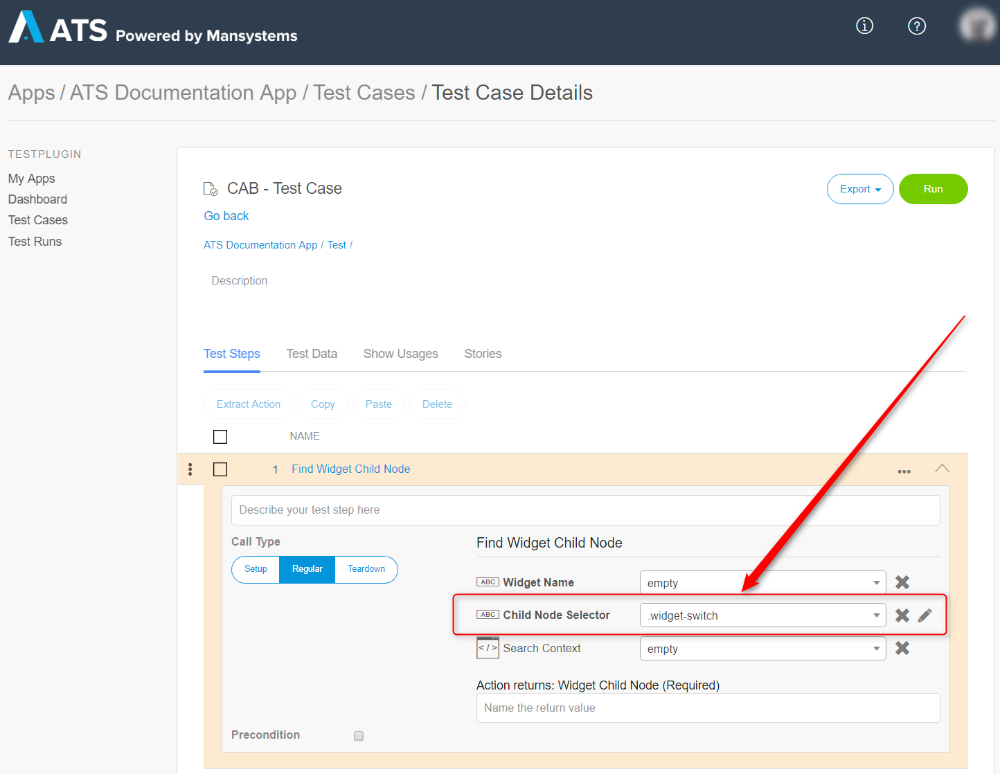
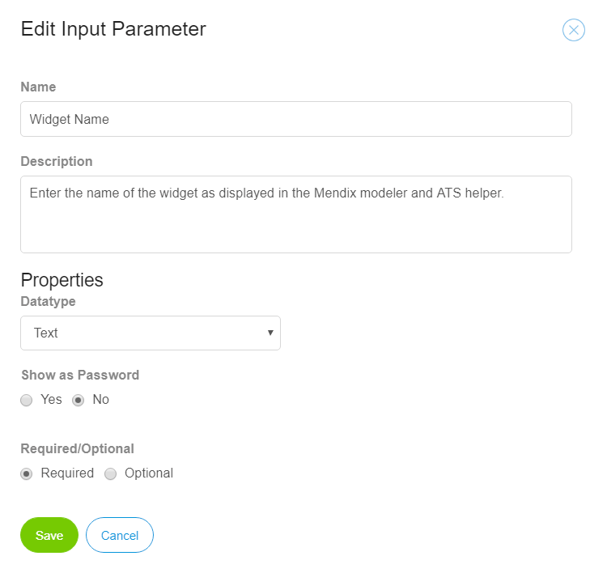
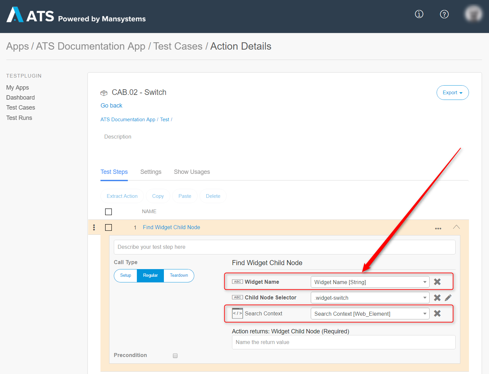
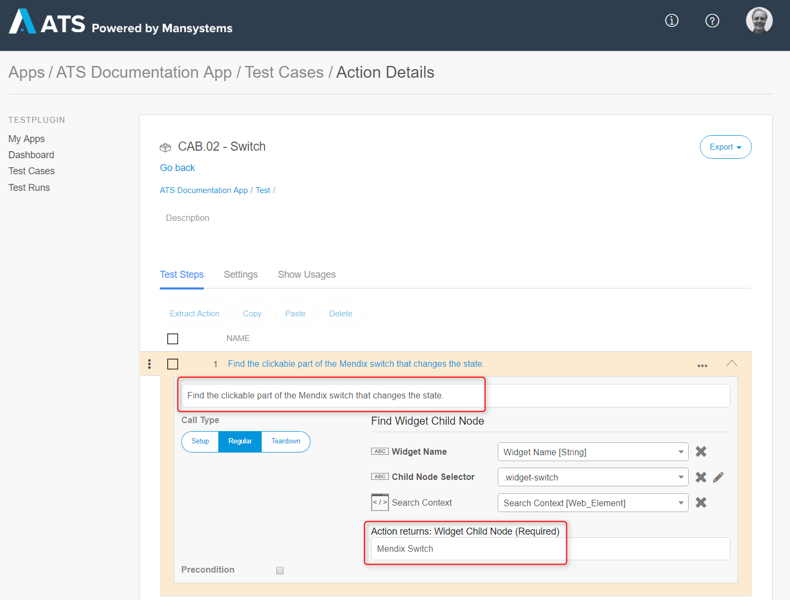
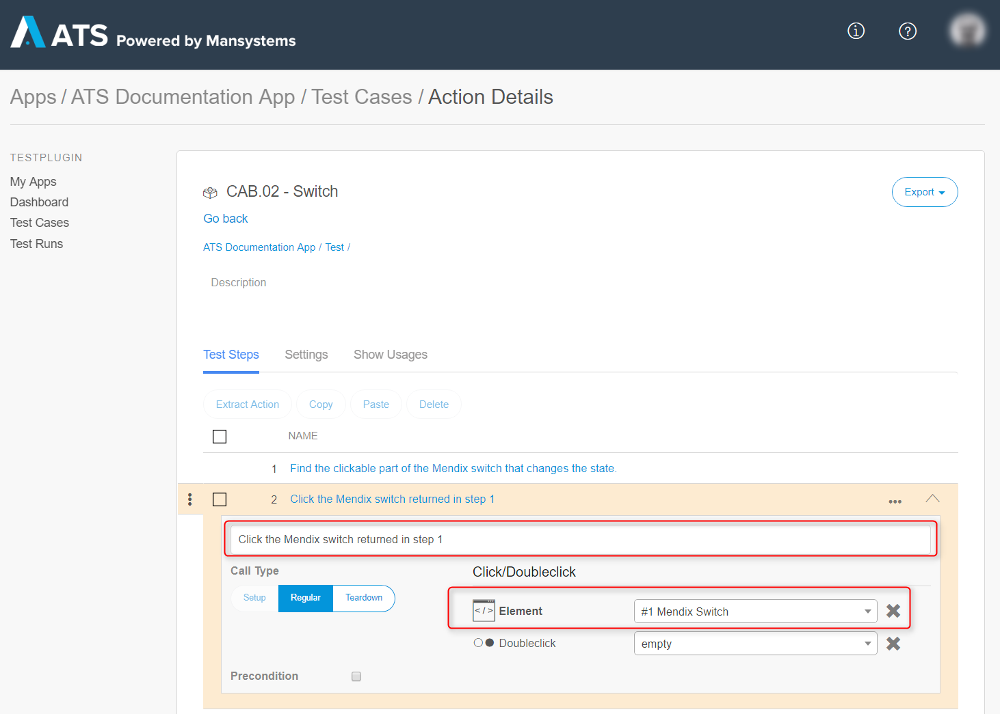
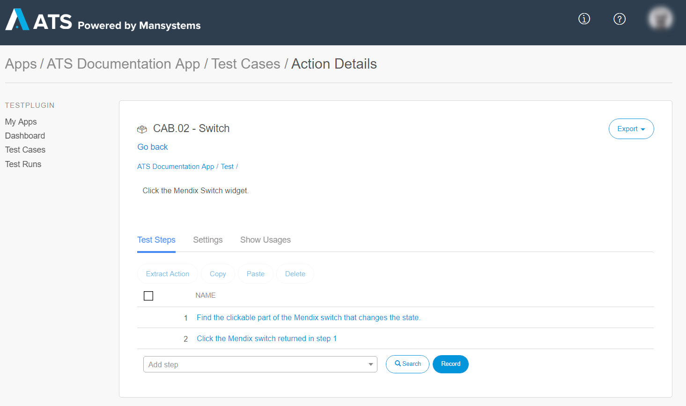
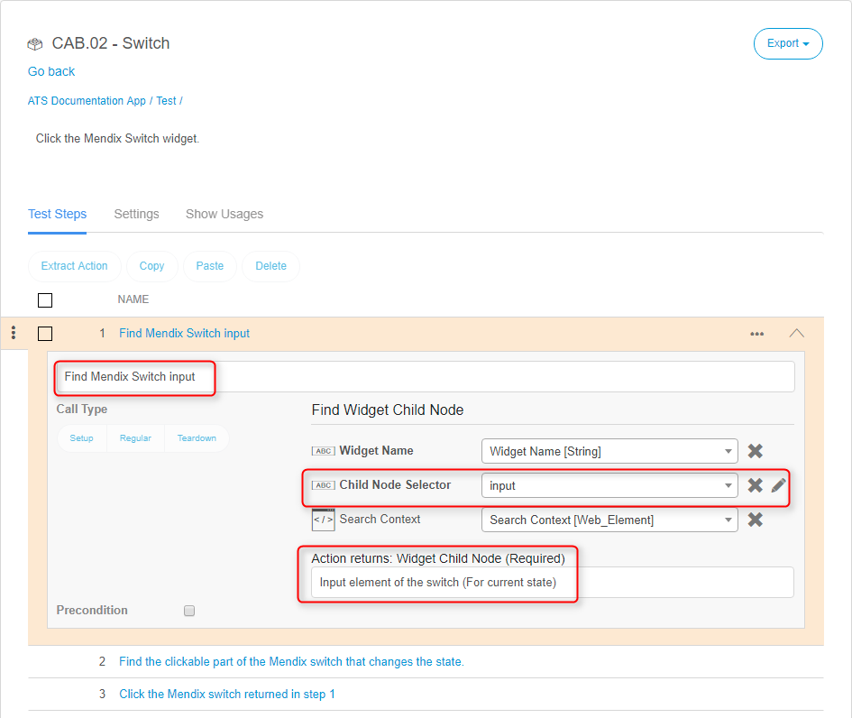
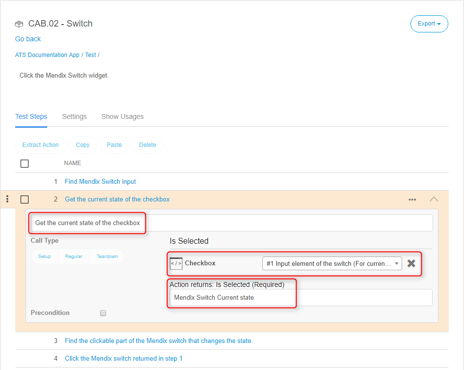
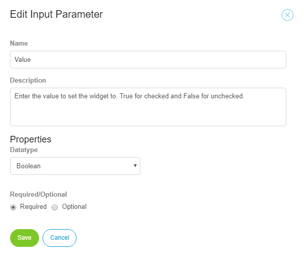

## 1 Introduction

This how-to explains how to create an unsupported widget action for the Mendix switch widget. In a standard situation, the first step is to check if ATS supports the widget.

The how-to assumes that you must build your own action. 

The how-to applies to all widgets like the button widget. If ATS needs to click the widget, you can follow this how-to until section [5 Last Check](#LastCheck). Keep in mind that it might need some adjustments according to the widget!
 
Sections [6 Adding Logic to Make Your Action "Smarter"](#AddingLogic) and [7 Final Check](#FinalCheck) apply "logic" to an action that is of the check box type. If a widget is of the check box type, you can follow these steps to apply logic. 
 
**This how-to will teach you how to do the following:**

* Approach a widget that ATS must click.
* Create the custom action to click the widget.
* Add logic to your custom action.

## 2 Prerequisites

Before starting this how-to, make sure you have completed the following prerequisite:
 
* Read [Custom Action General Section](custom-action-general-2)

## 3 Defining the User Approach
 
First you define the user approach and how you interact with the widget. Since you are creating an Unsupported Widget action, how you find the widget is not important. What is important is how you interact with it.

To define the user approach, follow these steps:
 
1.  Trigger the Mendix Switch by clicking it. This changes its state from checked to unchecked:

    * Switch unchecked:
 
    

    * Switch checked:
 
    

2. You must determine where you must click it. After looking at the widget, you find out that you must click the actual switch to activate it.

## 4 Creating the Action Structure
 
In the previous section, you wrote down the user approach for the Mendix Switch widget. Now you must create this approach in ATS with actions. Create a new action for the next steps.
 
1.  Look for the element in the debugger ATS needs to click. ATS always clicks in the middle of an element, keep this in mind while looking for the element to click. You must start by checking the parent element, which is always the element with `mx-name-` when building an unsupported widget action. If the widget does not have `mx-name-`, look for the highest `div` element that is still referencing the widget. The parent element of the switch widget has `mx-name-switch1` in the debugger:

    

    The debugger creates the border around the selected element in the app: 

    

    When selecting which element to find, also remember that ATS clicks in the middle of an element. In this case, ATS does not click the actual switch. This means you must use the [Find Widget Child Node](../refguide-ats-1/find-widget-child-node) action. This action is a combination of the [Find/Assert Widget](../refguide-ats-1/findassert-widget) and [Find Element by Sizzle](../refguide-ats-1/find-element-by-sizzle) actions, combining the best of both. It’s an official Mendix action, it has all the internal processes, and it uses a CSS/jQuery selector to find the child, which makes it flexible.

2.  Check the different child nodes to find the one you need. While doing this, keep the [guidelines for creating a custom action](../bestpractices-2/guidelines-custom-action-2) in mind! It must be generic, so pick an element or element class that’s always present, because you "hard-code" it into your action. Also, make sure the element is visible for the end-user so that ATS can click it.

    After looking through the child nodes, you find a child element that covers the switch and also looks generic. This is the element in the debugger, and the rectangle shows which class name we are going to use:

    

    That element looks like this in the app:

    

3.  Use the class name to find the element, because it’s the most constant. The ID of an element changes a lot. You cannot use the ID when building a sustainable custom action. Use the class name selector in jQuery for finding specific elements. The class name you must use is `.widget-switch`. To make sure that it works, try it first in the debugger. 
4.  Simulate what ATS does by using the debugger. Since you use the *Find Widget Child Node* action, you also use the `mx-name` in your code. You use jQuery to find out if ATS finds the right element. Enter the following code in the console of the debugger:

    `$( ‘.mx-name-switch1 .widget-switch’ )` 

    You use "dots" here, because in jQuery the, dot stands for a class name selector.

    When you enter this in the console, it looks like this:

    

    It can happen that the debugger does not return an element. Check if jQuery is available and if you constructed the code in the correct manner. When you enter a selector in ATS, don’t use `$( ‘….’ )` or `jQuery( ‘…..’ )`.

5.  Enter the child node in the _Find Widget Child Node_ action:

    

    According to the guidelines for building a custom action, you must define the standard parameters. You only want to hard-code the child node; the action user must have the possibility to select another switch by only entering the **Widget Name**. 

6.  In this case, you have the required **Widget Name** and the optional **Search Context** parameters. Create both parameters in the **Settings** tab.

    * **Widget Name Input** parameter:

    

    * **Search Context Input** parameter:

    

    Make sure you set the data type correctly! The Search Context parameters expect a web element!

7.  Connect these parameters to the *Find Widget Child Node* action:

    

8.  Clarify the test step by filling in the description and possible output. In this case, your action returns the Mendix switch:

    

9.  Click the Mendix switch to change its state. Add the [Click/Doubleclick](../refguide-ats-1/clickdoubleclick) action, because this action is a Mendix action:

    

10. Connect the output of the first test steps to the *Click/Doubleclick* action and give a proper description:

    
  
## 5 Last Check

Now check for the following:

* Use of the ATS naming convention for parameters
* A clear description of test steps, input parameters, output parameters, and action returns
* Interpunction usage in pieces of code (if used)
* Use of data types on the different parameters to avoid errors

After checking these items, you can run the test case that uses this action.

Congratulations! You have created your own custom action for the Mendix Switch widget.

## 6 Adding Logic to Make Your Action "Smarter"

You have an action that clicks the Switch widget to alter its state, and now you will make it "smarter." Your action now clicks the Switch no matter its current state. Next, you need to add logic to set the switch to a specific state.

1.  In the debugger, notice that the Mendix Switch has the input type `checkbox`. You use this input element in combination with the _Is Selected_ action to get the current state of the widget, either "True" or "False":

    

2.  Check if ATS can find the input element. You do this by simulating what ATS does, the same way as before. Enter the following code in the console of the debugger: 

    `$( ‘.mx-name-switch1 input’ )`:
  
    

    It can happen that the debugger does not return an element. Check if jQuery is available and if you constructed the code in the correct manner.

    When you use an element's DOM name, the selector looks like this: `input` or `div`.

3.  Add another *Find Widget Child Node* action to find the input element. Make it step 1. Enter `input` in the child node selector parameter. As said before, you don’t use the full selector. Keep the guidelines in mind and give a proper description of the test step and its output:

    

    You use this input element to get the current state of the switch: "True for checked" and "False for unchecked."

4.  Add the *Is Selected* action and make it the second test step. Connect the output of step 1 that found the input element and give it a proper description:

    

5.  To use the output of the Is Selected action, you need something to compare it to. The action user must provide the "True" or "False" statement used to set the action. Next, you create the input parameter for the wanted state:

    

    Watch the data type! It must be a Boolean here, because the *Is Selected* action also returns a Boolean; otherwise, you couldn’t compare them.

    Give a clear description so that the action user knows what information is required.

    The logic you use is as follows: **Only click the switch if the value of the switch is NOT the same as the value entered by the user.**

    You use a precondition on the *Click/Doubleclick* action performing the logic: use the [Assert Not Equals](../refguide-ats-1/assert-not-equals) action as the precondition.

    For example, if you want to set the switch to unchecked, you enter the value false. If the switch is already false, then the values are equal and the precondition fails, which results in ATS *not* executing the *Click/Doubleclick* action, and vice versa.

6.  Check the **Precondition** box at test step 4 (the *Click/Doubleclick* action) and select the *Assert Not Equals* action. Next, connect the input parameter value and the output of step 2 (the Mendix Switch current state):

    

## 7 Final Check

Now check the following items:

* Use of the ATS naming convention for parameters
* A clear description of test steps, input parameters, output parameters, and action returns
* Interpunction usage in pieces of code (if used)
* Use of data types on the different parameters to avoid errors

After checking these items, you can run the test case that uses this action.

Congratulations! You have added logic to your custom action.

