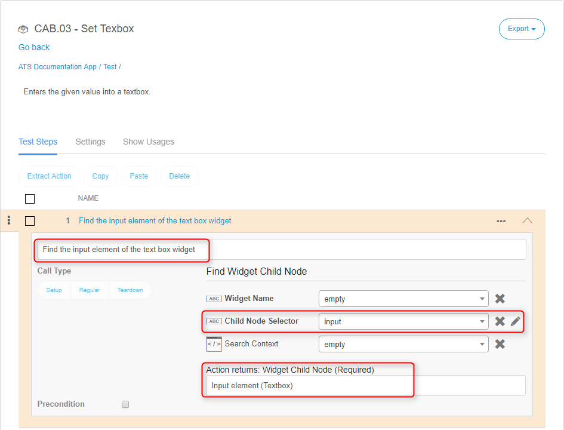
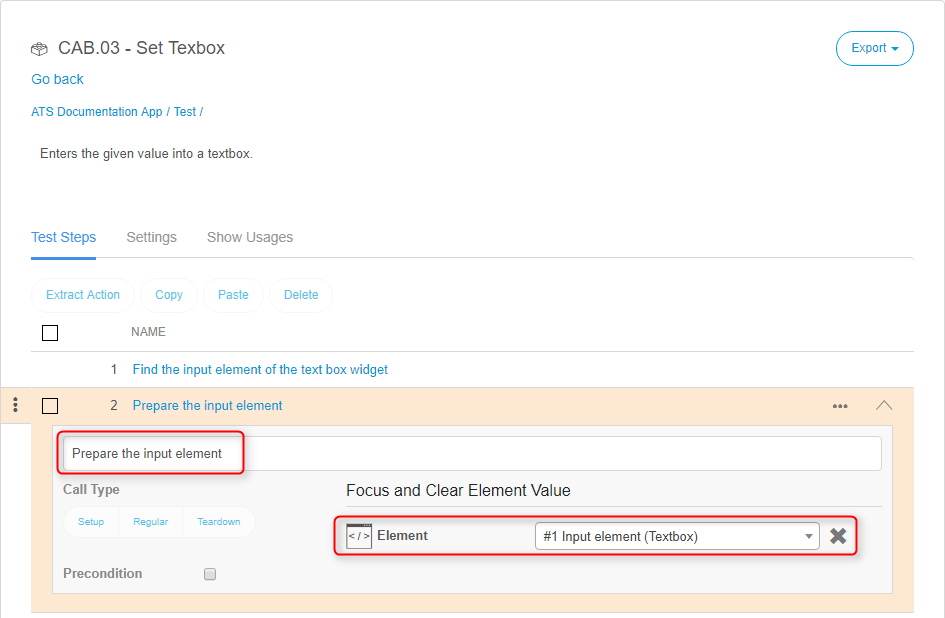
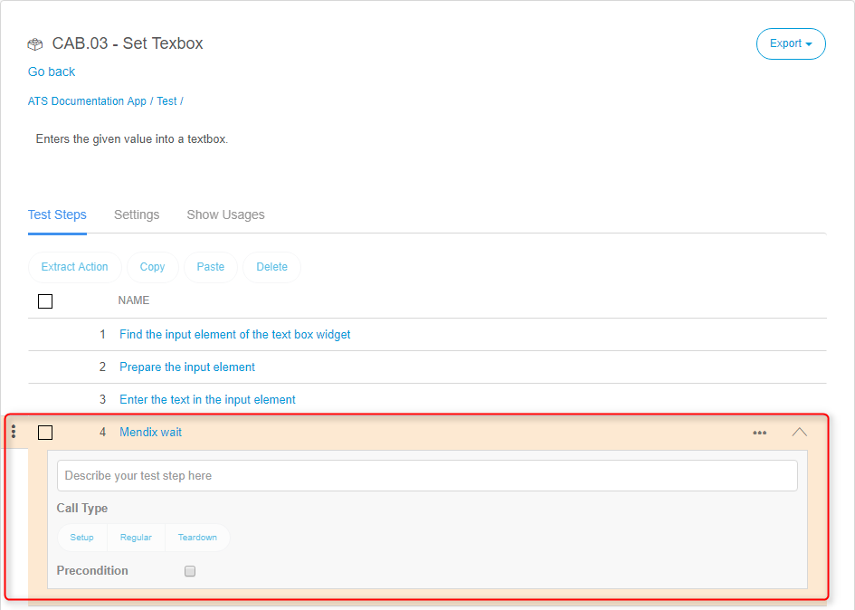
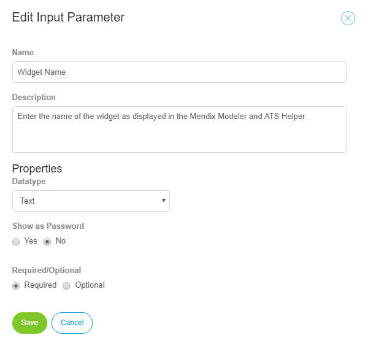
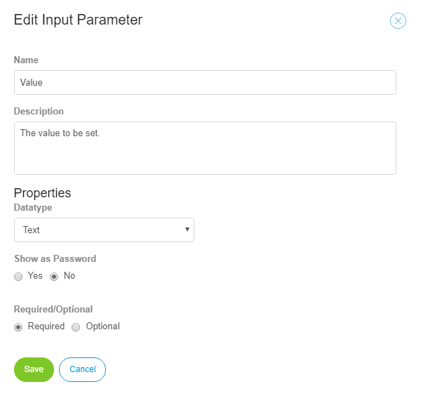
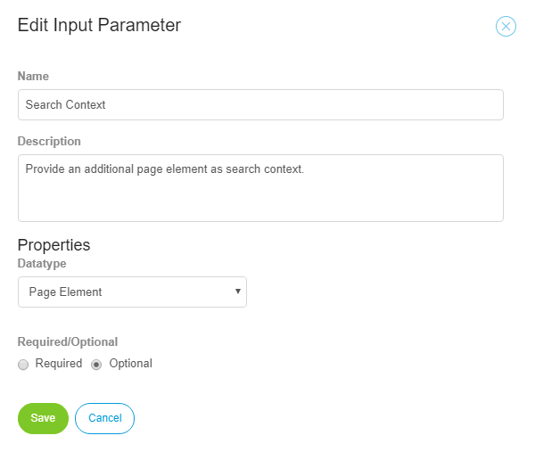
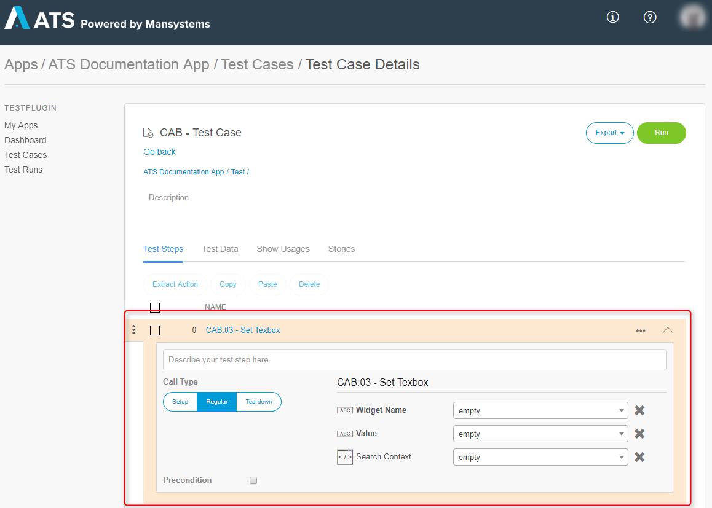

## 1 Introduction

This how-to explains how to create an Unsupported Widget action for the Mendix text box widget widget. In a standard situation, the first step is checking if ATS supports the widget. 

The how-to assumes that you must build your own action.

The how-to applies to all widgets like the text box widget, which means that, if ATS needs to enter text in a widget, you can follow this how-to. Keep in mind that it might need some adjustments according to the widget!

**This how-to will teach you how to do the following:**

* Approach a widget in which ATS must enter text
* Create a custom action for entering text in the widget

## 2 Prerequisites

Before starting this how-to, make sure you have completed the following prerequisite:
 
* Read **Custom Action General Section**

## 3 Defining the User Approach

First you define the user approach and how you interact with the widget. Since you are creating an Unsupported Widget action, how you find the widget is not important. What is important is how you interact with it.

You interact with the widget by clicking the text box and entering the text. The clicking part is something a user does to focus the text box so they can enter text. After that, you press <kbd>Enter</kbd> or click somewhere to unfocus the text box.

This is the text box focused:

This is the text box unfocused:

Now you know that you must focus, enter text, and unfocus the widget. You perform these tasks on the `input` element that is available inside all input widgets. The `input` element with the type `text` makes it possible to type inside a widget.

## 4 Creating the Action Structure

In the previous step, you wrote down the user approach for the text box widget. Now you are going to create this approach in ATS with actions.

To create the action structure, follow these steps:

1.  Start by checking the parent element, which is always the element with `mx-name` when creating an unsupported widget action. If the widget does not have `mx-name`, look for the highest `div` element that is still referencing the widget. The parent element of the text box looks like this in the debugger:

    

    The debugger creates the border around the selected element in the app:

    

2.  The parent element is not an `input` element. Find a child element that ATS can use to enter text in the widget. When you look at the parent element, you will see it has an `input` child element that ATS can use:

    

    When you create a custom action for an unsupported widget action, you must use the [*Find Widget Child Node*](../refguide-ats-1/find-widget-child-node) action. This action is a combination of the [*Find/Assert Widget*](../refguide-ats-1/findassert-widget) and [*Find Element by Sizzle*](../refguide-ats-1/find-element-by-sizzle) actions, combining the best of both. It is an official Mendix action, it has all the internal processes, and it uses a CSS/jQuery selector to find the child, which makes it flexible. The selector for finding the input element is an input. You use this selector in the *Find Widget Child Node* action to find an input element inside the text box widget.

    Before you start creating the action, you must know if ATS can find the `input` element within the text box widget. You use the debugger to simulate what ATS does. Since the *Find Widget Child Node* action uses the `mx-name` to find the parent, you must also use the `mx-name` in your code.

3.  Use jQuery to find out if ATS can find the element. Enter the following code in the console of the debugger: `$( ‘.mx-name-textBox2 input’ )`. You use "dots" here, because in jQuery, the dot stands for a class name selector. When you enter this in the console, it looks like this:

    

    It can happen that the debugger does not return an element. Check if jQuery is available and if you constructed the code in the correct manner. When you enter a selector in ATS, don’t use `$( ‘….’ )` or `jQuery( ‘…..’ )`.

4.  Add the *Find Widget Child Node* action to your action. Enter the `input` child node selector, then enter the test step description and output description:

    

5.  Test step 1 provides the `input` element that you need for the other steps. Now, add the *Focus and Clear Element Value* action. Enter the output of step 1 as the input, and give it a proper description:

    

6.  After focusing the `input` element, enter the text. When entering text in an `input` element, use the [*Send Keys*](../refguide-ats-1/send-keys) action. Add the action, connect the input element from step 1, and give it a proper description:

    

7.  The last action you add is [*Mendix Wait*](../refguide-ats-1/mendix-wait). You trigger a possible event in the widget by entering text, so you need to ensure that ATS waits for all the background processes to finish:

    

## 5 Action Parameters

Next, you need to add these action input parameters:

* Widget Name
* Value
* Search Context

{}
Keep the **guidelines for creating a custom action** in mind while creating action parameters. 
{}

To add the action parameters, follow these steps:

1.  Configure the **Widget Name** input parameter like this:

    

2.  Configure the **Value** input parameter like this:

    

3.  Configure the **Search Context** input parameter like this:

    

    For this custom action, you do not need an output parameter.

4.  Connect the input parameters to the correct actions. Start with the **Widget Name** and **Search Context** parameters for the *Find Widget Child Node* action:

    

5.  The last parameter to connect is the **Value** parameter. Connect this input parameter to the Send Keys action:

    

There is no need to add logic to this custom action. It only involves entering text in a widget.

## 6 Final Check

Now check for the following:

*  Use of the ATS naming convention for parameters
*  A clear description of test steps, input parameters, output parameters, and action returns
*  Interpunction usage in pieces of code (if used)
*  Use of data types on the different parameters to avoid errors

After checking these items, you can run the test case that uses this action.

Congratulations! You have created your own custom action for the Mendix text box widget.

