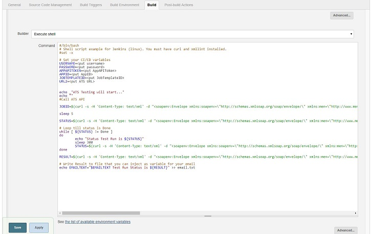

## 1 Introduction

This how-to explains the ATS CI/CD API. This API allows you to start and run configured ATS Test cases from third-party tools.

## 2 Setup CI/CD API in Jenkins

You can now easily include your ATS tests in your CI/CD pipeline, like for example in Jenkins. 
If you are running Jenkins (on Linux), you can add a build step of type Execute shell and use the following simple shell script (notice that you need curl and xmllint installed on your Linux server). 
This is only an example and can be written in the language of your choice like for example Powershell or Groovy. 



```
#/bin/bash
# Shell script example for Jenkins (linux). You must have curl and xmllint installed.
#set -x

# Set your CI/CD variables
USERNAME=<put username>
PASSWORD=<put password>
APPAPITOKEN=<put AppAPIToken>
APPID=<put AppID>
JOBTEMPLATEID=<put JobTemplateID>
URL2=<put ATS URL>


echo _"ATS Testing will start..."
echo ""
#Call ATS API

JOBID=$(curl -s -H 'Content-Type: text/xml' -d "<soapenv:Envelope xmlns:soapenv=\"http://schemas.xmlsoap.org/soap/envelope/\" xmlns:men=\"http://www.mendix.com/\"><soapenv:Header><men:authentication><username>$USERNAME</username><password>$PASSWORD</password></men:authentication></soapenv:Header><soapenv:Body><men:RunJob><TestRun><AppAPIToken>$APPAPITOKEN</AppAPIToken><AppID>$APPID</AppID><JobTemplateID>$JOBTEMPLATEID</JobTemplateID></TestRun></men:RunJob></soapenv:Body></soapenv:Envelope>" ${URL2}/ws/RunJob -X POST |xmllint --xpath "string(//JobID)" -)

sleep 5

STATUS=$(curl -s -H 'Content-Type: text/xml' -d "<soapenv:Envelope xmlns:soapenv=\"http://schemas.xmlsoap.org/soap/envelope/\" xmlns:men=\"http://www.mendix.com/\"><soapenv:Header><men:authentication><username>$USERNAME</username><password>$PASSWORD</password></men:authentication></soapenv:Header><soapenv:Body><men:GetTestRun><TestRun><AppAPIToken>$APPAPITOKEN</AppAPIToken><JobID>$JOBID</JobID><AppID>$APPID</AppID></TestRun></men:GetTestRun></soapenv:Body></soapenv:Envelope>" ${URL2}/ws/GetJobStatus -X POST |xmllint --xpath "string(//ExecutionStatus)" -)

# Loop till status is Done
while [ ${STATUS} != Done ]
do
        echo "Status Test Run is ${STATUS}"
        sleep 300
        STATUS=$(curl -s -H 'Content-Type: text/xml' -d "<soapenv:Envelope xmlns:soapenv=\"http://schemas.xmlsoap.org/soap/envelope/\" xmlns:men=\"http://www.mendix.com/\"><soapenv:Header><men:authentication><username>$USERNAME</username><password>$PASSWORD</password></men:authentication></soapenv:Header><soapenv:Body><men:GetTestRun><TestRun><AppAPIToken>$APPAPITOKEN</AppAPIToken><JobID>$JOBID</JobID><AppID>$APPID</AppID></TestRun></men:GetTestRun></soapenv:Body></soapenv:Envelope>" ${URL2}/ws/GetJobStatus -X POST |xmllint --xpath "string(//ExecutionStatus)" -)
done

RESULT=$(curl -s -H 'Content-Type: text/xml' -d "<soapenv:Envelope xmlns:soapenv=\"http://schemas.xmlsoap.org/soap/envelope/\" xmlns:men=\"http://www.mendix.com/\"><soapenv:Header><men:authentication><username>$USERNAME</username><password>$PASSWORD</password></men:authentication></soapenv:Header><soapenv:Body><men:GetTestRun><TestRun><AppAPIToken>$APPAPITOKEN</AppAPIToken><JobID>$JOBID</JobID><AppID>$APPID</AppID></TestRun></men:GetTestRun></soapenv:Body></soapenv:Envelope>" ${URL2}/ws/GetJobStatus -X POST |xmllint --xpath "string(//ExecutionResult)" -)

# Write Result to file that you can inject as variable for your email
echo EMAILTEXT="Test Run Status is ${RESULT}" >> email.txt
```
