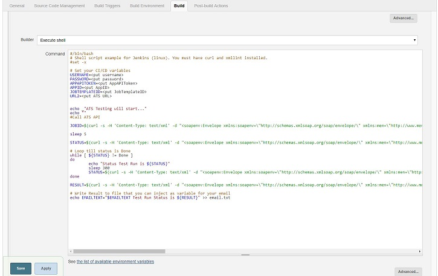

## 1 Introduction

This how-to explains data driven testing, a functionality of ATS. With data driven testing, you can run the same test case with different data sheets, without manually entering the new information in the case. ATS Executes a test case for each record in the master data set.

## 2 Setup CI/CD API in Jenkins

You can now easily include your ATS testing in your CI/CD pipeline, like for example in Jenkins. 
If you are running Jenkins (on Linux), you can add a build step of type Execute shell and use the following simple shell script (notice that you need curl and xmllint installed on your Linux server). 
This is only an example and can be written in the language of your choice like for example Powershell or Groovy. 

