## 1 Introduction

This how-to explains data driven testing, a functionality of ATS. With data driven testing, you can run the same test case with different data sheets, without manually entering the new information in the case. ATS Executes a test case for each record in the master data set.

**This how-to will teach you  how to do the following**
-	Create a master data set with different datasheets in ATS
-   Create an excel file to upload in ATS
-	Create a master data set using excel file
-	Use the master data set in a test case
-   Understand the result log of a data-driven test case

This how-to uses the company expenses app as an example. In this how-to you create data for the following fields in the company expenses app.

1. Amount
2. Date
3. Type
4. Description

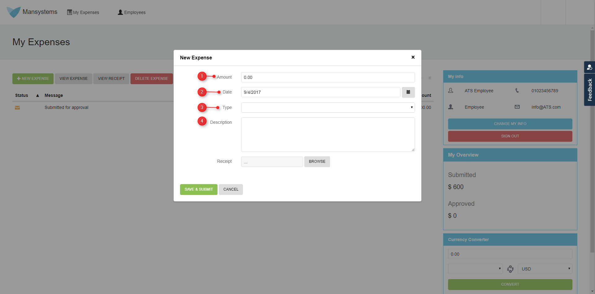

An example test case is used to illustrate how to connect the data set to a test case.

## 2 Prerequisites

Before starting with this how-to, make sure you have the following prerequisites in place:

* [How to Create a Test Case](create-a-test-case)

## 3 Create a Master Data Set within ATS

The following steps explain how to create a master data set within ATS. If you want to create a master data set from an Excel file, please see chapter four.

1. Open your app in ATS and go to the **Test Cases** menu item.
2. Click the **Test Data** tab.
3. Click **New Data Set**

When you click the **New Data Set**, the **New Data Set** dialog box opens.

4. Enter a name for your data set in the **Name** field. Remember that you must find the data set later so giving it a unique and corresponding name is advisable.
5. Enter a description for your data set in the **Description** field. Providing a clear description of what data is found inside is advisable.
6. Click **Save**

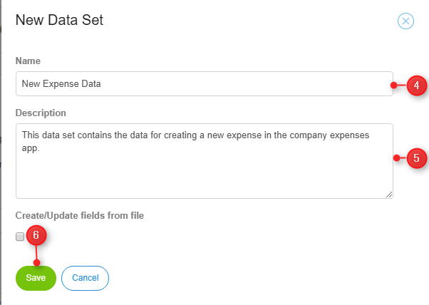

### 3.1 Create data set fields

The following steps explain how to add data set fields to your master data set.

1. Click the name of the data set.
2. Click **New Field**.

3. When you click **New Field**, the **New Field** dialog box opens. Enter **Amount** in the name field, this field represents the expense amount in the company expenses app. By using the exact label from the Mendix app, it becomes easier to connect the fields from your data set to the right action.
4. The amount in the company expenses app can only be a number. Select **Number** as the datatype.
5. Click **Save**

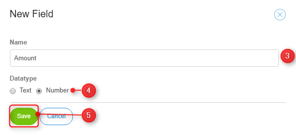

Repeat step 1 to 5 for the fields in the company expenses app.
* Date
* Type
* Description

The result will look comparable to the image below:

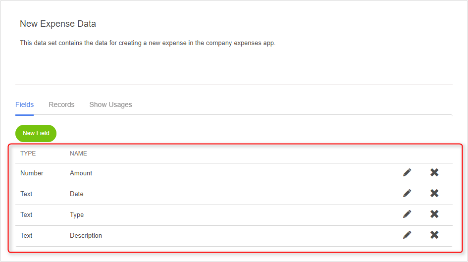

 Next, you create a record for the data set fields.

### 3.2 Create Records

The following steps explain how to create a record for your data set fields.

1. Click the **Records** tab.
2. Click **New Record**.

The **New Record** dialog box opens.

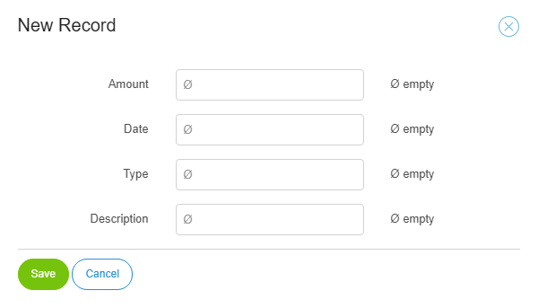

3. Enter the desired values for each field and click **Save**.

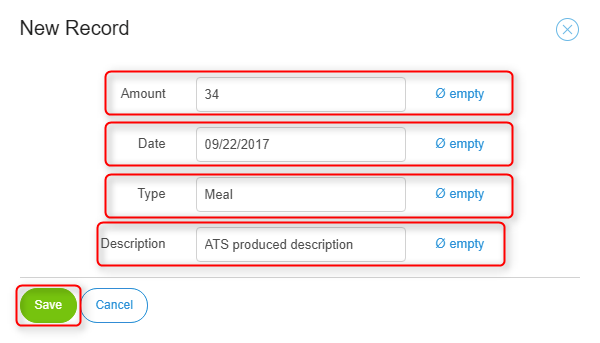

Repeat step 2 and step 3 as many times as you want. In our example, we create a record for each expense type.
* Accommodation
* Meal
* Other
* Supplies
* Transport

The records look like this:

You can also update your records from excel. This is explained in chapter five.

## 4 Create the Excel File

The following steps explain how to create the right excel file and how it should look. You need this file in chapter five.

1. Open Excel and create a new file.

ATS implements the values in the first row as data set fields and all the rows beyond the firs row as records. See the example below.

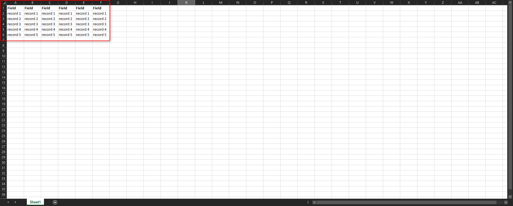

2. First you create the data set fields you need. 
    * Amount
    * Date
    * Type
    * Description

3. Now that you created the data set fields, you must add records. Create a record for each expense type available, five in total.
    * Accommodation
    * Meal
    * Other
    * Supplies
    * Transport

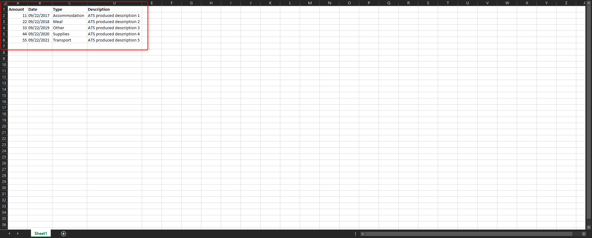

4. Now save the excel file so that you can use it in the next chapter.

## 5 Create a Master Data Set with Excel

The following steps explain how to create and update a master data set from an excel file. You use the file you created in chapter four.

1. Open your app in ATS and go to the **Test Cases** menu item.
2. Click the **Test Data** tab.
3. Click **New Data Set**

When you click the **New Data Set**, the **New Data Set** dialog box opens.

4. Enter a name for your data set in the **Name** field. Remember that you must find the data set later so giving it a unique and corresponding name is advisable.
5. Enter a description for your data set in the **Description** field. Providing a clear description of what data is found inside is advisable.
6. Check the **Create/Update fields from file** box.
7. Select the excel file you created in chapter four.
8. Click **Save**.

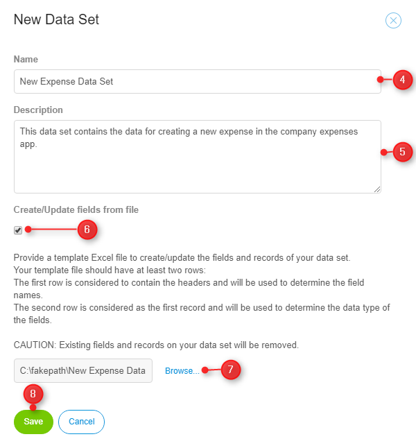

Now you created a new master data set using an excel file.

## 6 Update the master data set using an excel file.

The following steps explain how to update a master data set using an excel file.

1. Click the name of the data set.
2. Click the **Records** tab.
3. Click **Export to Excel**.

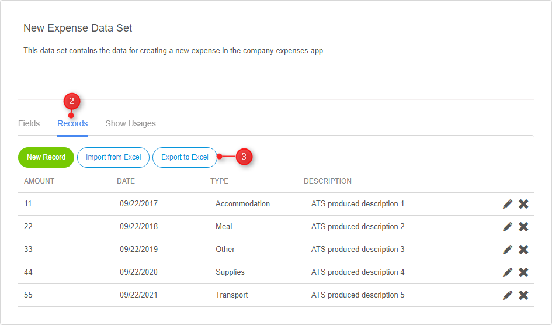

You now download an excel file containing the data set. 

4. Save the file to your local computer so that you can make changes.
5. Change the description of all records to "ATS excel description 1" etc.

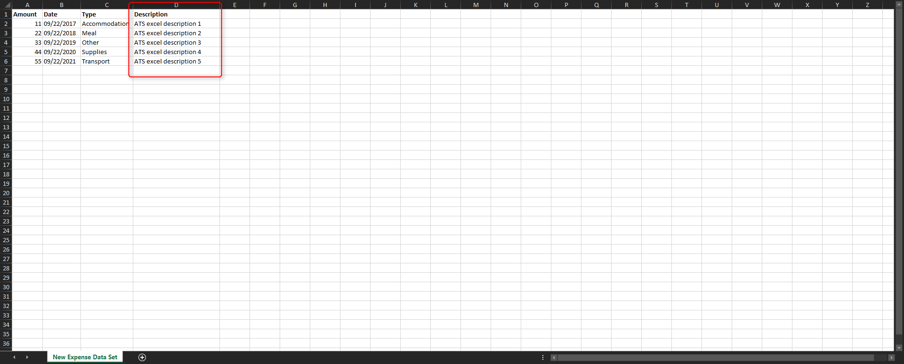

6.  Click **Import from Excel** inside the **Records** tab.

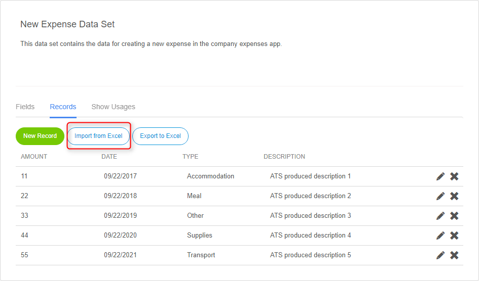

The **Import records** dialog box opens.

7. Select the file you altered in step 4 and step 5. 
8. Click **Import**.

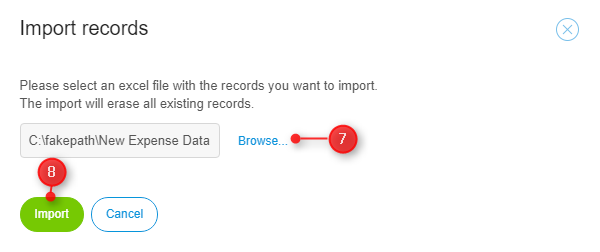

ATS now updated the changed records.

You now updated the master data set using an excel file.

## 7 Connect the Master Data Set to your Test Case

The following steps explain how to connect the master data set to your test case. An example test case is used in this chapter. See [How to Create a Test Case](create-a-test-case) for more information.

1. Open your test case and click the **Test Data** tab.
2. Click the arrow icon.

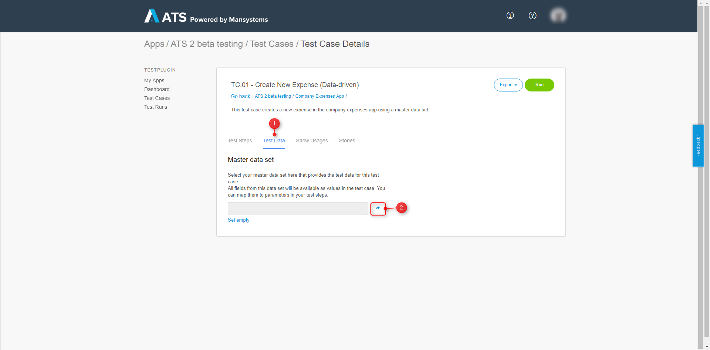

The **Select Data Set** dialog box opens.

3. Search for the master data set.
4. Select the data set.
5. Click **Save**.

Now you connected the master data set to your test case.

Next, you connect the data set fields to the right test steps.

6. Click the **Test Steps** tab.
7. Select the test step you want to connect a data set field too.
8. Search and select the first data set field.

Repeat this process for all the data set fields you want to connect.

You now connected the data set fields to the test steps in your test case.

## 8 Data-Driven Results

The following steps explain how to read and understand the results of a data-driven test case. An example is used in which the data-driven test case is already executed.

1. Open your app and click the **Test Runs** menu item.
2. Click the result of the data-driven test case.

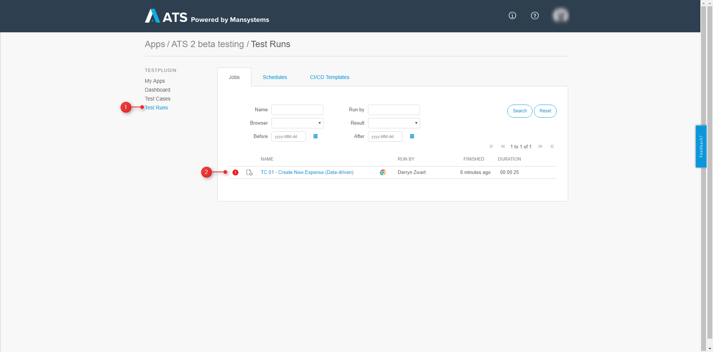

This opens the **Result Log** page. Where ATS displays the result of each executed record.

3. Click one of the results.

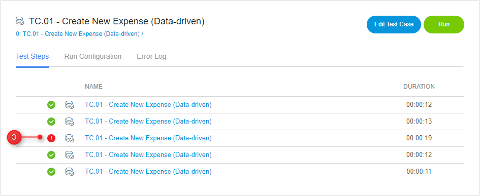

4. To see the record used by this execution, click the **Data Records** tab.

This displays all the values in the record.

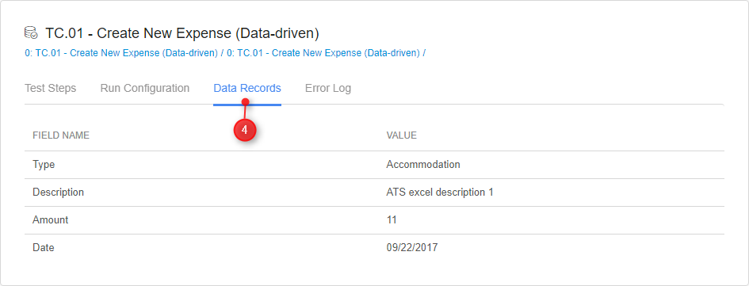

You can use the breadcrumbs to return to the overview **Result Log**.

You now know how to do the following:

* Create a master data set within ATS.
* Create an Excel file to upload in ATS.
* Create a master data set using an excel file.
* Update a master data set using an excel file.
* Connect the master data set to your test case.
* Analyse the result of a data-driven test case.