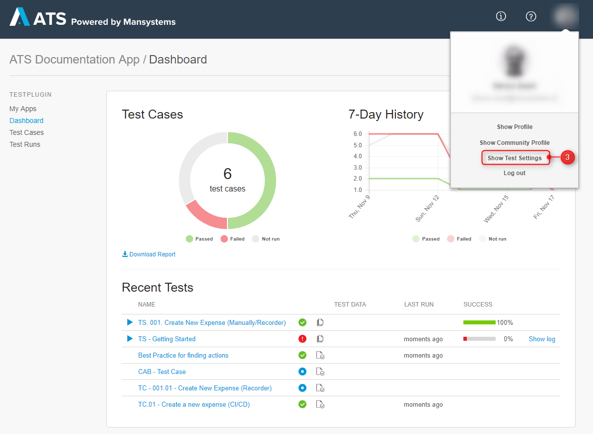

## 1 Introduction 

This how-to explains how to configure a selenium hub in ATS. The four different possibilities are explained and where you can retrieve the necessary information.

**This how-to will teach you how to do the following:**

* Configure a Browserstack Selenium Hub
* Configure a Saucelabs Selenium Hub
* Configure a Testingbot Selenium Hub
* Configure a Custom Selenium Hub

## 2 Prerequisites

Before starting with this how-to, make sure you have the following prerequisites in place:

* Have the appropriate role to gain access to the test settings in ATS.
* Have access to a selenium provider account or internal selenium server.

## 3 The Test Settings

To get to the test settings follow these steps:

1. Go to ATS and login.
2. Open the app where you want to add the selenium hubs.
3. Once inside your app click the profile menu and select **Show Test Settings**.

The **Selenium hubs** section contains all the configured selenium hubs for this app. Here you add a new selenium hub by clicking **New Selenium Hub**.

The **Select Provider** dialog box opens. Here you can select one of the four configurable selenium hub options. Each of the options is explained in the following chapters.

## 4 Custom Capabilities

Each selenium provider allows the user to set certain custom capabilities. The custom capabilities are used to set specific conditions. ATS enters these custom capabilities when you execute a test case or test suite. For example, Selecting 'Chrome' as your browser is a custom capability. The different selenium providers allow for different custom capabilities that is why ATS allows you to enter your own capabilities.

Some examples are:
* Timezone
* Resolution
* Builds
* Names

{}

Browser overwrites do not work! ATS only executes test cases and test suites on the supported browsers.

{}

This is explained for each selenium hub option.

## 5 Configure Browserstack

### 5.1 Basic Configuration

To configure Browserstack as a selenium hub follow these steps:

1. Go to the **Select Provider** dialog box and select **Browserstack**.

2. The **New Selenium Hub** dialog box opens. Here you enter the necessary information for ATS to connect to your Browserstack account.
3. First, you enter a name for your selenium hub. This is only meant to help you identify the selenium hub.
4. Next, you enter the username of your Browserstack account. 
5. Finally, you enter the access key of your Browserstack account.

To find the username and access key follow these steps:
1. Go to [Browserstack](https://www.browserstack.com) and login with the account you want to connect to ATS.
2. Click **Automate** in the navigation bar.
3. There is a collapsible menu on the left side of the screen. It displays the **Username** and the **Access Key** when you unfold it. It also has a **Copy** button. 

### 5.2 Custom Capabilities

