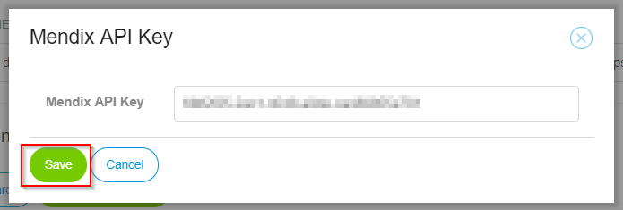
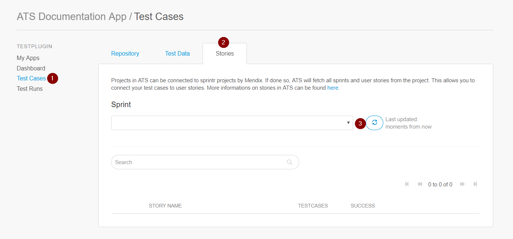

## 1 Introduction

Mendix ATS is a testing tool designed for automated testing off Mendix applications. With your automated tests you want to test functionalities of the application, which are described in your User Stories. As you want to test for those functionalities, ATS can retrieve the User Stories in the Mendix Sprintr project. The User Stories that are retrieved can be linked to Test Cases. This can be useful for you and your team to see what can be tested automatically and which functionalities are covered by a Test Case. Additionally linking User Stories to Test Cases can be usefull to show stakeholders that the functionalities build in the sprint are tested.

**This how-to will teach you how to do the following**

* Set the Mendix API key
* Retrieve User Stories in ATS
* Connect Test Cases to User Stories
* Connect User Stories to Test Cases

## 2 Prerequisites

Before starting this how-to, make sure you have completed the following prerequisite:

* Read [How to Get Started](getting-started-2)
* Read [How to Create a Test Case](create-a-test-case-2)

## 3 Set the Mendix API Key

The following steps describe how you can set your Mendix API Key in ATS:

1. Go to ATS and login.
2. Open the app where you want to add the Mendix API Key.
3. Inside your app click the profile menu and click **Show Test Settings**.

{} **Show Test Settings** is only present if you have SCRUM Master rights in the Mendix Sprintr project {}

4. On the **Settings** page click **Set API Key**.

Clicking **Set API Key** opens the **Mendix API Key** Dialog:

5. To retrieve your Mendix API Key open the project in Sprintr and click **API Keys**.
6. Click **Create API Key**
7. Enter a API Key name in the **API key name** field and click Generate API Key. 
8. Copy the API Key and paste it in the **Mendix API Key** field in ATS.
9. Click **Save**:

You have set the Mendix API Key. ATS can now retrieve the User Stories from the Mendix Sprintr project.

## 3 Retrieve User Stories in ATS

The following steps explain how to retrieve User Stories from the Mendix Sprintr project in ATS:

1.  Open your project in ATS and go to **Test Cases**.
2. Click the **Stories** tab.
3. Click the **Refresh button** to retrieve the User Stories from Sprintr:

If you filled in a correct Mendix API Key you can now see the User Stories in ATS:

## 5 Connecting Test Cases to User Stories

To be able to connect Test Cases to User Stories you should have created a Test Case.

## 6 Connecting User Stories to Test Cases

To be able to connect User Stories to Test Cases you should have created a Test Case.