## 1 Introduction

In test cases, you often reuse some of the same test steps. For example to open the application and logging into the application. Adding the separate steps each time is time-consuming. Besides, if the password of the user changes you have to change the password in each test case in which you use that password. This is time-consuming as well. To make your test cases easier to maintain ATS has added the option to create your own actions. These actions can be created from within a test case or by creating a new action. This how-to explains both ways of creating such actions.

**This how-to will teach you how to do the following:**
* Extract actions
    * Create an extracted action from a test case
    * Create an extracted action by creating a new action

## 2 Prerequisites

Before starting with this how-to, make sure you have completed the following prerequisites:

*  Read [How to Get Started](getting-started-2)
*  Read [How to create a test case](create-a-test-case-2)

## 3 Extract actions

You can create an extracted action for all test steps that you use in more than one test case.

### 3.1 Create an extracted action from a test case 

The following steps describe how to extract actions. In this example we create an extracted action for the actions **Open Mendix Application** and **Login**:

1. Create a test case. Give it a name and a description.
2. Add the actions **Open Mendix Application** and **Login**.
3. Set the **URL** input parameter of the **Open Mendix Application** to **Environment URL**.
4. Enter the **Username** and **Password** input parameters of the **Login** action. 
5. Select the checkboxes of both steps.
6. Click **Extract action**

 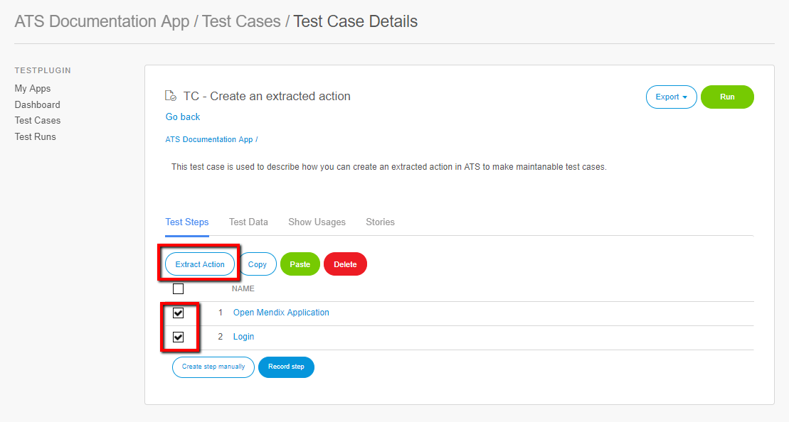

 Clicking extract action opens the **Action - Set Details**:

 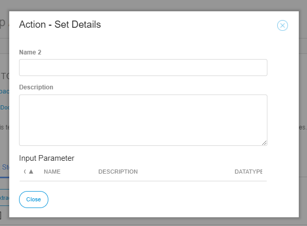

7. Enter a name in the **Name** field. (for example, *Open application and log in as employee*). Giving it a clear name of what the action does is advised.
8. Enter a description in the **Description** field. (for example, *This action opens the application, based on the environment URL, and logs into the application as employee*). Giving each extracted action a description of what it does is advised.
9. Click **Close**

 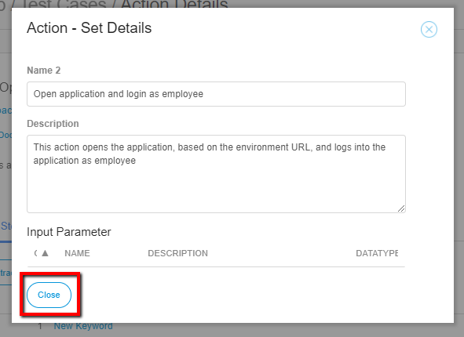

 You have now created an extracted action. To view the test steps in the extracted action follow these steps:

 1. In your test case click the **Drop-down** menu of the extracted action.
 2. Click **Open**

 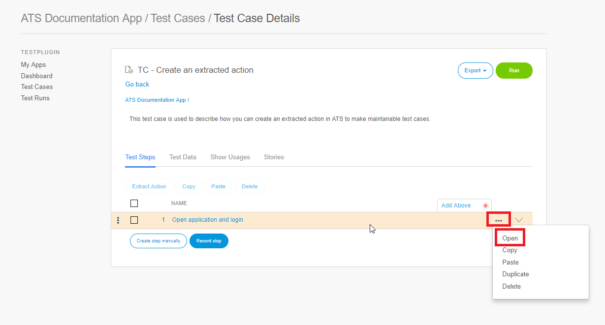

 Clicking **Open** opens the **Action Details** page. On this page you see the test steps in the action. In case a password changes, you can change it on this page.

 You can also open your extracted action from the repository, as this action is now added to the repository:

 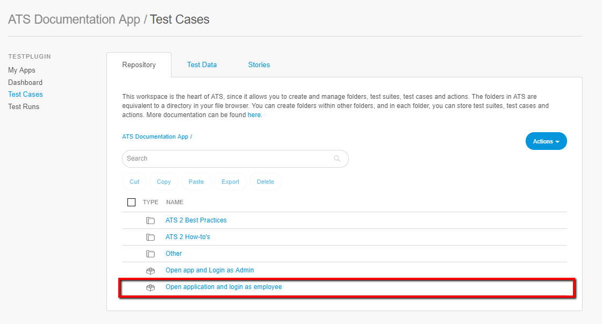

 To use this custom action in other test cases follow these steps:

 1. Create a new test case, which you give a name and description.
 2. Click **Create step manually**.
 The folder with your application name contains all custom and extracted actions.
 3. Select the action you want to add as test step to your test case.
 4. Click **Select**

  

  You have now added your extracted action to another test case. So, if the password changes you only have to change it within the action and not within each test case. This saves time and effort to keep all your test cases up to date. 
  
  ### 3.2 Create an extracted action by creating a new action 
  
The following steps describe how to create an extracted action for deleting an expense in the company expenses app:

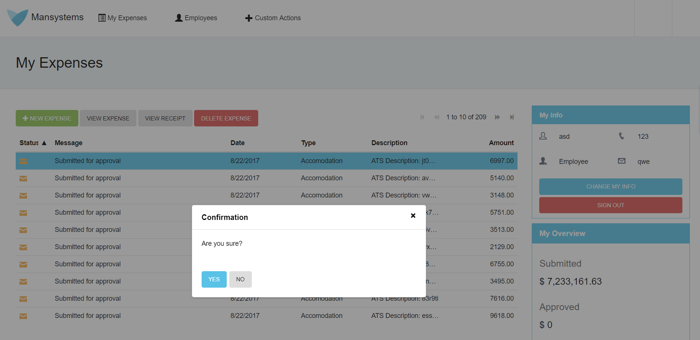

The actions needed to delete an expense are **Click DataGrid row**, **Click Widget** and **Confirm Dialog**. 

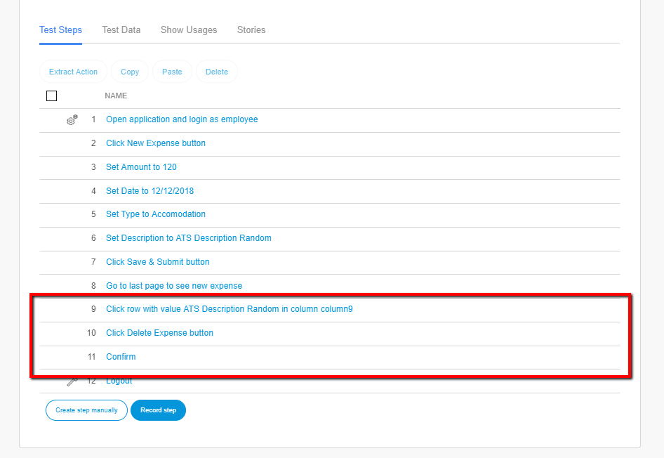

The actions to delete an expense are always the same, but the value of the description can differ. The following steps describe how to create a reusable extracted action of deleting an expense.

1. Open your project in ATS and click the **Test cases** menu item to open the **Repository**.
2. Click the **Actions** dropdown.
3. Click **New Action**.

Clicking **New Action** opens the **Create new** dialog:

4. Enter a name in the **Name** field. (for example, *Find and delete an expense based on the description*). Using a clear and concise naming structure is advised.    
5. Enter a description in the **Description** field (for example, *This action deletes an expense based on the description. The description can be entered in the input parameter **Value**.*). Giving each test case a description of what it does is advised.
6. Click **Create**

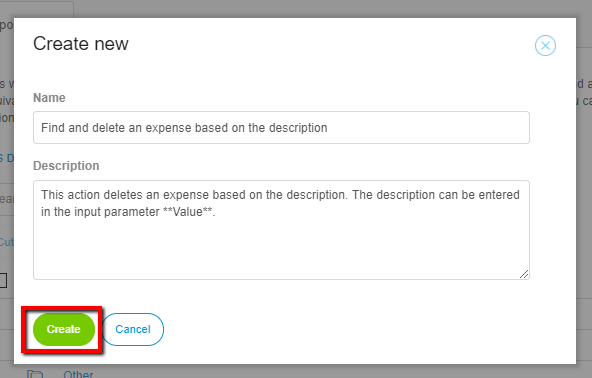

Clicking create opens the **Actions Details** Page

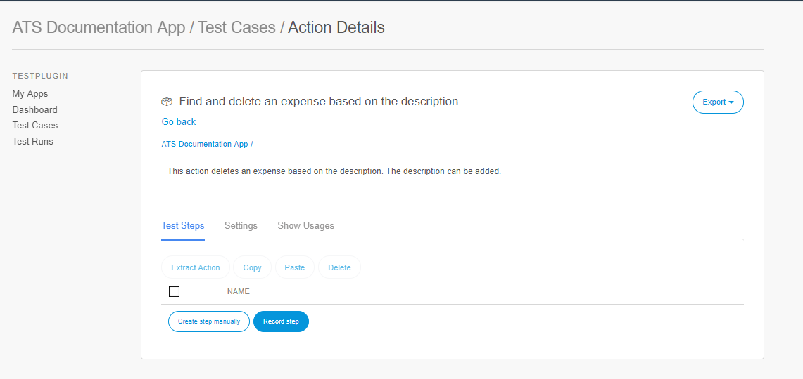

7. Record the test steps needed to delete an expense, so the actions **Click DataGrid row**, **Click Widget** and **Confirm Dialog**. You can also add the actions manually and enter the input parameters.

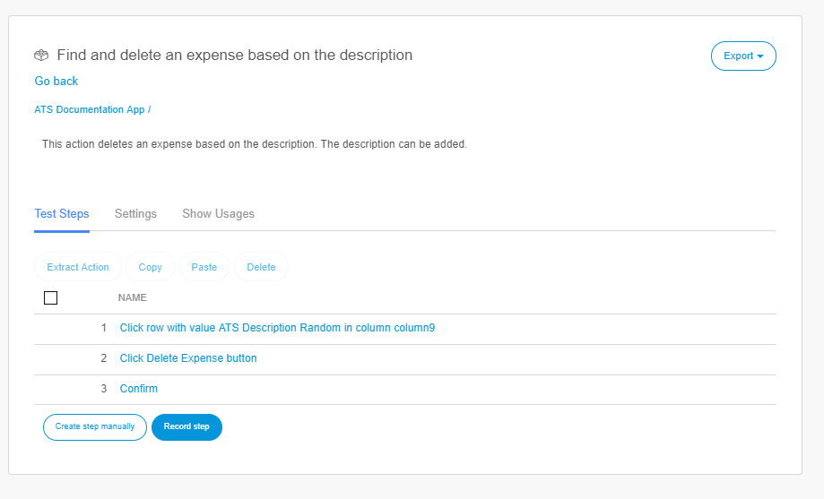

8. Click the **Settings** tab.
9. Click **New**.

Clicking **New** opens the **Edit Input Parameter** dialog:

10. Enter **Column Value** in the **Name** field. When defining action parameter names, always use the ATS [naming conventions](../../refguide/rg-version-1/best-practices).
11. Enter a description in the **Description** field. (for example, *Enter the value of the description of the expense to be deleted.*). Giving each input parameter a description of what to enter in the input parameter is advised.
12. Click **Save**.

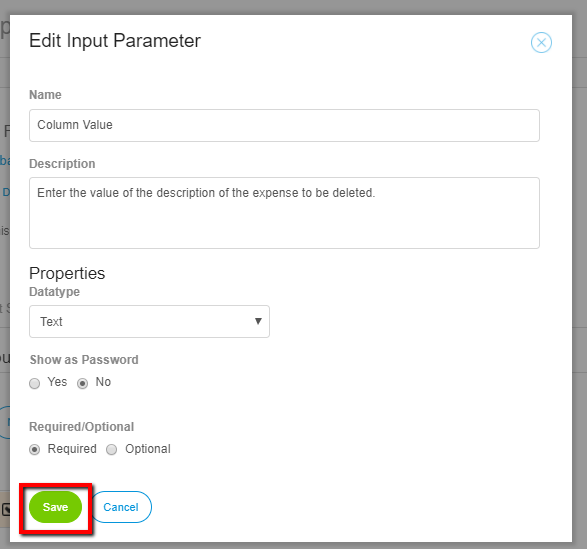

Clicking **Save** adds the input parameter:

You have now created a new input parameter. The next step is to link the input parameter to the correct test step. 

13. Click the **Test steps** tab.
14. Open the **Click DatGrid Row** action.
15. Change the input parameter to **Column Value** below **Input values**

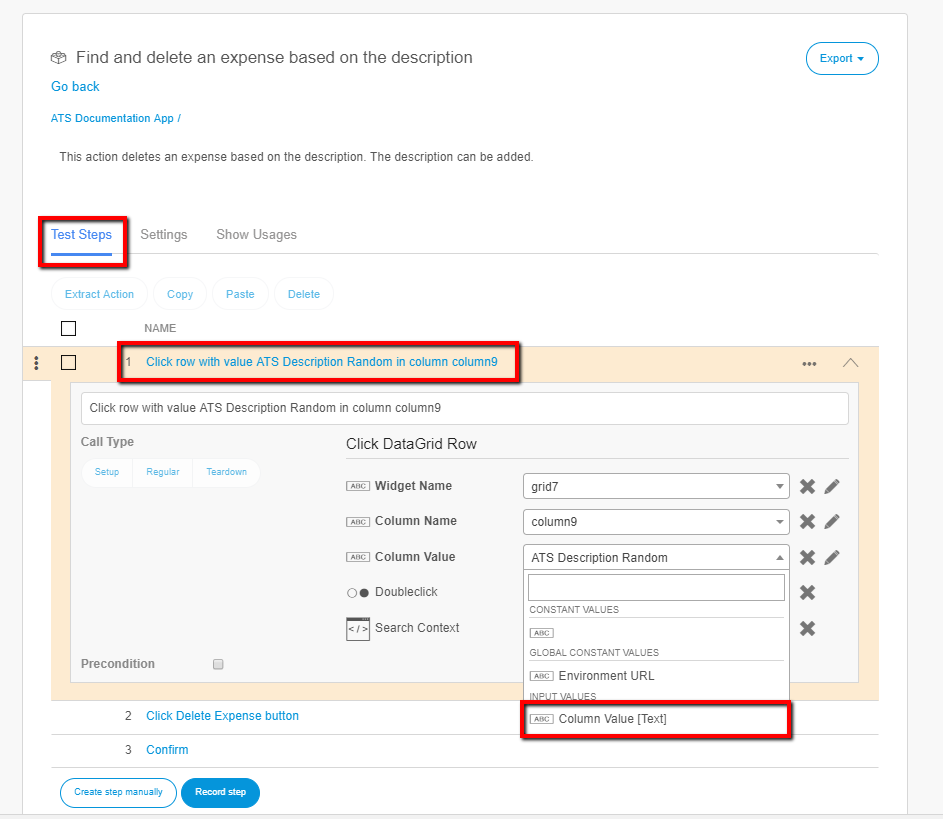

You have nog created the action with which you can delete new expenses based on the description. To check whether the action deletes an expense based on the description add the action to a test case. Enter the **Column Value** and run the test case:

Congratulations, you have created a reusable extracted action to delete a new expense. Every time you want to delete an expense in your test cases you only have to add this actions and enter the input parameter. 

## 4 Next Up

You now learned how to create extracted actions to make your test cases more maintainable. The next how-to is [How to Schedule Test Cases/Test Suites](schedule-testcase-testsuite-2). You find an overview of all the how-tos and the structure on the [ATS 2 How-to's](ht-version-2) page. We advise you to follow the predefined structure.

