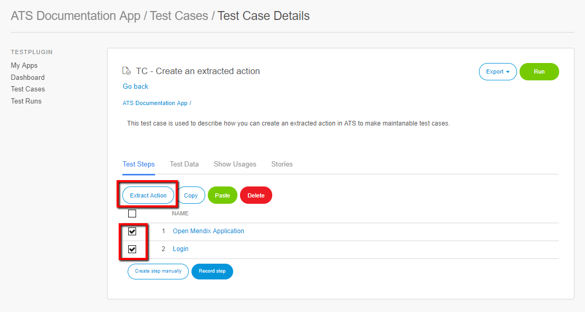
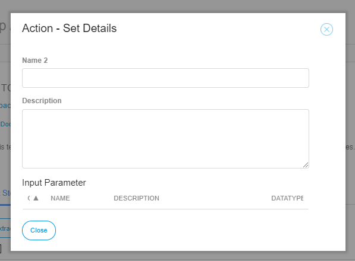
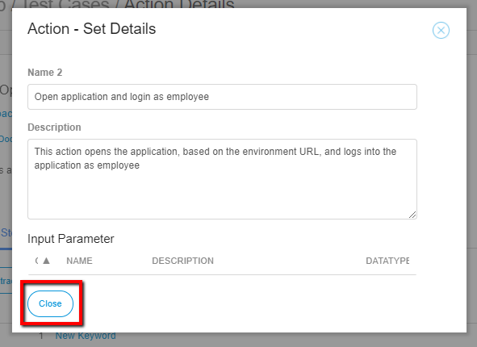
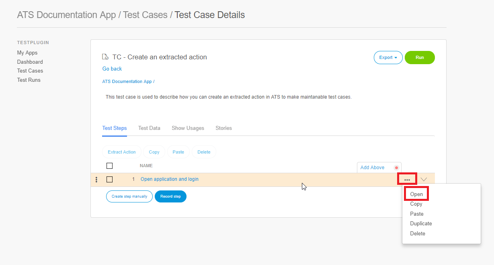
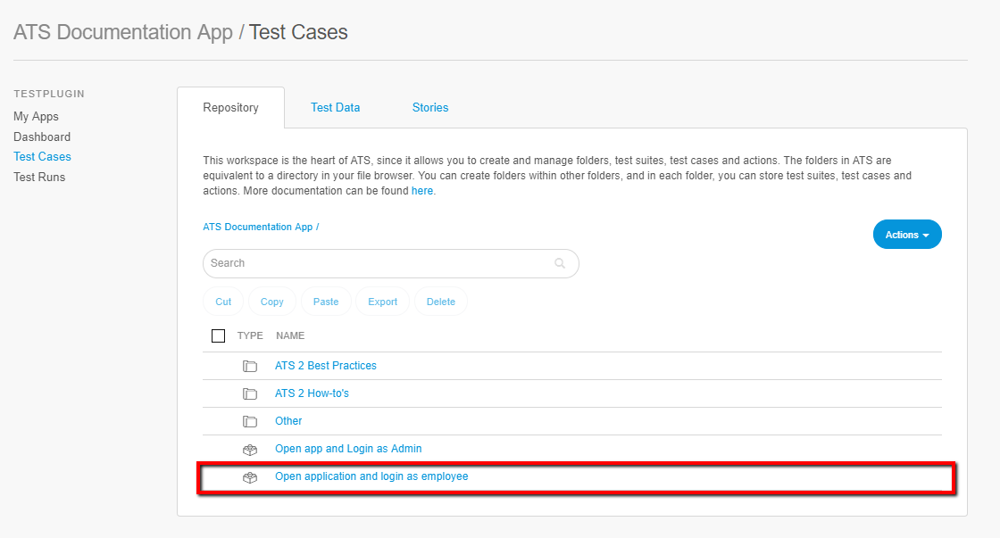

## 1 Introduction

Each sprint new functionality is added to an application. This functionality can be tested with new test cases, after which it can be tested with running the regression test suite. However, each sprint also other changes, like bug fixes, are made. This and the new functionality can break other test cases. So, each test case you have created likely needs maintenance time somewhere during the application life cycle. 

Another example is when the password of a user changes. In case you have 50 test cases that all login as that user, each with the login action, than you need to change the password in 50 test cases. As this is time consuming you would like to have maintaianble test cases, so that you only have to change the password, or something else, in one location and not in different test cases.

This document described how you can create maintanable test cases in ATS. 

**This how-to will teach you how to do the following:**
* Extract actions

## 2 Prerequisites

Before starting with this how-to, make sure you have completed the following prerequisites:

*  Read [How to Get Started](getting-started-2)
*  Read [How to create a test case](create-a-test-case-2)

## 2 Extract actions

Test steps that are used in more than one test case could be combined in a custom action. 

The following steps describe how to extract an action. In the example we create an extracted action for the actions 'Open Mendix Application' and 'Login':

1. First crete a test case. Give it a name and a description.
2. Add the actions 'Open Mendix Application' and 'Login'.
3. Set the **URL** input parameter of the 'Open Mendix Application' to **Environment URL**.
4. Enter the **Username** and **Password** input parameters of the 'Login' action. 
5. Select the checkboxes of both steps.
6. Click **Extract action**

 

 Clicking extract action opens the **Action - Set Details**:

 

7. Enter a name in the **Name** field. (for example, *Open application and login as employee*). Giving it a clear name of what the action does is advised.
8. Enter a description in the **Description** field. (for example, *This action opens the application, based on the environment URL, and logs into the application as employee*). Giving each extracted action a description of what it does is advised.
9. Click **Close**

 

 You have now created an extracted action. To view the test steps in the extracted action follow these steps:

 1. In your test case click the **Drop-down** menu of the extracted action.
 2. Click **Open**

 

 Clicking **Open** opens the **Action Details** page. On this page you see the test steps in the action. In case a password changes, you can change it on the **Action Details** page.

 You can also open your extracted action from the repository, as this action is now added to the repository:

 

 To use this custom action in other test cases follow these steps:

 1. Create a new test case, which you give a name and description.
 2. Click **Create steps manually**.
 The folder with your application name contains all custom and extracted actions.
 3. Select the action you want to add as test step to your test case.
 4. Click **Select**

  

  You have now added your exrtacted action to another test case. Again, if the password changes you only have to change it within the action and not within each test case. This saves time and effort to keep all your test cases up to date. As mentioned before, creating extracted actions can be done for each couple of steps that are used in more than one test case. 

  Additions:
  - Provide meaningful summary for each test case and also try to provide description for each test case to describe what a particular test case is validating.
 -  Use variables for hard coded values like base URL, port numbers or other environment specific things.
 - Try to reduce dependency between test cases as low as possible. -> refer to other document