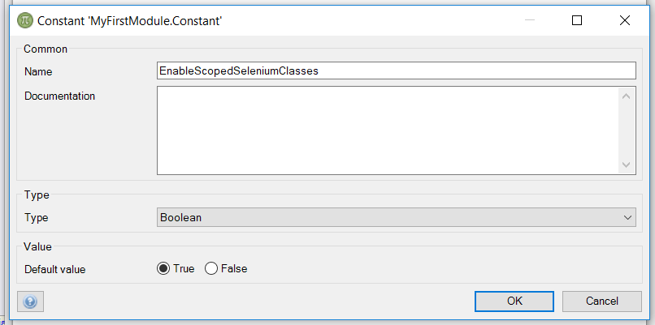
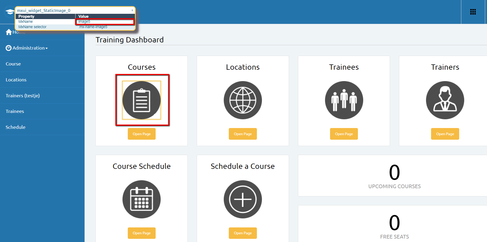
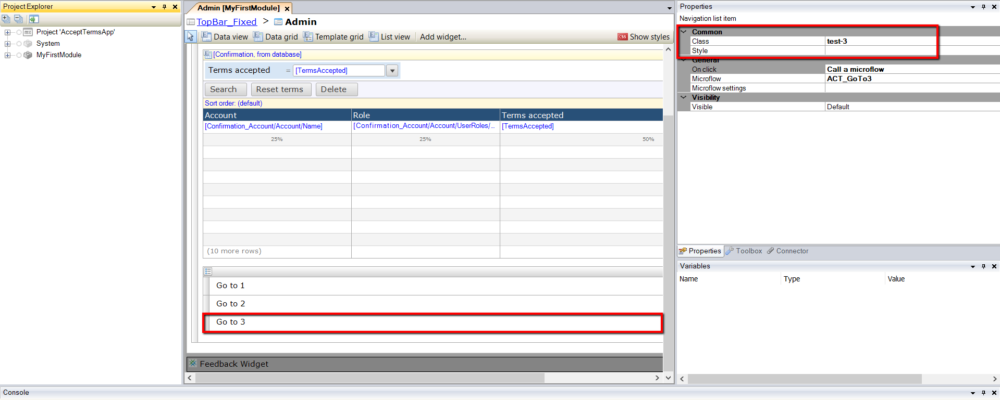
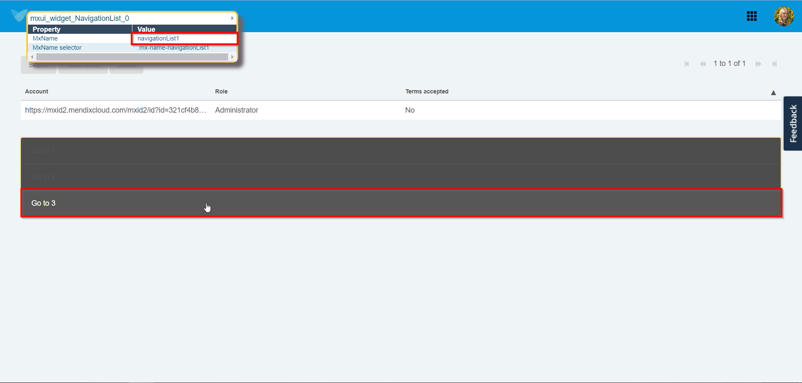
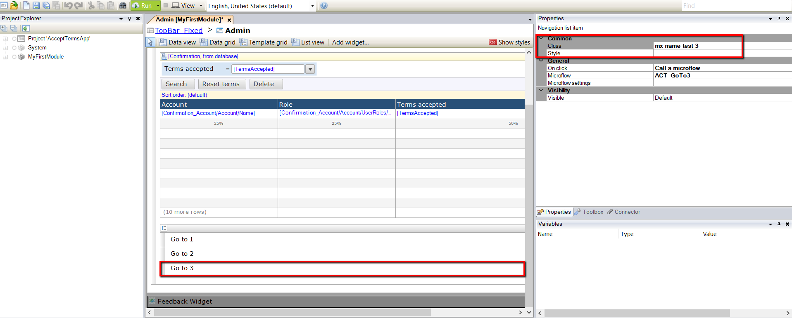
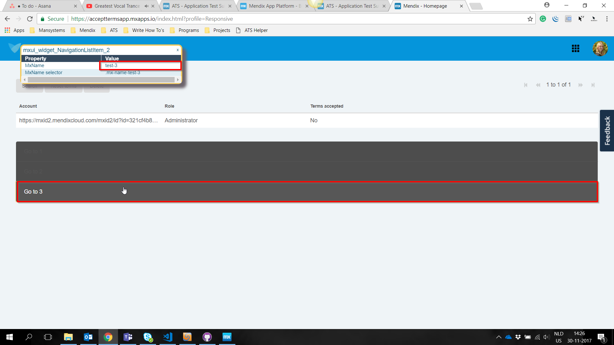

## 1 Introduction

ATS provides two different tools to help build test scripts: the ATS Helper and ATS Recorder. The ATS Helper identifies the mx-name of widgets on the application under test (AUT). But, not all widgets have an mx-name, in which case the ATS Helper cannot interact with them. The ATS Recorder is a function/plugin within ATS that records your manual test steps in the AUT and automatically selects the correct action for each step. However, sometimes the ATS recorder does not record the step you are performing. To increase the ATS Recorder coverage of your AUT and the number of widgets the ATS helper can identify, you can take certain steps. This how-to describes these steps.

**This how-to will teach you how to do the following:**

* How to increase recorder coverage of your AUT with the ATS Recorder.
* How to increase ATS Helper coverage of your AUT.

## 2 Prerequisites
Before starting this how-to, make sure you have the following prerequisites in place:

*  Read and Installed the ATS Helper and Recorder, see [How to Install the ATS Helper and ATS Recorder](install-ats-helper-recorder-2.md)
*  Completed the Rapid Application Developer course

## 3 Increasing ATS Recorder coverage of your AUT

Using the ATS Recorder is the easiest and least time-consuming way to create test cases. So increasing the number of widgets on your AUT that the ATS Recorder can record, simplifies creating test cases and reduces the total time needed. The following steps increase the recorder coverage:

* Giving snippets a unique name
* Give widgets a unique name
* Reduce the use of custom widgets

{}
To put these changes in place, developers must make changes in the Mendix modeler.
{}

The next chapters give a description of how to take each step and how it increases ATS Recorder and ATS Helper coverage of your AUT.

### 3.1 Giving snippets a unique name 

When developers create a snippet in Mendix and reuse that snippet on the same page, the ATS Recorder cannot distinguish them. This can also be the case when developers use several snippets on one page. The ATS Recorder cannot distinguish the snippets, as they do not have a unique name. You enable unique snippet names in the Mendix modeler by adding a constant to your project with certain properties.

{}
This only works for Mendix version 6.10 and above.
{}

To add a constant in the Mendix modeler follow these steps:

1. Open your project in the Mendix modeler and open the project settings.
2. In the **Configuration** tab click **New**. This opens the **New Configuration** dialog.
3. In the dialog click the **Constants** tab and click **New**. This opens the **Select Constant** dialog.
4. Select a module in this dialog where you want to add the constant and click **New**. This opens the **Add Constant** dialog.
5. Enter a name in the dialog and click **OK**. This opens the **Constant** dialog. where you can add the following properties:

* Name: EnableScopedSeleniumClasses
* Type: Boolean
* Default value: True

6. Click **OK**. This opens the **New Constant Value** dialog.
7. Click **OK** in the **New Constant Value** dialog and click **OK** in the **New Configuration** dialog.

You have now added the constant in the Mendix modeler. If you have such a constant anywhere in your project, the mx-name classes of snippets are longer and unique.

### 3.2 Giving widgets a unique name

Your application has many buttons, images, and menu widgets etc. on each page. It is possible that those widgets have the same mx-name, for example, mx-name-actionButton1. The recorder can often record these widgets, but when you run your script it might fail. It might fail because ATS interacts with the first widget it finds with that mx-name. Changing the name in the Mendix modeler to a unique name solves this problem:

### 3.3 Reducing the use of custom widgets

Custom widgets are often designed differently than Mendix widgets. As the ATS Recorder is designed to recognize Mendix widgets. So it can have difficulties recording test steps you take in custom widgets. The advice is to build functionalities as much with Mendix widget as possible. You should only use custom widgets in your application if Mendix widgets do not suffice. To use as many Mendix widgets as possible you should ask yourself questions like:
* Does it add value to the application if I add a custom widget instead of a standard widget?
* Can it be solved in a different way, with the use of standard widgets?

## 4 Increasing ATS Helper coverage of your AUT

Even with the tips from the previous chapter recording every widget on your AUT is likely not possible. But if the ATS Recorder doesn't record a widget, it doesn't mean ATS cannot interact with it. If the ATS Recorder doesn't record certain widgets, you should check with the ATS Helper if that widget has an mx-name. For example, the ATS Recorder might not record clicking on a certain image. But if you check that image with the ATS Helper you see that that image does have an mx-name:

If the image has an mx-name, ATS can *Find, Click, Set, Assert, and Get* these widgets with the standard Mendix actions.

In case the widget doesn't have a unique mx-name or an mx-name at all, the following steps increase the ATS Helper coverage of your AUT:

* Giving buttons a unique name in ATS
* Adding an mx-name in the class of the widget

### 4.1 Giving buttons a unique name in ATS
The previous chapter described that ATS can interact with the correct widget by giving it a unique name in the Mendix modeler. Another way to let ATS interact with the correct widget is by adding another mx-name in the ATS action. ATS will search for the second mx-name within the first mx-name:

You have to add this manually in ATS. To find the mx-name use the ATS Helper in your AUT.

### 4.2 Adding an mx-name in the class of the widget
You can develop a widget without an mx-name, for example, a navigation list with several navigation options:

The ATS Recorder cannot record the options in the navigation list, as they do not have an mx-name. For the same reason, the ATS Helper can not interact with these options. The ATS Helper shows the mx-name of the complete navigation list, instead of the options:

You can manually enter a class in the **Class** of the modeler with an mx-name to solve this:

As the options in the navigation list have an mx-name, the ATS helper can interact with them. In ATS you can *Find, Click, Set, Assert, and Get* these widgets with the standard Mendix actions. ATS can still interact with the options if you add another class as well:

You have given the **Class** an mx-name and not the widget name in the **Name** field, as the options of the navigation list do not have a **Name** field. Widgets that the ATS Recorder recognizes get their mx-name from the name in the **Name** field. For example, the navigation list:

For this reason, recording this widget is still not possible.

With these tips you increase the ATS Recorder and ATS Helper coverage of your AUT. Good luck using these tips.
