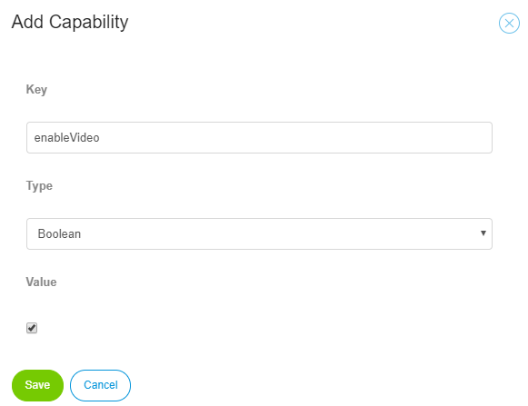
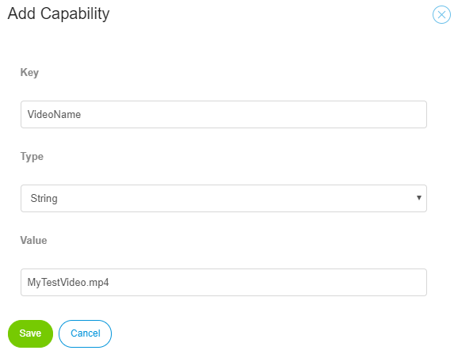
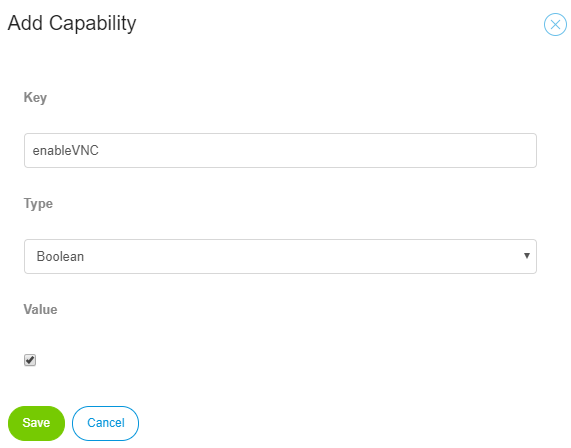
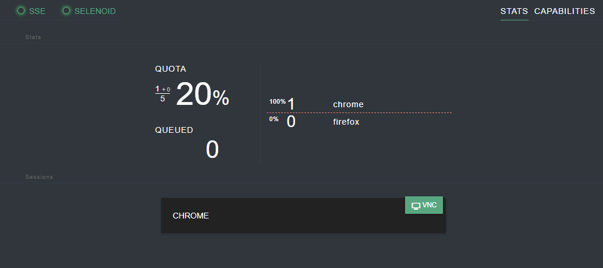
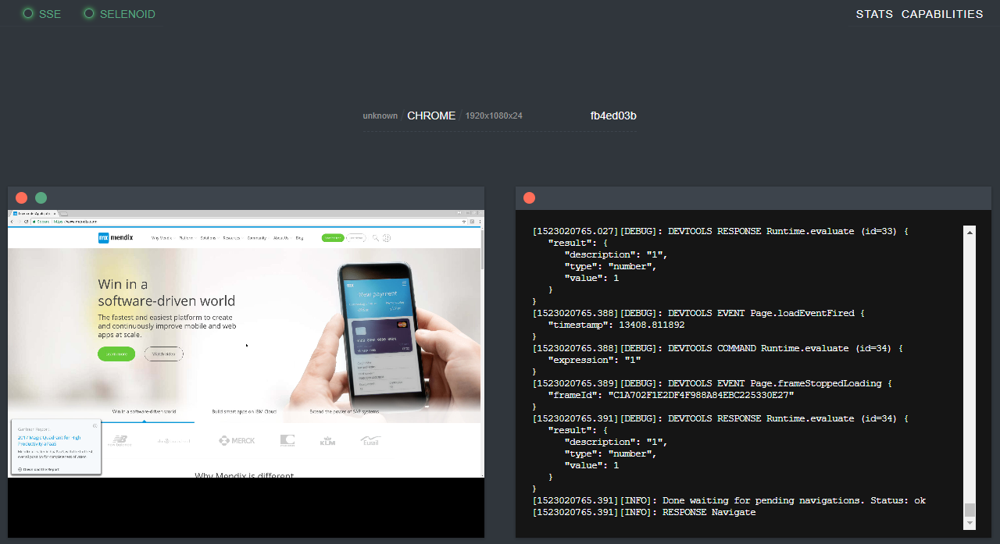

# How-to Setup local Selenoid hub #

In this How-to, we show you an example of a simple setup of a Selenoid hub with a Chrome node and a Firefox node on a Linux machine with docker. This will also work on a Windows machine with docker, but the commands and configuration could be slightly different. The official project can be found here: [https://github.com/aerokube/selenoid](https://github.com/aerokube/selenoid) and the official documentation here: [http://aerokube.com/selenoid/latest/](http://aerokube.com/selenoid/latest/).

It is possible to run Selenoid without Docker, but that is outside of the scope of this How-to. Please refer to the official documenation if you would like to achieve this.

## 1. Prerequisites ##

- Some basic docker and docker-compose knowledge.
- A machine with the latest versions of **docker** and **docker-compose** installed.
- Your machine should allow connections from ATS on port 4444.


## 2. Install your hub and nodes with Docker-Compose ##

- Create a folder or directory to place your docker-compose.yml and browser.json files.

In our example **/docker**

- Create a folder or directory to place your video files

In our example **/docker/video**

- Create a browser.json in your folder/directory (/docker)

```
{
        "firefox": {
                "default": "58.0",
                "versions": {
                        "58.0": {
                                "image": "selenoid/firefox:58.0",
                                "port": "4444",
                                "path": "/wd/hub",
                                "tmpfs": {"/tmp":"size=512m"}
                        }
                }
        },
        "chrome": {
                "default": "65.0",
                "versions": {
                        "65.0": {
                                "image": "selenoid/chrome:65.0",
                                "port": "4444",
                                "tmpfs": {"/tmp":"size=512m"},
                                "shmSize" : 1073741824
                        }
                }
        }
}
```

- Create a docker-compose.yml in your folder/directory (/docker)

```
version: '3'
services:
  selenoid:
    network_mode: bridge
    image: aerokube/selenoid
    volumes:
      - "/docker:/etc/selenoid"
      - "/var/run/docker.sock:/var/run/docker.sock"
      - "/docker/video:/opt/selenoid/video"
    environment:
      - OVERRIDE_VIDEO_OUTPUT_DIR=/opt/selenium/video
      - TZ=Europe/Amsterdam
    command: ["-conf", "/etc/selenoid/browsers.json", "-video-output-dir", "/opt/selenoid/video"]
    ports:
      - "4444:4444"
```

- Open a console and give the following commands to pull the images first:

```
sudo docker pull selenoid/chrome:65.0
sudo docker pull selenoid/firefox:58.0
sudo docker pull selenoid/video-recorder
sudo docker pull aerokube/selenoid
```

- Open a console and give the following command from the folder/directory where your docker-compose.yml is placed:

```
sudo docker-compose up -d

Starting docker_selenoid_1 ... done
```

- After it's done starting, you can check the status

```
sudo docker-compose ps
      Name                     Command               State           Ports         
-----------------------------------------------------------------------------------
docker_selenoid_1   /usr/bin/selenoid -conf /e ...   Up      0.0.0.0:4444->4444/tcp
```

- To check the status of the hub

```
curl -s http://localhost:4444/status

{"total":5,"used":0,"queued":0,"pending":0,"browsers":{"chrome":{"65.0":{}},"firefox":{"58.0":{}}}}
```

## 3. Start Testing ##

You can start testing by sending your test script to: [http://yourmachinenameorIP:4444/wd/hub](http://localhost:4444/wd/hub).  Make sure it is reachable from the outside!

## 4. Recording a video of your Test Case ##

In case you want to record your test case as a video

- Add a Custom Capability to your Selenium hub configuration:

**enableVideo** with a boolean set to **true**



- Once the test case is finished you will find your video in:  [http://yourmachinenameorIP:4444/video](http://localhost:4444/video)

It will show as "sessiom-id.mp4"

- (Optional:) You can give the video file a custom name by adding another Custom Capability:

**VideoName** and as a string your name, for example **MyTestVideo.mp4** (don't forget the .mp4!)



After executing the test case, don't forget to download the video file or give it a different in the next session, otherwise it will be overwritten!

## 4. Optional: Installing a hub with a Portal with "Live-View" ##

You will need a slightly different browser.json and docker-compose.yml file

- browser.json (with vnc browser images):

```
{
        "firefox": {
                "default": "58.0",
                "versions": {
                        "58.0": {
                                "image": "selenoid/vnc:firefox_58.0",
                                "port": "4444",
                                "path": "/wd/hub",
                                "tmpfs": {"/tmp":"size=512m"}
                        }
                }
        },
        "chrome": {
                "default": "65.0",
                "versions": {
                        "65.0": {
                                "image": "selenoid/vnc:chrome_65.0",
                                "port": "4444",
                                "tmpfs": {"/tmp":"size=512m"},
                                "shmSize" : 1073741824
                        }
                }
        }
}
```

- docker-compose.yml (with added selenoid UI for the portal):

```
version: '3'
services:
  selenoid:
    network_mode: bridge
    image: aerokube/selenoid
    volumes:
      - "/docker:/etc/selenoid"
      - "/var/run/docker.sock:/var/run/docker.sock"
      - "/docker/video:/opt/selenoid/video"
    environment:
      - OVERRIDE_VIDEO_OUTPUT_DIR=/docker/video
      - TZ=Europe/Amsterdam
    command: ["-conf", "/etc/selenoid/browsers.json", "-video-output-dir", "/opt/selenoid/video"]
    ports:
      - "4444:4444"

  selenoid-ui:
    image: "aerokube/selenoid-ui"
    network_mode: bridge
    links:
      - selenoid
    ports:
      - "8080:8080"
    command: ["--selenoid-uri", "http://selenoid:4444"]
```

- Pull the images first

```
sudo docker pull selenoid/vnc:chrome_65.0
sudo docker pull selenoid/vnc:firefox_58.0
sudo docker pull aerokube/selenoid-ui
```

- Start the hub

```
# sudo docker-compose up -d

Creating docker_selenoid_1 ... done
Creating docker_selenoid-ui_1 ... done

sudo docker-compose ps

        Name                      Command               State           Ports         
--------------------------------------------------------------------------------------
docker_selenoid-ui_1   /selenoid-ui --selenoid-ur ...   Up      0.0.0.0:8888->8080/tcp
docker_selenoid_1      /usr/bin/selenoid -conf /e ...   Up      0.0.0.0:4444->4444/tcp 
```

- You can visit your portal on [http://yourmachinenameorIP:8080](http://localhost:8080)

- To enable "Live-View" you need to add another Capability to your Selenium hub configuration:

**enableVNC** with a boolean set to **true**



- After starting your test case you will your session in the portal:



- By clicking on your session, you will be able to see your live view:



