## 1 Introduction

To create more logic in test cases and more difficult test situations ATS has the possibility to add preconditions for test steps in your test cases. Maybe you have an application that sometimes shows a dialog after you login with your open or new orders. If you do not know in advance whether you see the dialog after you login makes it difficult to prepare test cases, as you sometimes need the **Close Dialog** action but not always. To make sure your test cases do not fail due to the presence, or the absence, of the Dialog you could add a preconditions with the action **Find/Assert Dialog**. If a dialog is found, so the precondition is successfull, the actual test step **Close Dialog** will be executed. In case no dialog is found, so the precondition fails, the actual test step **Close Dialog** is skipped and the test case continues with the next step. This is just an example of when you can use a precondition, there are many more situations.

This how-to uses the Mendix Company Expenses app as an example. In this how-to you will create a test case that clicks on a specific expense to view the details, but we do not know on which page of the datagrid that expense is present. So the test case searches for that expense on the first page of the datagrid. If it is present it click on it, but if it is not present it click on the next button to go to the next page of the datagrid and again check if the expense is present there and if so click on it.  

In the company expenses app I want to click on the following expense to view the details:

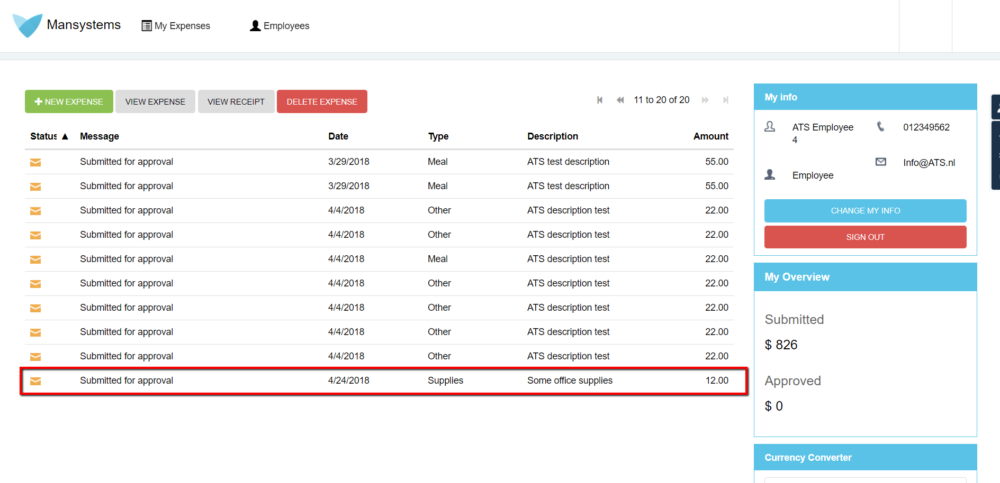

**This how-to will teach you how to do the following:**
* How to use precondition in test cases
* Analyzing the results of a test case with preconditions

## 2 Prerequisites

Before starting with this how-to, make sure you have completed the following prerequisites:

*  Read [How to Get Started](getting-started-2)
*  Read [How to create a test case](create-a-test-case-2)

## 3 How to use precondition in test cases

The following steps explain how to create a test case with preconditions: 

1. Open ATS and go to your project.
2. Click the **Test Cases** menu item to go to the **Repository tab**.
3. Create a new test case and record the following steps:
    * Open the company expenses app
    * Login as employee
    * Logout

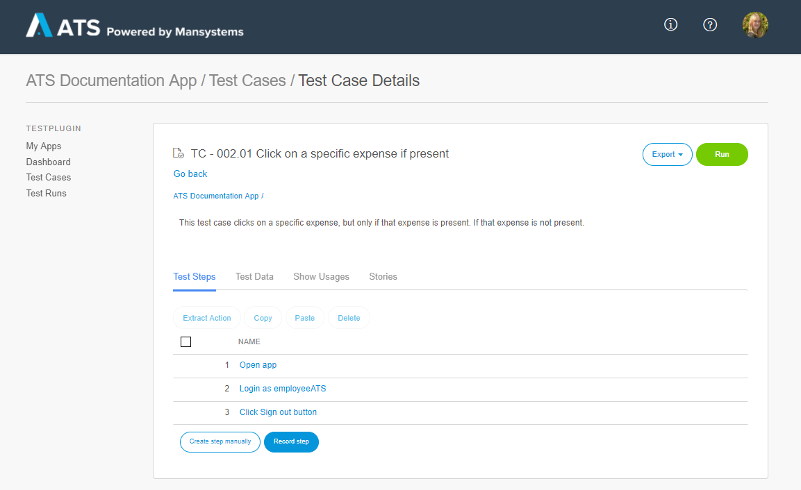

4. Add the actions **Find/Assert DataGrid Row**. Give it a description and enter an output value name.

The action **Find/Assert DataGrid Row** is added instead of **Click DataGrid Row**, as that action has an output parameter we need in the next steps.

5. Enter grid7 in **Widget Name**, column9 in **Column 1 Name** and Some office supplies in **Column 1 Value**. You can make the search for this datagrid row more specific by entering more column names with values.
6. Check the **Precondition** checkbox.
7. Click **Setup precondition**.

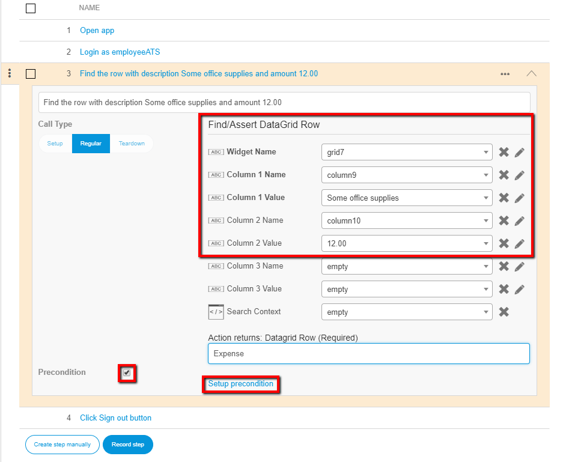

Clicking **Setup precondition** opens the **Select funtion or action** dialog:

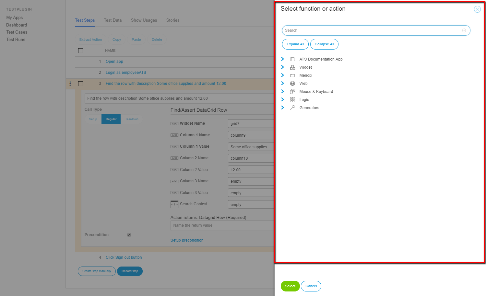

8. Add as precondition the **Find/Assert DataGrid Row** action. You add this action as precondition as well, as you do not want the test case to fail if the expense couldn't be found.
9. Enter the same values in the input parameter fields:

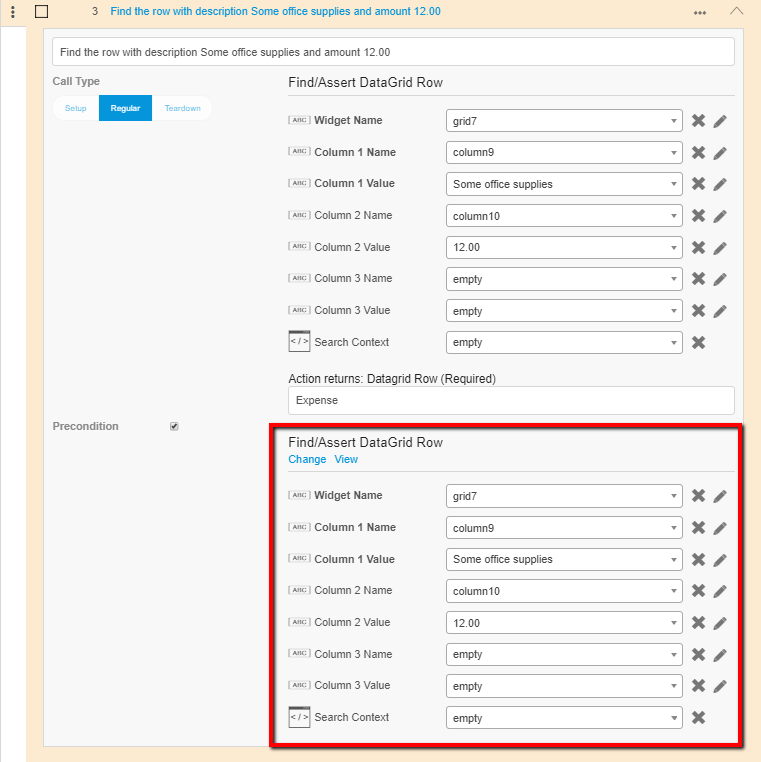

Now you want to doubleclick on the expense, but only if the expense is found on that page.

10. Add the **Click/Doubleclick** action and enter a description. 
11. Refer the **Element** input parameter to the output of the previous step. Also set **Doubleclick** to true. 
11. Add as precontition the **Assert not equalTo** action.
12. Refer the **Object 1** input parameter of the precondition to the output of the previous step. Leave **Object 2** empty:

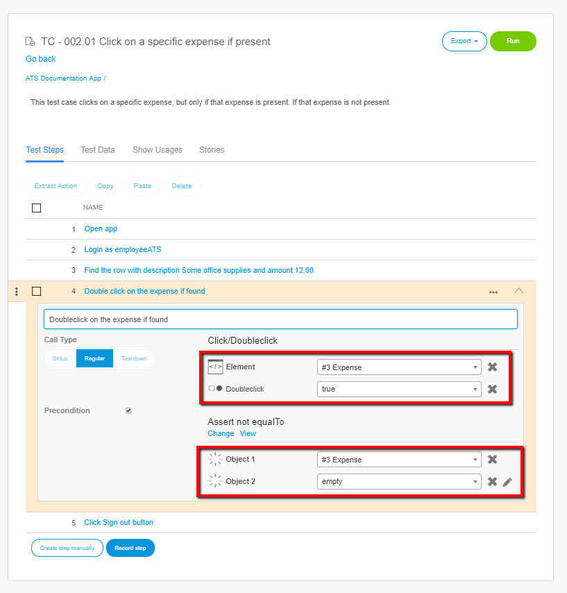

By adding the **Assert not equalTo** action as precondition the action is only executed if the expense is found on the previous step. If step 3 is not executed the output of step 3 is empty. The **Assert not equalTo** action then asserts empty with empty, which are equal to each other. So the precondition fails and the actual test step is not executed. 

These two steps are sufficient to only click on the expense in case the expense is present on the page. But if the expense is not present on the page, nothing is clicked. With the following steps you search the next chunk in the datagrid for that expense.

13. Add the step to go to the next page of the datagrid by recording clicking **Paging-next**:

14. Add as precondition the **Assert equalTo** action.
15. Refer the **Object 1** input parameter of the precondition to the output of step 3. Leave **Object 2** empty: 

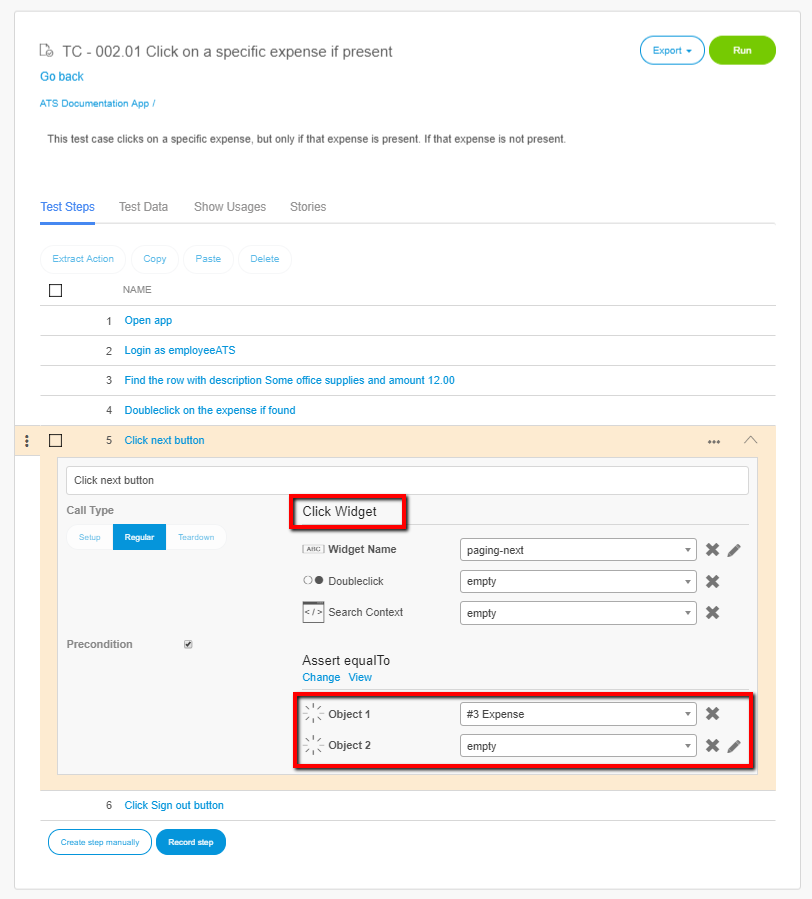

By adding the **Assert equalTo** action as precondition the action is only executed if the expense is not found in step 3. If step 3 is not executed the output of step 3 is empty. The **Assert equalTo** action then asserts empty with empty, which are equal to each other. So the precondition is succesfull and the test step is executed.

16. Add the action **Find/Assert DataGrid Row** to be able to find the expense on this page. Fill in the fields as in the previous **Find/Assert DataGrid Row** action.
17. Add the precondition **Assert equalTo**. Refer **Object 1** again to step 3:

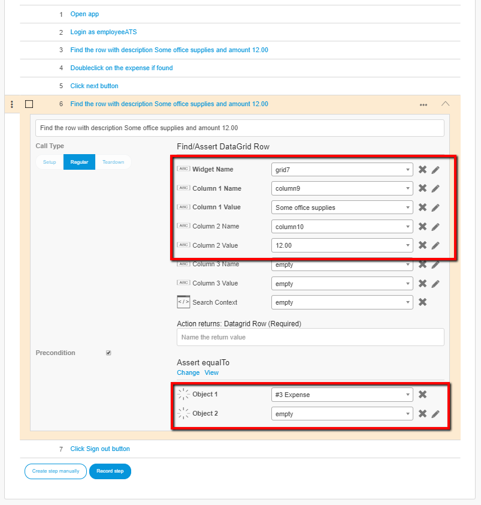

18. Add the action **Click/Doubleclick**. Give the action a description.
19. Add the precondition **Assert equalTo**. Refer **Object 1** again to step 6:

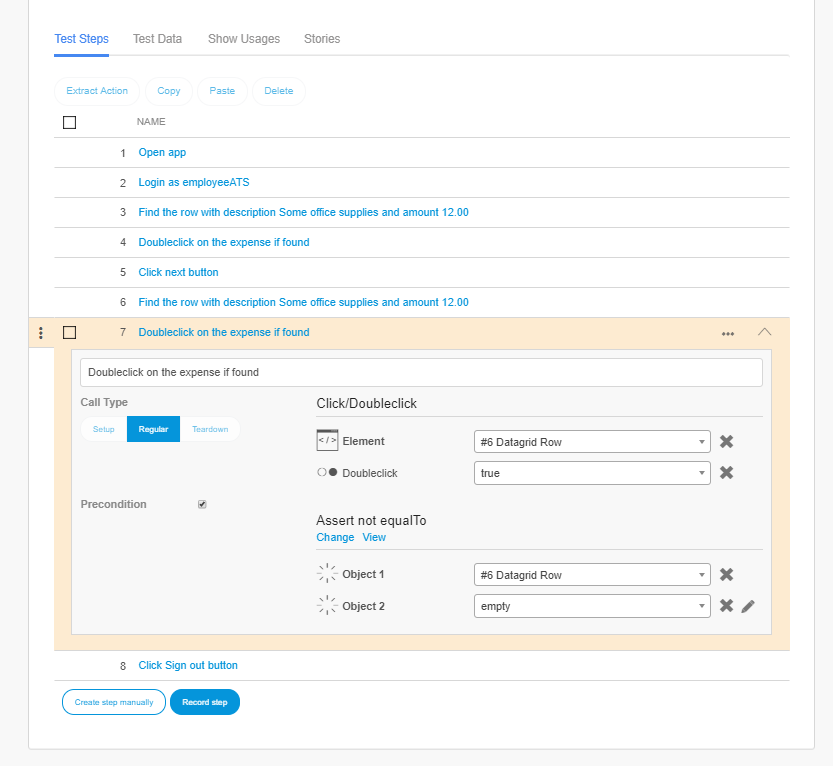

20. The last step that you should add is the **Close Dialog** step, as doubleclicking on an expense opens the **New Expense** dialog:

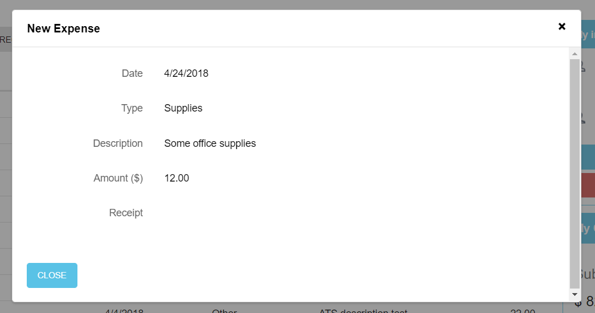

Before you run the test case you should define setup and teardown steps. The final test case looks like the image:

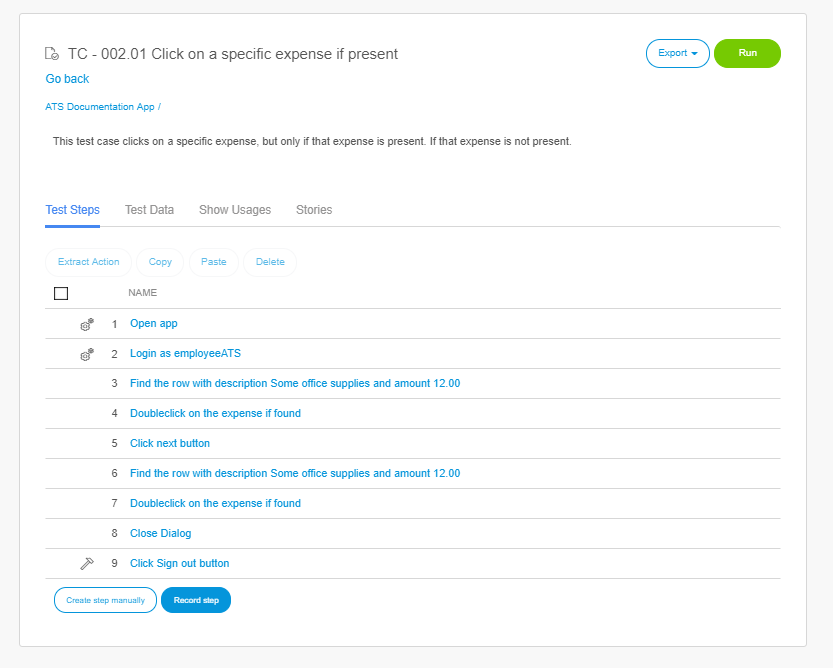

## 4. Analyzing the results of a test case using preconditions

Congratulations you have successfully created a test case using preconditions. This is just an example of what you can do with preconditions, there are many more options like a negative test case. 

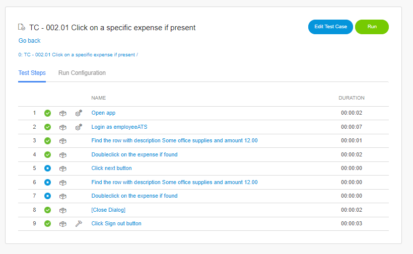

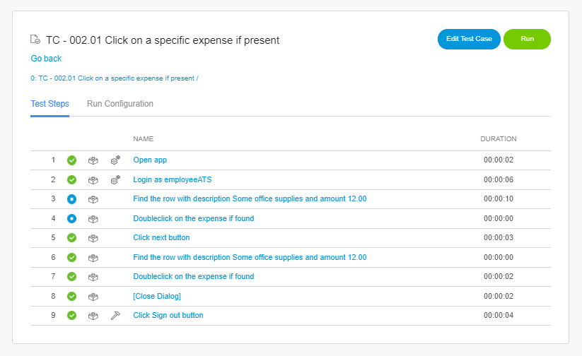

How the test run looks if it is on the first page and how the test run looks on the seocnd page