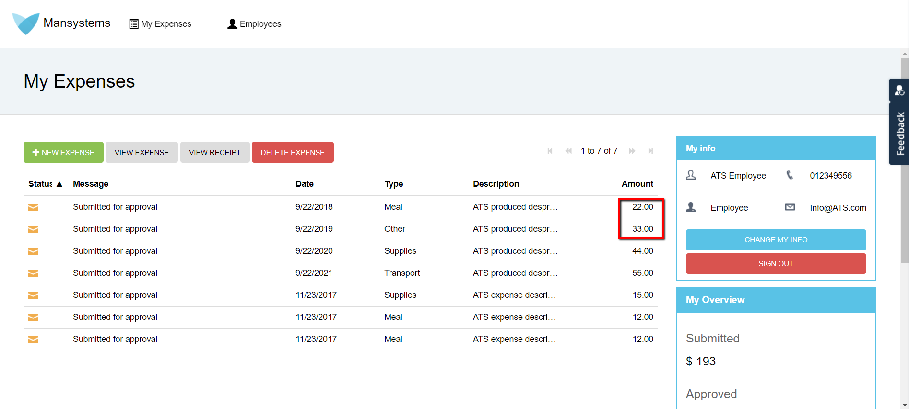
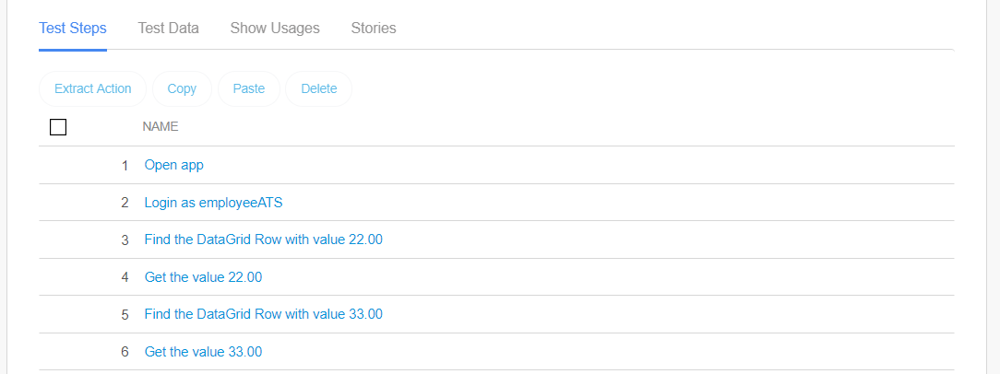
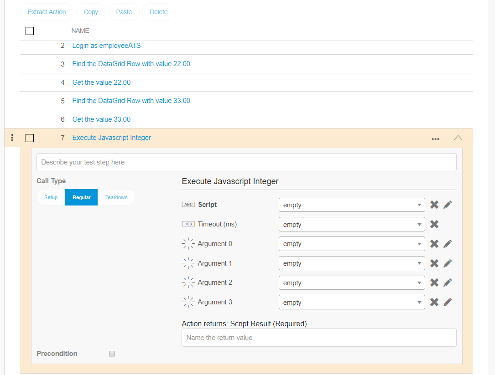
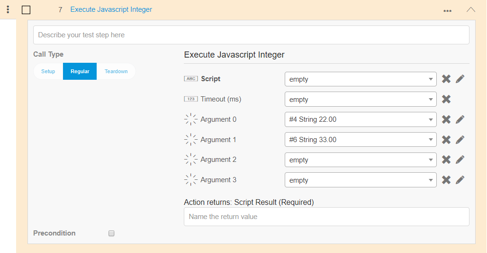
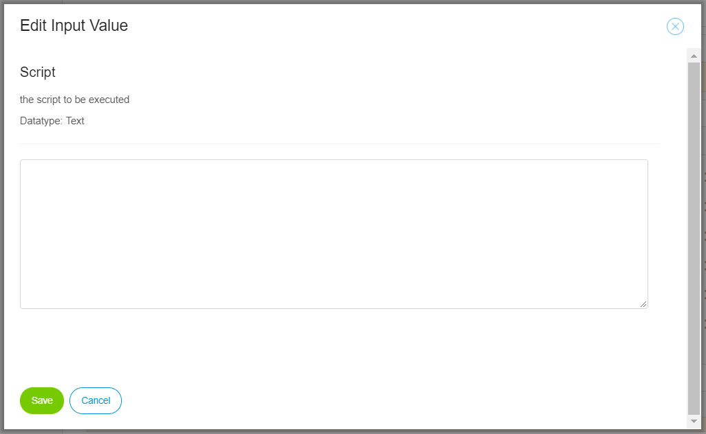
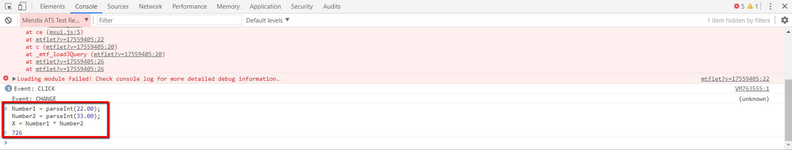
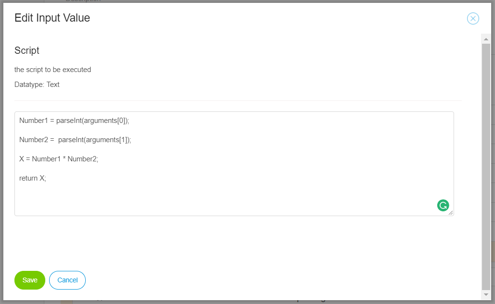

## 1 Introduction

There are many Mendix and core actions in ATS. But not everything you want to test in your application under test (AUT) might be possible with those actions. To make it possible to extend the testing possibilities of ATS the **Execute JavaScript** action is provided. 

Examples of what you can do with the **Execute JavaScript are:

* Create actions that can calculate
* Create actions to scroll on your page
* Create actions to log into your application if your application doesn't use the standard Mendix login page
* Create actions that interact with webelements on your page

This how-to described how to use the **Execute Javascript**.

**This how-to will teach you how to do the following**

* Use the execute JavaScript actions

## 2 Prerequisites

Before starting this how-to, make sure you have completed the following prerequisite:

* Read [How to Create a Test Case](create-a-test-case-2)
* Have basic JavaScript knowledge
* Have basic JQuery knowledge

## 3 Using the execute JavaScript actions

ATS provides three different Execute JavaScript actions:

* [Execute Javascript Integer](/refguide/rg-version-1/execute-javascript-integer)
* [Execute Javascript String](/refguide/rg-version-1/execute-javascript-string)
* [Execute Javascript WebElement](/refguide/rg-version-1/execute-javascript-webelement)

The difference between these actions is the item ATS returns:

| JavaScript action | Returns | Examples |
| :--- | :--- | :--- |
| Execute JavaScript Integer| Integer |  "2", "-50"|
| Execute JavaScript String | String | "ATS123", "Helloworld!"|
| Execute JavaScript WebElement | Web element | Checkbox, Dialog |

So if your JavaScript returns a String, you should use the **Execute JavaScript String** action etc.

### 3.1 Simple calculation

In this example you use the **Execute JavaScript Integer** to do a calculation in the compnay expenses app. In the application you are going to multiply the following values 22.00*33.00:

The following steps explain how to add the **Execute JavaScript Integer** action for this calculation:

1. Open your project in ATS and add a test case
2. Add the following actions in your test case with the appropriate input parameters:
* Open application
* Login
* Find/Assert DataGrid Row
* Get Row Cell Value   
* Find/Assert DataGrid Row
* Get Row Cell Value

The **Find/Assert DataGrid Row** in combination with the **Get Row Cell Value** are added to retrieve the values 22.00 and 33.00 from the DataGrid Row. 

3. Add the **Execute JavaScript Integer** action:

4. Link **Argument 0** to the outputvalue of test step 4 and **Argument 1** to the outputvalue of test step 6:

5. Click the pen icon of the **Script** input parameter.

Clicking the pen icon opens the **Edit Input Value** dialog:

In this dialog you can add the JavaScript code. 

6. Go the the company expenses app and open the Debugger.

In the Debugger you can write your code and see if it works. It takes less time to edit the code in the Debugger than with rerunning your test case:

 

7. Add the code to multiply the values in the **Edit Input Value** dialog. Edit the code in such a way that it now referce to the arguments:

8. Add the **Assert Equals** action to check if your code is correct:

9. Run the script to check if your code is correct.

This is an example of a simple JavaScript calculation in ATS. there is much more you can do with this in ATS. To help you write code also read [Helpfull Resoucres](/howtos/ht-version-1/custom-action-helpful-resources) and [Selectors](/refguide/rg-version-1/selectors.md).

Ook een base on example of clicking in the middel of a button? 
timeout something about
mtf.$ ipv $

