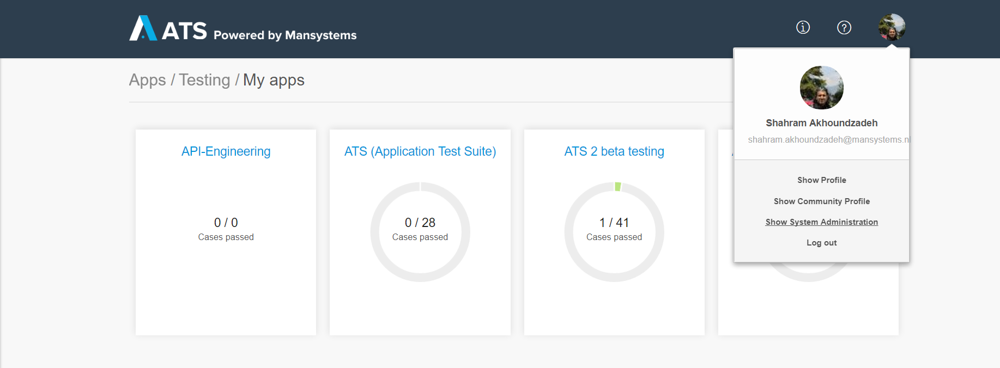
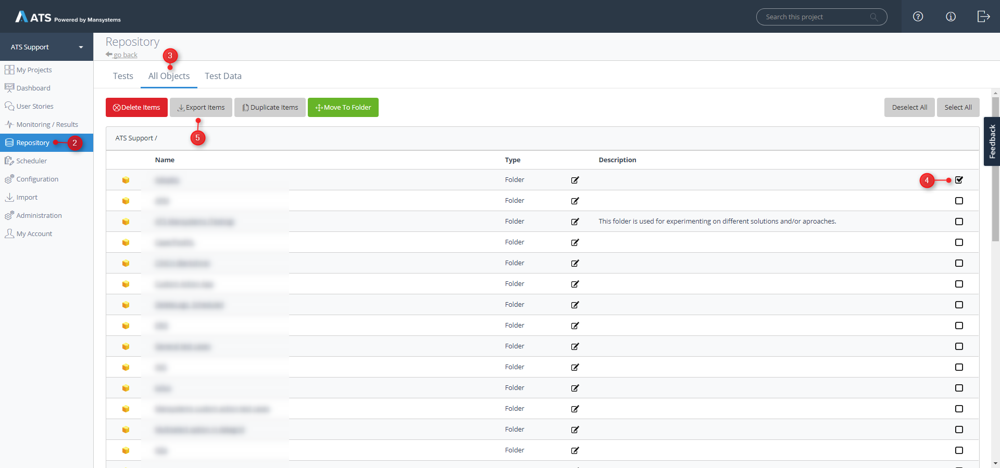
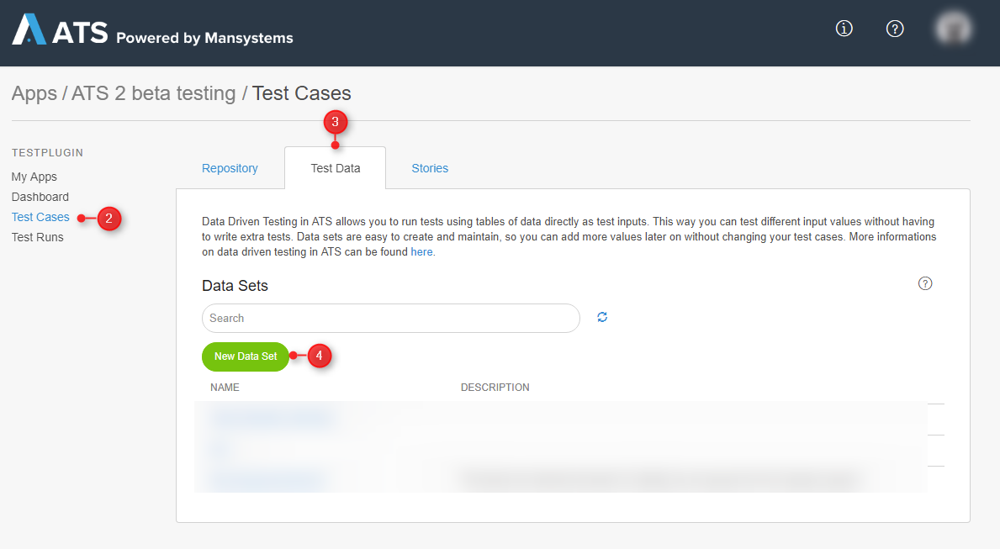
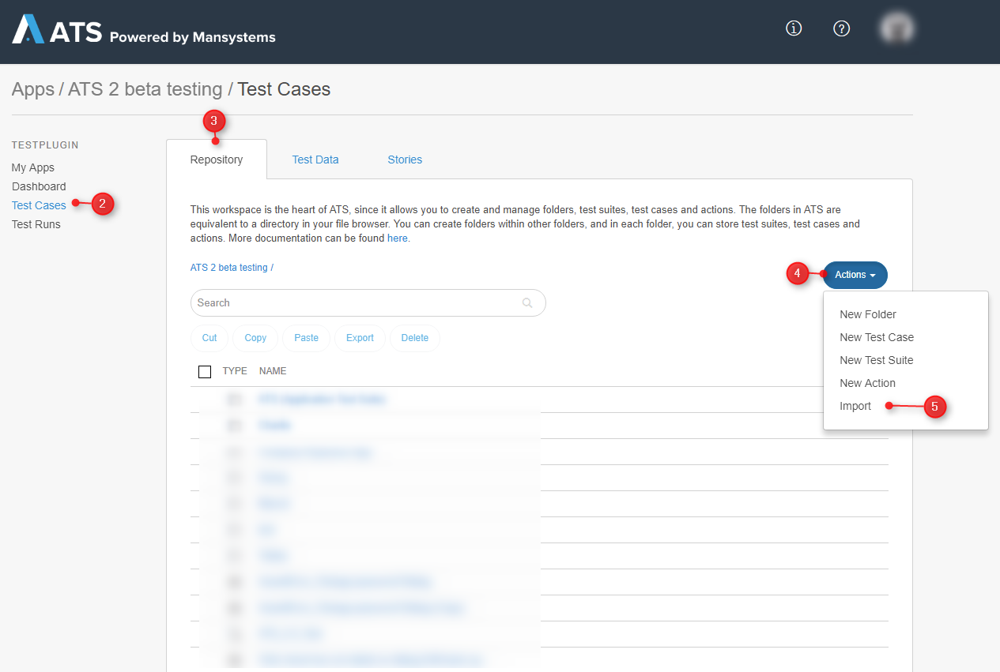
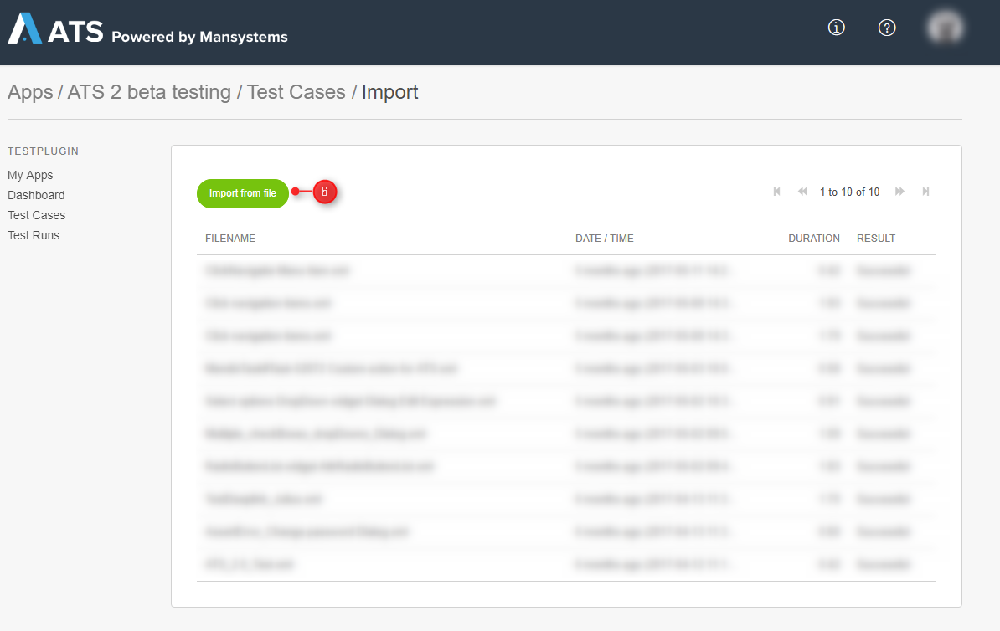
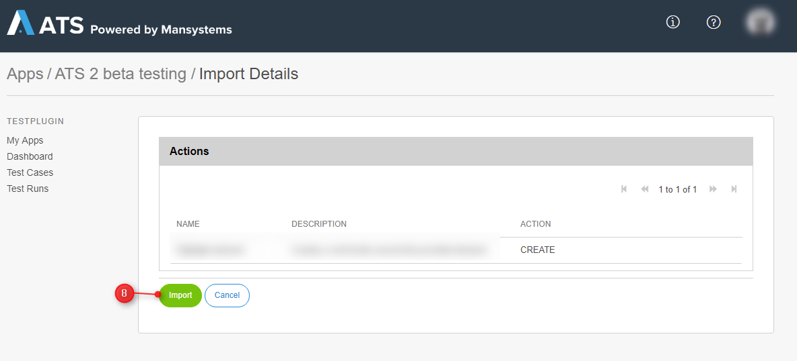
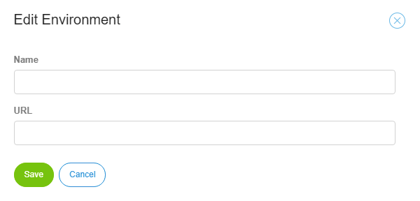
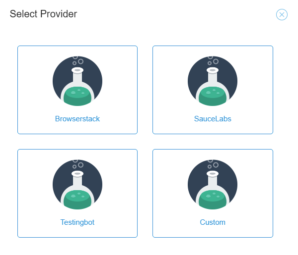

## 1 Introduction

This how-to describes the steps for moving your data from ATS 1.8 to ATS 2.0.

**This how-to will teach you how to do the following:**

* Add your app to ATS 2.0
* Import and export your data
* Configure the test settings

Before starting with the update, please take notice of the following:

* It is **not** possible to migrate the test results of ATS 1.8 to ATS 2.0
* You must export all your test data and repository items and import them into ATS 2.0
* Each project/app in Mendix Sprintr resembles an app in ATS 2.0
* User accounts, apps and app permissions are automatically synced from Mendix Sprintr

## 2 System Administration

### 2.1 Add your App

1. Open the app you want to test in Sprintr.
2. Go to **Settings** and click **General**.
3. Copy the **App ID**.
4. Go to [ATS 2.0](https://ats100.mendixcloud.com) in the cloud. Log in with your Mendix account if needed.
5. Open the profile menu and click **Show System Administration**.

6. Click the **New** button in the **System Administration** page.

 

7. Enter the Mendix App ID retrieved in step 3. Enter the **Customer Name** and click **Save**.

  

## 3 Data Administration

You must export all test datasets and repository items from your ATS 1.8 environment and import them into ATS 2.0. This chapter explains these steps.

### 3.1 Export Data Sets

1. Open your ATS 1.8 environment.
2. Go to the **Repository**.
3. Open the **Test Data** tab.
4. Select the data set and click the tab **Records**.
5. Click **Export to Excel**.

Repeat this process for all data sets. Store them in a separate folder for easy importing later on.

### 3.2 Export All Objects

1. Open your ATS 1.8 environment.
2. Go to the **Repository** and open the **All Objects** tab.
3. Click the checkbox of an item. Now click the **Select All** button.
4. When you have selected all items. Click **Export Items**.

 

### 3.3 Import Data Sets

Now you must create all the data sets and upload the corresponding excel file.

1. Open your app in ATS 2.0.
2. Click the **Test Cases** navigation menu.
3. Click the **Test Data** tab.
4. Click the **New Data Set** button.

  

5. Enter the same **Name** as in ATS 1.8. The excel file name minus the date is the name of the data set in ATS 1.8.

6. Check the box **Create/Update fields from file** and select the file from your folder.

7. Click **Save**.

  

Repeat this process for all remaining data sets.

### 3.4 Import All Object in ATS 2.0

1. Open your app in ATS 2.0. 2. Click the **Test Cases** navigation menu. 3. Click the **Repository** tab. 4. Click the **Actions** drop-down.

5. Click **Import** in the drop-down.

 

6. Click the **Import from file** button. 

7. Select the all objects file you exported in chapter 3.2.

8. If there are no errors after loading you must click **Import**.

## 4 Test Settings

### 4.1 Environment Setting

1. Open your app in ATS 2.0.
2. Click the profile menu.
3. Click **Show Test Settings**.

4. Click **New** under **Environments**.
5. Enter a **Name** for the app and the URL.

### 4.2 Selenium Hub

1. Open your app in ATS 2.0.
2. Click the profile menu.
3. Click **Show Test Settings**.

4. Click **New Selenium Hub** under **Selenium Hubs**.
5. Select one of the selenium options and walkthrough the wizard.

You now succesfully updated your ATS 1.8 environment to ATS 2.0.