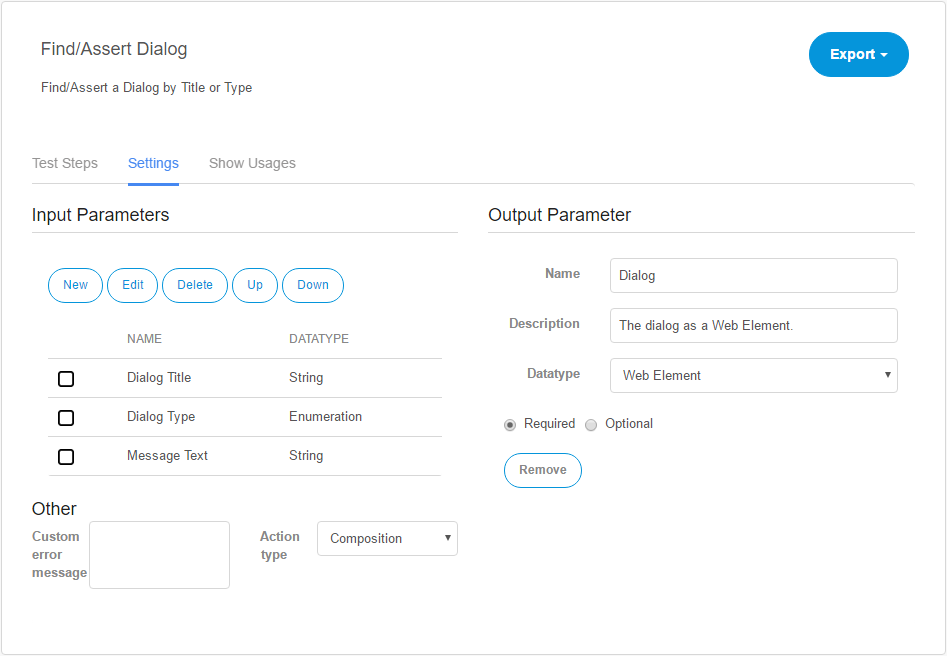

## Action

Actions are prototypes of test steps and work like building blocks for test cases. Actions can consist of many other actions.

Unlike a test case, an action cannot run on its own.

In ATS you can create a new action by going to **Test Cases **in the navigation menu and clicking **New Action** in the **Actions** dropdown in the **Repository** tab. A dialog will open where you can give your action a name and an optional description. After you have created a new action, click its name and the **Action Details** page will open.

Another way to create a new action is to extract an action out of test steps from a test case. For more information on how to extract an action, see the section "Extract Action, Copy, Paste, Delete" of the [Test Case reference](test-case).

## Action Details

On top left of the **Action Details** page you will find the name and the description of the action. To change them, click them and edit the text. ATS will save the changes automatically.

On top right of the page, you will find the Export dropdown, where you can **export** the action definition. This will create a XML file, which you can import into another ATS project.

### Test Steps

Test steps describe the actions that ATS will perform. You can add new test steps by searching an action in the **Add step** box. For a more detailed search for an action you can use the **Test Step Setup** dialog by clicking .

Another way of adding test steps to a test case is to use the recorder by clicking **Record**. For more informations, read the [recorder chapter](recorder) of this reference guide.

The details of a test step will open by clicking the test step description. For more information, read the [Test Step](test-step) section of this reference guide.

### Settings

Under the settings tab, you can set the **Input-** and **Output parameters** of the action. These optional parameters can pass values to the action or return the outcome of an action.

#### Input Parameters

An input parameter is a value, that you can use inside your action. The input parameter corresponds to the [Action parameter](test-step#action-parameter) of a test step. An action can have multiple optional or required input parameters, but only one output parameter.

The following table describes the buttons under Input parameters:

| Button label | Description |
| --- | --- |
| New | Creates a new input parameter. It will open a dialog, where you can give the input parameter a name, an optional description and set the input parameter properties. |
| Edit | Opens the edit dialog for a selected input parameter. |
| Delete | Deletes a selected input parameter. |
| Up | Swaps the order of the selected input parameter with the input parameter above. |
| Down | Swaps the order of the selected input parameter with the input parameter below. |

To create a new input parameter, press the **New** button below Input parameters. This will open a dialog, where you can give the input parameter a name and an optional description.

Under properties you will find extra settings for the input parameter:

| Property name | Description |
| --- | --- |
| Datatype | The specified datatype of the input parameter |
| Show as password | If set to yes, ATS will display the value of the input parameter as asterisks.  |
| Required/Optional | If set to _required_, the input parameter has to be set in the test step details. Otherwise, ATS will not run the action. |

#### Output Parameter

An output parameter is the outcome of an action. Each action can only have one output parameter or none. ATS uses output parameters to make the outcome of an action available to other actions or test steps.

To set an output parameter click the **Set** button under Output Parameter.

The page will change and the following input fields will appear:

| Name | Description |
| --- | --- |
| Name | The name for the output parameter. |
| Description | An optional description for the output parameter. |
| Datatype | The datatype of the output parameter. |

To pass the outcome of your action to the output parameter, you will have to call the _Set return value_ action in your action. ATS will use the input value of _Set return value_ action as the output parameter of the current action.

If you want to remove the output parameter from your action you can do so, by clicking **Remove**.

### Show Usages

The Show Usages tab gives an overview of all other actions used in the current action. Besides that, it also shows other actions and test cases that use the current action.

