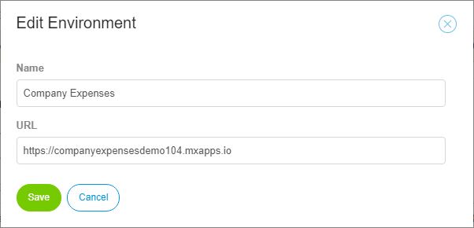
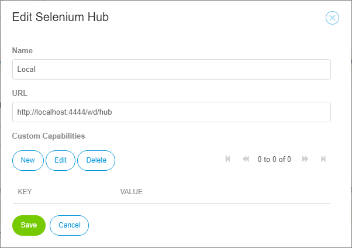

## App

## Dashboard

The dashboard is the point of ATS, where you can find all informations about the results of your tests. It is split into two parts: **Current Status and 7-Day History** infographics and the **Recent Tests** result tree. 

### Infographics

The infographics are the first thing you will see, if you open your app in ATS. These charts will show you the current status and the states of the past seven days of your tests. It includes the results of all your test cases. Datadriven tests are counted as a single test case. 

For the 7-days history, everyday at 23:59 UTC, a snapshot of the current test states is taken.

You can generate a report of the status of your tests by pressing **Download Report**. After the generation is finished, your browser will download the report as a PDF document. 

### Recent Tests
Under **Recent Tests** you can find detailed informations about the status of all your test cases and test suites. You can see the passed time since the latest run, its result and for test suites the success rate. The success rate is calculated using the results of all containing test cases. For data driven tests, the data set is displayed in the column **test data**.

The results of your tests are displayed as icons. The following table explaines the meanings of those icons:

| Icon | Meaning |
| ---- | ------- |
|| Passed. The test was run successfully |
|| Failed. The test has failed |
|| Canceled. The test was canceled by a user before finishing |
|| Skipped. The execution of this test was skipped or it hasen't been run yet |

There are three icons for distinguishing between test cases, test suites and datadriven test cases.

| Icon                                     | Meaning    |
| ---------------------------------------- | ---------- |
|  | Test Case  |
|  | Test Suite |
| | Datadriven Test Case|

You can open the latest execution log of a test case by pressing **Show Log**. Clicking the **name of a test case/test suite** will open the edit page. 

## Permissions
We have two roles in ATS, which are assigned to the user by the system itself. The role tester is assigned to a user, when he has at least one teamserver project licensed in ATS. He is going to be app admin, if he has the app settings permission of the teamserver project in Sprintr. The app settings permission is by default part of the SCRUM Master role in Sprintr.

A tester has access to every data or action, which is neccessary to write and execute tests in ATS. 
An app admin has extra access to the test settings page described in the next section. 

## Settings
Settings is the central point to configure ATS. Here you can set the Mendix API Key, add your deployments and your selenium hubs. You will also find an overview of all testers and administrators of your project. 



Only project administrators can edit the settings. All other users can only view the available deployments and selenium hubs.



### Environments

Under **Environments**, you can see a list of deployment locations, that are configured for the current project. Those will be selectable, to use as target test applications.

You can edit, create, and delete applications by pressing the buttons in the top bar:

When creating a new application, you can set the following parameters:

| Field | Description                              |
| ----- | ---------------------------------------- |
| Name  | The name of the application.             |
| URL   | The URL under which the Mendix application to test is running. |

### Selenium hubs

Under **Selenium Hubs**, you can see a list of the Selenium hubs that are configured for this project. Project users can run tests on the listed hubs. To add a new Selenium hub, click the **New** in the top bar:

In the "Edit Selenium Hub" dialog, you can set the following parameters:

| Field               | Description                              |
| ------------------- | ---------------------------------------- |
| Name                | The name of the Selenium hub.            |
| URL                 | The URL of the Selenium server.          |
| Custom Capabilities | Set the Selenium DesiredCapabilities (for more information, see the Selenium documentation). |

ATS automatically retrieves the parallel test session limit from the selenium hub. This limit is updated every 15 minutes. If ATS is not able to get the limit from the selenium hub, it is set to one single test execution at a time.  

### Execution log cleanup

ATS automatically deletes execution logs that are older than 90 days. You can change here, for how many days ATS will keep the execution logs. ATS will keep the execution logs at least for one day.

### Mendix API Key
The Mendix API Key is used to synchronize stories between sprintr and ATS.
You will have to set this key, otherwise you cannot use the project stories in ATS. Be aware, that after you have set the Mendix API Key, you won't be able to see it again. You can only set a new API key.

Visit [Authentication](../apidocs/authentication), for more informations about where to find the API Keys of your Mendix project.

### CI/CD API key
The CI/CD API key is used to allow other systems or applications access to the ATS CI/CD API. Generating a new API key will revoke access for any systems using the old API key. These systems will not be able to access the ATS CI/CD API until they are updated with the new API key. Make sure to save the displayed API key in a secure place, as you cannot view it again in ATS. 

For more informations about the CI/CD API visit the [CI/CD API section](cicd-api.md) of this documentation. 