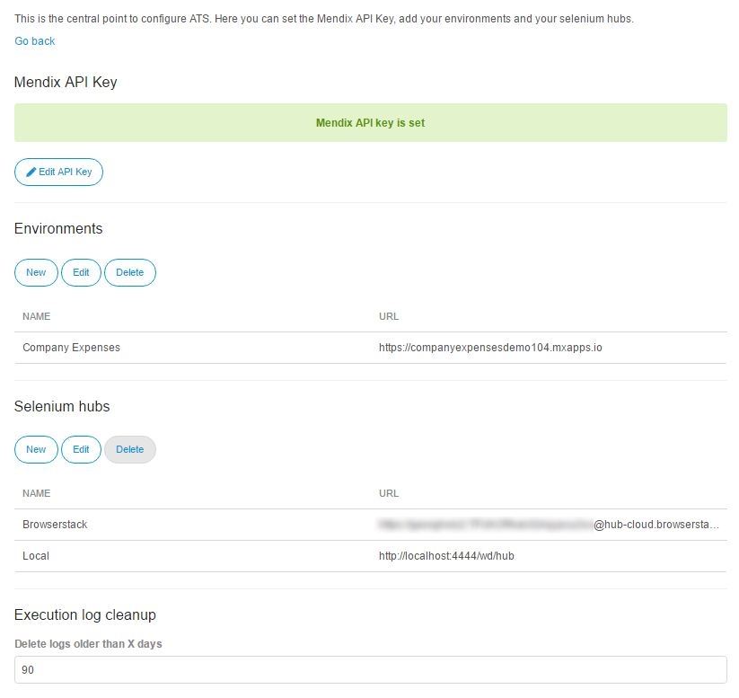

## App

## Dashboard

The dashboard is the point of ATS, where you can find all informations about the results of your tests. It is split into three parts: **Status**, **Details** and **History**

### Status

Status is the first thing you will see, if you log in to ATS. The chart will show you the current state of your tests.
It includes the results of all your test cases. For data driven tests, only the aggregated result out of the execution with the records of the dataset is counted, similar like it is done for a testsuite.

| Result type  | Meaning                                  |
| ------------ | ---------------------------------------- |
| Passed       | Number of tests which ran successfull.   |
| Failed       | Number of failed tests.                  |
| Canceled     | Number of tests canceled by the user manually |
| Not executed | Number of tests which haven't been executed yet |
| Unknown      | Number of tests where the status is unknown. |

You can export the current results of your test cases by pressing **Download Report **. This will generate a detailed test report for your project as pdf document. 

### Details
Under **Details** you can find detailed informations for all of your test cases and test suites. You can see the passed time since the latest execution, its result and the success rate. For test suites, the success rate is calculated using the results of all containing test cases. For data driven tests, the success rate is calculated on basis of the execution results of all records from the data set, they were executed with. The data set is displayed under **test data**.

You can open the latest execution log of a test case by pressing **Show Log**. Clicking the **name of a test case/test suite** will open the edit form. 

There are two icons for distinguishing between test cases and test suites.

| Icon                                     | Meaning    |
| ---------------------------------------- | ---------- |
|  | Test Case  |
|  | Test Suite |

### History
The history shows the results of the past seven days in a line-chart. 

## Permissions
We have two roles in ATS, which are assigned to the user by the system itself. The role tester is assigned to a user, when he has at least one teamserver project licensed in ATS. He is going to be app admin, if he has the app settings permission of the teamserver project in Sprintr. The app settings permission is by default part of the SCRUM Master role in Sprintr.

A tester has access to every data or action, which is neccessary to write and execute tests in ATS. 
An app admin has extra access to the test settings page described in the next section. 

## Settings
Settings is the central point to configure ATS. Here you can set the Mendix API Key, add your deployments and your selenium hubs. You will also find an overview of all testers and administrators of your project. 



Only project administrators can edit the settings. All other users can only view the available deployments and selenium hubs.



### Mendix API Key
The Mendix API Key is used to synchronize stories between sprintr and ATS.
You will have to set this key, otherwise you cannot use the project stories in ATS.
Visit [Authentication](../apidocs/authentication), for more informations about where to find the API Keys of your Mendix project.

### Deployments

Under **Deployments**, you can see a list of deployment locations, that are configured for the current project. Those will be selectable, to use as target test applications.

You can edit, create, and delete applications by pressing the buttons in the top bar:

When creating a new application, you can set the following parameters:

| Field | Description                              |
| ----- | ---------------------------------------- |
| Name  | The name of the application.             |
| URL   | The URL under which the Mendix application to test is running. |

### Selenium hubs

Under **Selenium Hubs**, you can see a list of the Selenium hubs that are configured for this project. Project users can run tests on the listed hubs. To add a new Selenium hub, click the **New** in the top bar:

In the "Edit Selenium Hub" dialog, you can set the following parameters:

| Field               | Description                              |
| ------------------- | ---------------------------------------- |
| Name                | The name of the Selenium hub.            |
| URL                 | The URL of the Selenium server.          |
| Parallel Sessions   | The number of tests that can run in parallel on the Selenium hub. |
| Use proxy           | Tells ATS to use the proxy. Usually there is no need to use a proxy server. |
| Proxy URL           | The URL of an optional proxy server. This is only visible, if "Use proxy" is checked |
| Custom Capabilities | Set the Selenium DesiredCapabilities (for more information, see the Selenium documentation). |

### Execution log cleanup

ATS automatically delete execution logs that are older than 90 days. You can change here, for how many days ATS will keep the execution logs. ATS will keep the execution logs at least for one day.