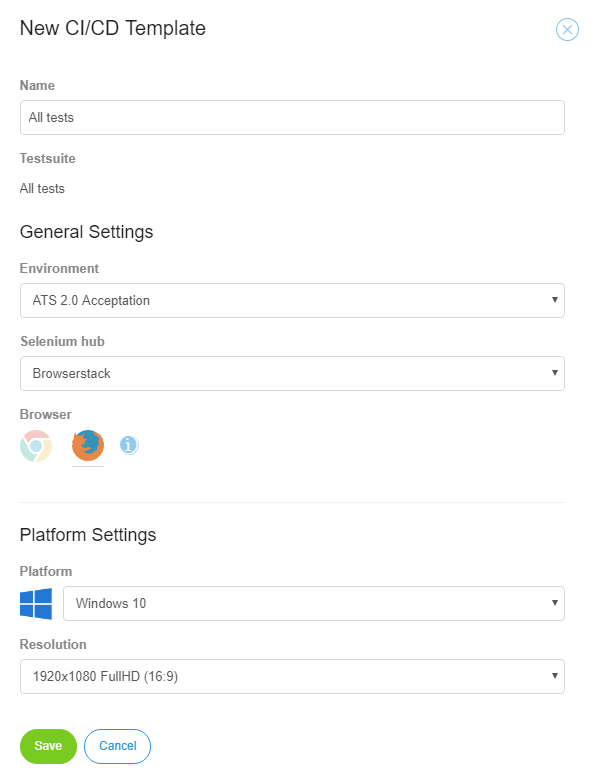

## 1 CI/CD API

With the CI/CD API you easily integrate ATS into your automated deployment workflow. You run a test according to predefined templates or you could retrieve the status of already finished tests. To use the CI/CD API you need a special webservice user, which ATS uses for authentication. For more information on how to integrate ATS into your CI/CD workflow read the [How-To ATS CI/CD](/link-to-howto).

## 2 CI/CD Templates

CI/CD Templates are predefined configurations for a remote job run. The remote job run is triggered via the run job webservice. Every CI/CD Template consists of the job configuration, an associated Testcase or Testsuite and a generated unique ID. This ID identifies the CI/CD template. An overview of all existing CI/CD Templates is found on the **CI/CD Templates tab** on the Test Runs page.


| Name | Description |
|------|-------------|
| Type Icon | Testcase, Testsuite |
| Name | Test Case Name, Test Suite Name or Custom Name|
| Browser | Firefox, Chrome |
| UID | The ID which identifies the CI/CD Template |

You add new CI/CD Templates by clicking **Add Testcase** or **Add Testsuite**. A dialog box opens, where you select the Testcase or Testsuite for the CI/CD Template. After that, the **New CI/CD Template** dialog box opens.



You configure the following options in the **New CI/CD Template** dialog box:

| Name | Description |
|------|-------------|
| Name | Default: Name of the Testcase/Testsuite. Customizable. |
| Environment | Environment to test. |
| Selenium Hub | The selenium hub, where the test is executed. |
| Browser | The browser, which is used for the test. Chrome or Firefox|

For supported selenium hubs, like Browserstack, further options are available. More information on supported selenium hub provider is found [here](supported-selenium-hub-provider).

## 3 API

The ATS CI/CD API is based on the SOAP webservice protocol. Currently there are two services available, **Run Job** and **Get Job Status**. The following sections shows the structures of the request and response messages of these services.

### 3.1 Run Job

#### URL

```
https://ats100.mendixcloud.com/ws/RunJob
```

#### Request

You must include the following information into the request.

| Name | Description |
| --- | --- |
| username | Username of the webservice user |
| password | Password of the webservice user |
| AppAPIToken | Key for the CI/CD API. Is generated on the **Test Settings** page |
| AppID | The ID of your Mendix APP |
| JobTemplateID | The unique ID of the CI/CD Template |

##### Example

```
<soapenv:Envelope xmlns:soapenv="http://schemas.xmlsoap.org/soap/envelope/" xmlns:men="http://www.mendix.com/">
  <soap:Header>
    <tns:authentication>
      <username>exampleUser</username>
      <password>examplePassword</password>
    </tns:authentication>
  </soap:Header>
  <soap:Body>
    <tns:RunJob>
      <TestRun>
        <AppAPIToken>exampleString</AppAPIToken>
        <AppID>exampleString</AppID>
        <JobTemplateID>exampleString</JobTemplateID>
      </TestRun>
    </tns:RunJob>
  </soap:Body>
</soapenv:Envelope>
```

#### Response

The following table shows the data contained in the response of the **Run Job** service:

| Name | Description |
| --- | --- |
| Started | True, if the test has already started. False otherwise.  |
| ErrorMessage | Contains the error message, if test failed to start. Is empty, if the test started succesfully. |
| JobID | The unique ID of the job. This ID is used to retrieve the result of the test with the **Get Job Status** service |

##### Example

```
<soapenv:Envelope xmlns:soapenv="http://schemas.xmlsoap.org/soap/envelope/" xmlns:men="http://www.mendix.com/">
  <soap:Body>
    <tns:RunJobResponse>
      <RunJob>
        <Started>false</Started>
        <ErrorMessage>exampleString</ErrorMessage>
        <JobID>exampleString</JobID>
      </RunJob>
    </tns:RunJobResponse>
  </soap:Body>
</soapenv:Envelope>
```

### 3.2 Get Job Status

#### URL

```
https://ats100-test.mendixcloud.com/ws/GetJobStatus
```

#### Request

You must include the following information into the request.

| Name | Description |
| --- | --- |
| username | Username of the webservice user|
| password | Password of the webservice user |
| AppAPIToken | Key for the CI/CD API. Is generated on the **Test Settings** page |
| JobID| The unique ID of the Job returned by the **Run Job** service |
| AppID | The ID of your Mendix APP |

##### Example

```
<soapenv:Envelope xmlns:soapenv="http://schemas.xmlsoap.org/soap/envelope/" xmlns:men="http://www.mendix.com/">
  <soap:Header>
    <tns:authentication>
      <username>exampleUser</username>
      <password>examplePassword</password>
    </tns:authentication>
  </soap:Header>
  <soap:Body>
    <tns:GetTestRun>
      <TestRun>
        <AppAPIToken>exampleString</AppAPIToken>
        <JobID>exampleString</JobID>
        <AppID>exampleString</AppID>
      </TestRun>
    </tns:GetTestRun>
  </soap:Body>
</soapenv:Envelope>
```

#### Response

The following table shows the data contained in the response of the **Get Job Status** service:

| Name | Description |
| --- | --- |
| ExecutionStatus| Status of the Execution: **Running** or **Queued**|
| ExecutionResult| Contains the error message, if test failed to start. Is empty, if the test started succesfully. |
| JobID | The unique ID of the job. This ID is used to retrieve the result of the test with the **Get Job Status** service |

#### Example

```
<soapenv:Envelope xmlns:soapenv="http://schemas.xmlsoap.org/soap/envelope/" xmlns:men="http://www.mendix.com/">
  <soap:Body>
    <tns:GetTestRunResponse>
      <TestRun>
        <ExecutionStatus>[key]</ExecutionStatus>
        <ExecutionResult>[key]</ExecutionResult>
        <ErrorMessage>exampleString</ErrorMessage>
      </TestRun>
    </tns:GetTestRunResponse>
  </soap:Body>
</soapenv:Envelope>
```