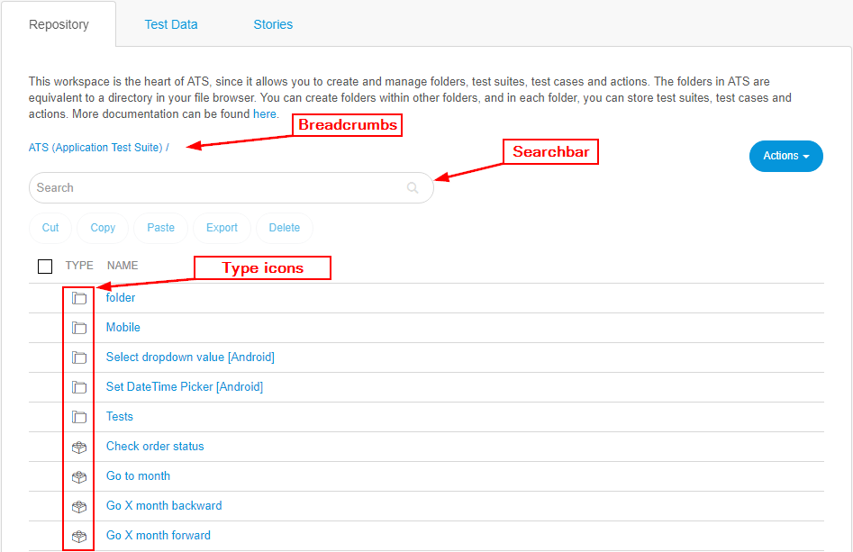

## Repository

The Repository is the heart of ATS, since it allows to create and manage folders, test suites, test cases, Drop-Downs and actions. You can also create test data for data-driven testing. For more information on how to use data-driven testing in ATS, see [Test Data](test-data). The repository can be accessed by clicking **Test Cases** in the navigation menu.

You can search for a specific item, by using the search bar in the repository. ATS will search for the desired item in the current folder and all subfolders. This means that if you start searching from a folder, other than the root folder, ATS will only look inside that folder and his subfolders.

The breadcrumbs in the repository allow quick navigation between folders. Click the name of the folder to go back to that parent folder.  

If you want to cut, copy or delete an item in the repository, you can do so by marking it with the checkbox. After that, the actions become available.

## Actions 
In the repository you can use the **Actions** drop-down to perform the following actions:
- Create a **New Folder**
- Create a **New Test Case**. For more information on creating a test case, see [Test Case](test-case).
- Create a **New Test Suite**. For more information on creating a test suite, see [Test Suite](test-suite).
- Create a **New Action**. For more information on creating an action, see [Action](action).
- Create a **New Drop-Down**. For more information on creating a Drop-Down, see [Drop-Down](drop-down).
- **Import** items into the repository.

ATS stores all created items into the repository.
## Import/Export

ATS allows to export to and import data from an XML file. It is possible to move data between different apps or to save test definitions on your hard drive.

You can export the following data:

* Folders
* Test cases/test suites
* Actions
* Parameters set in actions/test cases

### Import

There are two ways of using the import: _create data_ and _update data_.
 
_Create data_ means that you will be importing new data for the first time into your target project. 
_Update data_ means that you will be importing data that will overwrite existing data, thus updating actions, test cases, test suites or folders.

When importing data, ATS will solve all data conflicts by overwriting the existing properties by the imported ones.

To import data in ATS do the following:

- Click **Actions** and **Import**  to open the data import form.
- On the data import form, click **Import from file** to open the import data dialog.

### Export

There are different scenarios on how to export data from ATS:

- Exporting a single action
- Exporting several actions
- Exporting test cases
- Exporting test suites
- Exporting folders containing:
   - Actions
   - Actions and test cases
   - Actions, test cases, and test suites
   - Folders, actions, test cases and test suites

To export the data, you have to mark the items in the **Repository** and then click **Export** in the top menu. You can also export the item right away from the edit view, by clicking **Export** in the top right.