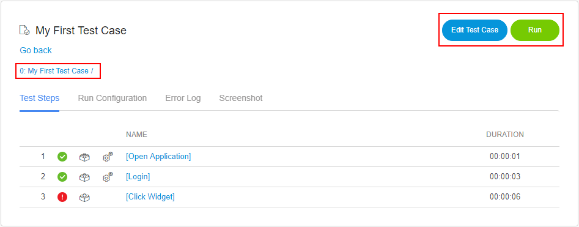
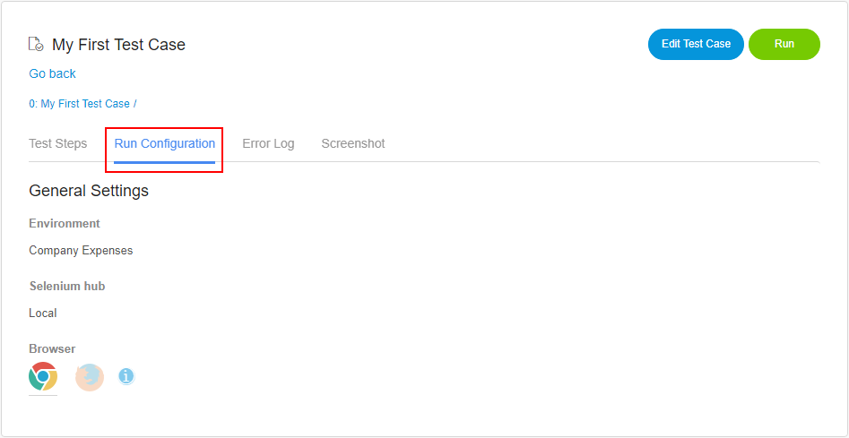
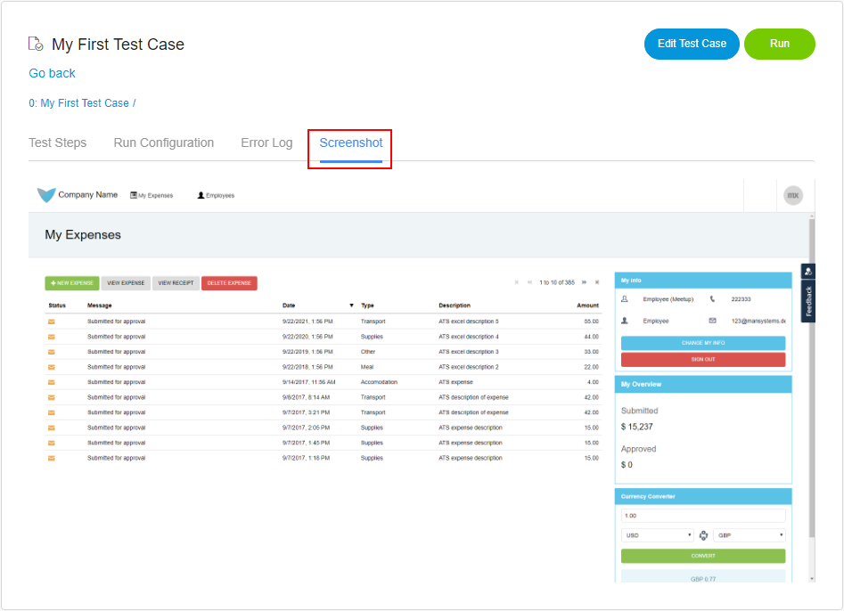
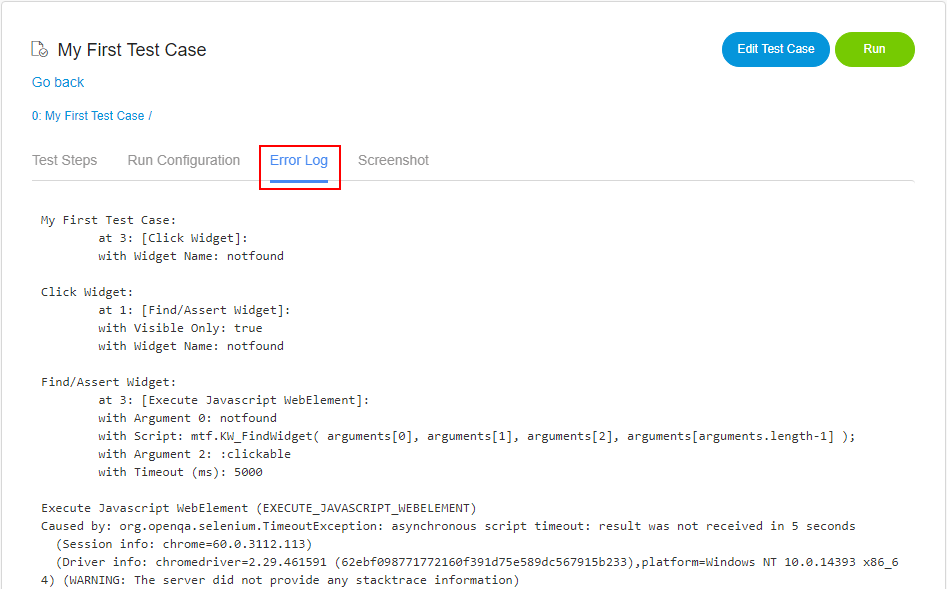

## Results

Under **Results**, you will find all running and executed tests from your app.
The Results tab is split into two tables: **Pending tests** and **Most recent tests**.

Pending tests are tests, which are currently running or are waiting for a free running slot. 
Under Most recent tests you will find all tests, which have finished or have been canceled.

You can search most recent tests by
* Result
* Name
* Browser
* After date
* Before date
* Executed by

If you click on the name of a finished test, a detailed view of the result log will open.

## Result log

When you click your test case the **result log** will open. The **result log** shows detailed information about the results of a test. It contains the results for all test steps, the run configuration, and if enabled, screenshots of the steps. 

If the test was not successful, you can check the error log, for more information.

### Test steps

Under **Test steps** you will find the result, start time and the duration of every step of your test.

Depending on the [action log depth](action-log-depth), you can drill down deeper into the log by clicking the name of the test step. You can always go back to a parent step, by clicking its name in the breadcrumbs.

### Actions

The **Actions** button provides you with following actions:

* Edit the opened test case/test suite
* Rerun the test 

### Run Configuration

The **Run Configuration** shows the configuration that the test was executed with. It shows the name of the deployment, the selenium hub and the icon of the browser. Under advanced settings, you can see if the screenshot option was set to enable and the action log depth.  

### Screenshots

All screenshots ATS takes during the test run are available under **Screenshots**. By default, screenshots are only taken, if a test step fails.  

### Error log

The **Error log** shows detailed information about a failed test step. 

