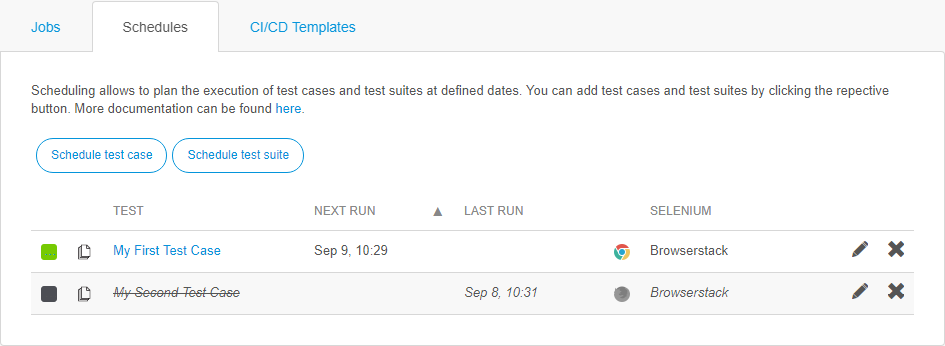

## Schedule

Scheduling allows to plan the execution of test cases and test suites at defined dates. You can add test cases and test suites by clicking the respective button.

By clicking the name of the schedule, the test edit form will open. If you want to edit the schedule, click the **pencil** on the right side of the schedule. Clicking the **cross** will delete the schedule.  To activate/deactivate a schedule, press the **box** in front of the schedule.

## New Schedule

The following schedule settings are available:

| Field              | Description                              |
| ------------------ | ---------------------------------------- |
| Active             | Activate/Deactivate the schedule         |
| Repeat             | Check to repeat the schedule after a set amount of time |
| After              | Set time when the schedule should be executed |
| Every              | Set the interval for the schedule repetition |
| Environment         | Set the environment on which the test should run |
| Selenium Hub       | Set the Selenium hub on which the test is executed |
| Browser            | Set the browser in which the test is run (Chrome or Firefox) |
| Enable Screenshots | Enable screenshots during the test run   |
| Action Log Depth   | Set depth of the error logging           |

**Operating System**

If you have selected a selenium hub from a supported selenium hub provider (TestingBot, SauceLabs or Browserstack), you will get access to the operating system selection. Here you can set the operating system, on which the test case will be run on.

This option is only available for supported Selenium hubs.

If you want to read more about the different supported operating system, read the [Supported selenium hub provider section](supported-selenium-hub-provider) of this documentation.

**Resolution**

This option is only available if you have selected a selenium hub from a supported selenium hub provider and a valid operating system. With this option, you can set the screen resolution of your test run. The available screen resolutions are the supported resolutions for the operating system given by the selenium hub provider.

This option is only available for supported Selenium hubs.

If you want to read more about the different supported screen resolutions, read the [Supported selenium hub provider section](supported-selenium-hub-provider) of this documentation.