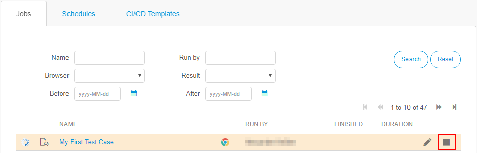

## Test Run 

There are multiple ways to run an existing test: 

* Clicking the play icon on the right side of the test item in the repository.
* Clicking the run button on the test edit form.
* Clicking the play icon on the right side of the test result under results.
* Clicking the run button after opening the result log. 

Before a test is run, the **Job Configuration** will open. For every test run, a new job will be created. For more informations about the different options you can set for running a test, visit the [Job configuration section](test-run-configuration.md). 

You can also cancel a running job by pressing the cancel button in the corresponding line on the test run page. This will immediately cancel the job and interrupt all running test steps. 

## Special Behaviour
Here you will find descriptions of special situations for test case runs and the outcoming results of them. 

##### What happens if I set an integer as input for a textbox? 
Inputs for textboxes etc. are always interpreted as text. This means, that the integer will be converted into a string.

##### What happens if I try to run a test case with an empty step?
In the current version of ATS, test steps without an action will lead to failing test results. 

##### What happens if I run an empty test case or test suite?
Empty test cases will run and lead to a successfull test results. Empty test suites will run and shown in the pending tests overview, but the result will not be saved. 

##### What happens if I run a test case including an action without required input parameters?
The test case will run, until the action with the missing input parameter is executed. ATS will search for the input parameter and won't find it. This will result in following error:

Cannot resolve value for required parameter [ParameterName]. Value wasn't found on stack.

The final result of the test case will be failed.