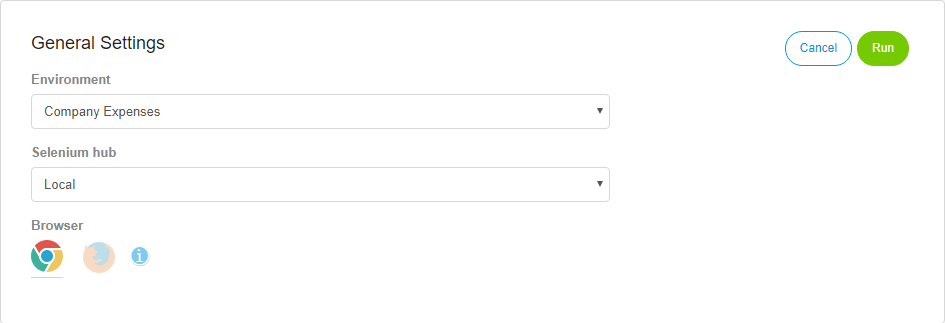
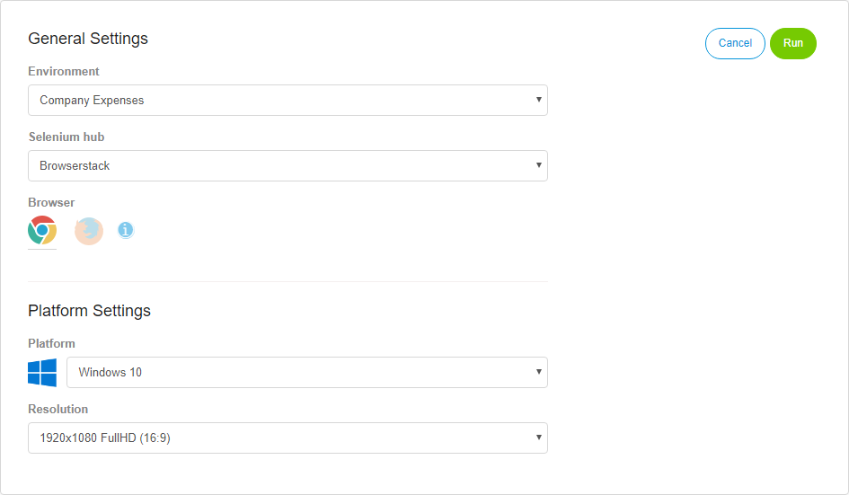
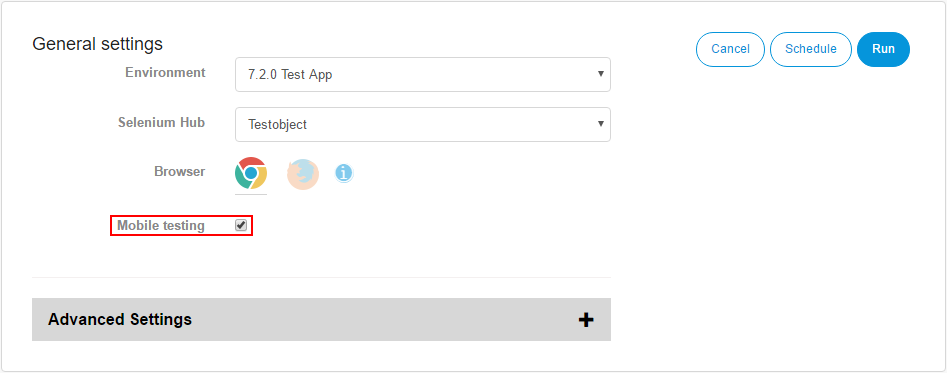

## Test Run 

There are multiple ways to run an existing test: 

* Clicking the play icon on the right side of the test item in the repository.
* Clicking run in the run dropdown on the test edit form.
* Clicking the play icon on the right side of the test result under results.
* Clicking rerun in the actions dropdown after opening the result log. 

Before a test is run, the **Run Configuration** will open. 

If you click run on the test edit form, the run configuration will only open, if the test hasn't run before. Otherwise the test will run immediatly, with the configuration set in the previous run. 

If you want to change the configuration, click **Edit Run Configuration** in the run dropdown menu. 

## Run Configuration

Under run configuration you can set the conditions for the test run. You can choose the deployment, selenium hub, browser and other options. 

If you have selected a selenium hub from a supported selenium hub provider (TestingBot, SauceLabs or Browserstack), you will get access to the operating system and screen resolution configuration.

The following options are always available:

| Name               | Description                              |
| ------------------ | ---------------------------------------- |
| Deployment         | Set the deployment on which the test will be run. |
| Selenium Hub       | Set the Selenium hub on which the test will be executed. |
| Browser            | Set the browser in which the test will be run. |
| Enable Screenshots | Enable the taking of screenshots during the test run. |
| Action Log Depth   | Set the depth of the error logging.      |

**Operating System**

If you have selected a selenium hub from a supported selenium hub provider (TestingBot, SauceLabs or Browserstack), you will get access to the operating system selection. Here you can set the operating system, on which the test case will be run on.

This option is only available for supported Selenium hubs.

If you want to read more about the different supported operating system, read the [Supported selenium hub provider section](supported-selenium-hub-provider) of this documentation.

**Resolution**

This option is only available, if you have selected a selenium hub from a supported selenium hub provider and a valid operating system. With this option, you can set the screen resolution of the operating system you have selected earlier. The available screen resolutions are the supported resolutions for the operating system given by the selenium hub provider.

This option is only available for supported Selenium hubs.

If you want to read more about the different supported screen resolutions, read the [Supported selenium hub provider section](supported-selenium-hub-provider) of this documentation.

As soon as you have finished setting the run configuration, you can execute the test case by clicking _Run_ or you can schedule the test case by clicking _Schedule_. If you want to know more about scheduling test cases in ATS, visit the [Scheduling section](scheduling).

## Mobile Testing

Currently only certain users have access to mobile testing in ATS.

To use mobile testing in ATS, you need a free account for TestObject. You will also have to create a new app in testobject to obtain a TestObject API key for ATS. Check the [help center of testingbot](https://help.testobject.com/) to read more about how to create an account and a new app in TestObject and where you can find the API key in the project.

In the future, ATS will support other selenium hub provider for mobile testing, like Browserstack Mobile. 

After you are finished setting up your TestObject account and project, go to **Test Settings** in ATS and create a new selenium hub for TestObject. Use `https://eu1.appium.testobject.com/wd/hub` as URL for the hub. You also have to add your TestObject API key as custom capability to the hub. Enter **testobject_api_key** as key and the API key of the TestObject app as value for the capability. If you want to read more about how to add a selenium hub to ATS with custom capabilites, check the [App section](app) of this reference guide.      
    
After you have selected TestObject as selenium hub in the test run configuration , the **mobile testing checkbox** will be shown. Check it and you are ready to run your mobile test. 

The test will run on a real mobile device in the TestObject TestLab. The following table shows the configuration of that device.

 | Type | Description |
 | --- | --- |
 | Device | Motorola Moto E (2nd gen) |
 | Platform | Android |
 | Version | 6.0 |
 | API level | 23 |
 | Resolution | 540x960 px / 4.5" |
 | CPU | ARM quad-core 1200 MHz |
 | RAM | 1024 MB |
 | Browser | Google Chrome |
 
 The support for Apple iOS and more devices will be added in the future. 

## Special Behaviour
Here you will find descriptions of special situations for test case executions and the outcoming results of them. 

##### What happens if I set an integer as input for a textbox? 
Inputs for textboxes etc. are always interpreted as text. This means, that the integer will be converted into a string.

##### What happens if I try to run a test case with an empty step?
In the current version of ATS, test steps without an action will lead to failing test results. 

##### What happens if I run an empty test case or test suite?
Empty test cases will run and lead to a successfull test results. Empty test suites will run and shown in the pending tests overview, but the result will not be saved. 

##### What happens if I run a test case including an action without required input parameters?
The test case will run, until the action with the missing input parameter is executed. ATS will search for the input parameter and won't find it. This will result in following error:

Cannot resolve value for required parameter [ParameterName]. Value wasn't found on stack.

The final result of the test case will be failed.