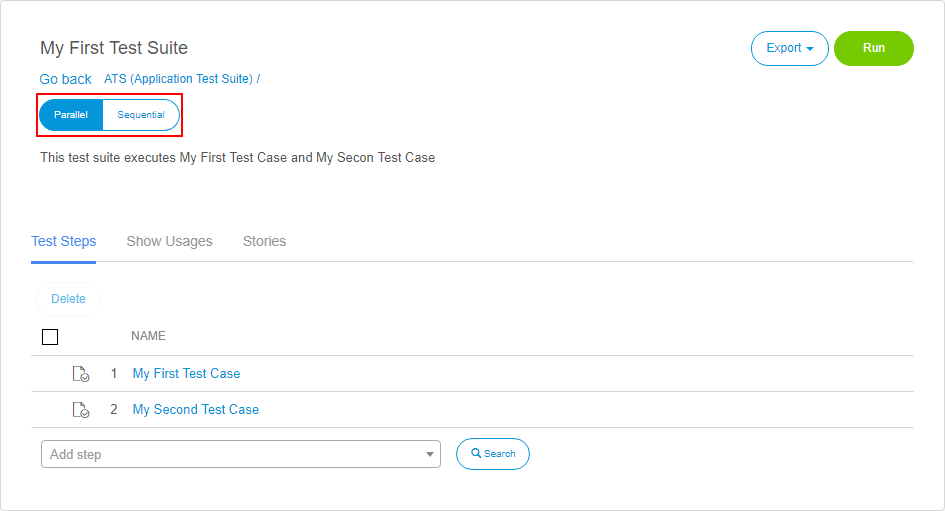

## Test Suite
A **test suite** is a set of test cases or other test suites. ATS uses test suites to a collection of test cases and/or suites in sequence.

In ATS you can create a new Test Suite by clicking New Test Suite in the **Actions** dropdown in the repository. 
A dialog will open where you can give your test suite a name and an optional description. After you have created a new test suite, the **Test Suite Details** page will open.

## Test Suite Details

On the top left of the **Test Suite Details** page, you will find the name and the description of the test case.  To change them, click them and edit the text. ATS will save the changes automatically. 

With the **parallel/sequential switch**, you can change the run behaviour of the test suite. If it is set to _parallel_, ATS will try to run all containing tests of your test suite in parallel. This is limited through the concurrency limit of your selenium hub. With the switch set to _sequential_, the tests will run in succession.

On the top right of the page, you will find the **Export** and **Run** buttons:

#### Export

| Name                   | Description                              |
| ---------------------- | ---------------------------------------- |
| Export Test Definition | Creates an XML representation of your test suite, which you can import into another app. |

#### Run

| Name                   | Description                              |
| ---------------------- | ---------------------------------------- |
| Run                    | The [run configuration page](test-run) will open, where you can edit the run configuration. If the test suite was run before, the prior configuration will be copied.  |

### Test Steps

Under test steps you can find all test cases and test suites that are used in the current test suite. You can add new test case or test suite by searching for it in the **Add step** box.
For a more detailed search, you can use the **Test Step Setup** dialog by clicking . There you can search for the desired test case or test suite in your project. You can also navigate through your project and explorer all available tests in it. 

You can add a new step above or below an existing test step, by clicking **Add above** or **Add below**. The buttons appear if you hover your mouse over an existing test step. 

#### Delete

To delete a test step in a test suite, simply click the  icon on the right side of the test step. 
You can delete multiple test steps at once, by marking the with the checkbox and click **Delete**.

#### Drag & Drop

If you move your mouse over an existing test step, the drag and drop handle will appear. By clicking and holding it you can move the test step to the new position.  

### Show Usages

The Show Usages tab gives an overview of all the test cases and test suites used in your test suite. Besides that, it also shows other test suites the test suite is used by. 

### Stories

Under Stories you can add user story to your test suite. This tab displays the connected stories, the number of test cases within that story and the success rate of the user story. 

- Open story:  Opens the linked user story. 
- Unlink selected story: This removes the link between test suite and user story.
- Link new story: Links an existing story to the test suite. 