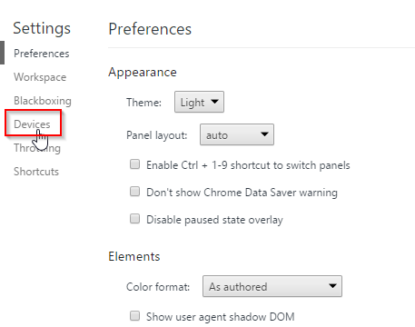
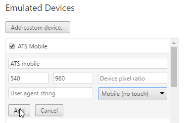
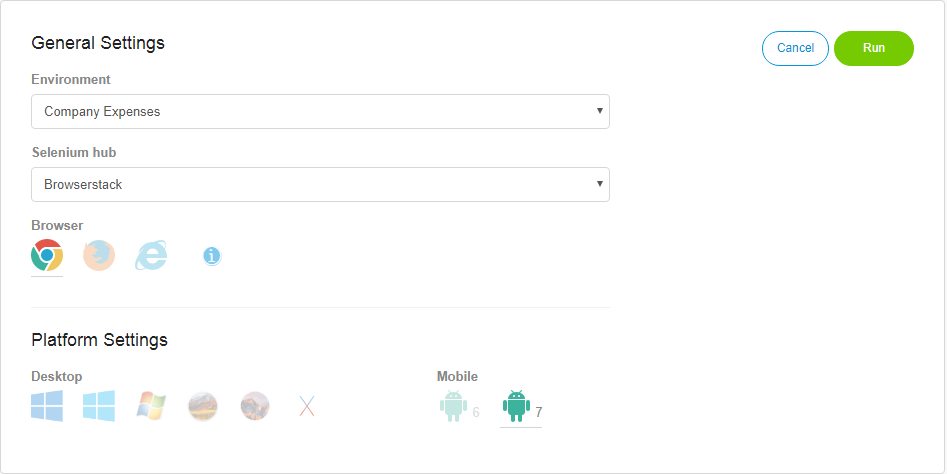
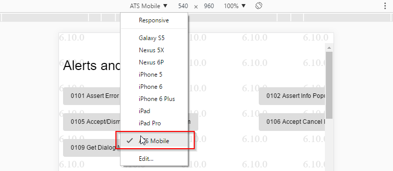

## Introduction

Mobile testing on **real devices** in ATS is an experimental feature and still in beta.

### Compatibility

| Aspect | Supported |
| ------ | --------- |
| Test Browser | Chrome v63 |
| Recorder | Chrome (via a custom mobile device profile) |
| ATS Helper | Chrome (via a custom mobile device profile) |
| Application type | Web applications with mobile view |
| Mobile Operating Systems | Android 6.0 "Marshmallow", Android 7.1.1 "Nougat" |
| Selenium Providers | Browserstack |

### Supported devices

In order to provide better support and stricter control guarantees we limit the mobile devices that can be used with testing. These devices are preselected for each android version and can not be changed.

| Provider      |  Android 6.0 "Marshmallow" | Android 7.1.1 "Nougat" |
| ------------- | -------------------------- | ---------------------- |
| Browserstack  | Google Nexus 6             | Google Pixel           |

Please refer to https://www.gsmarena.com/ for detailed specs.

## Preparations

Some preparations are required before you can start to test on mobile devices.

### Creating a Mobile Device Profile

In order to enable a proper working of the recorder and ATS Helper we need to create a custom mobile device profile in Chrome.

Follow these steps:

1. Open Chrome
2. Press **F12** to open the DevTools
3. Press **F1** to open the settings dialog
4. Select the **Devices** tab

    
6. Select **Add custom device**
7. Set the following properties
    * **Device name** to *ATS mobile*
    * **Width** to *540*
    * **Height** to *960*
    * **Device type** to *Mobile (no touch)*
8. Select **Add**

    
9. Close the settings and the DevTools by clicking the **x** button in the top right corner twice

## Running a Test Case on a Mobile Device

Once you've created a test case for mobile you'll want to run it.
This is what you have to do:

1. Open your test case 
2. Click **Run** and then **Edit Run Configuration**.
3. Select a **Selenium provider** that supports mobile testing and select **Chrome** as browser
4. Under **Platform Settings* select the mobile platform you wish to test: Android 6 or Android 7
5. Click **Run**

## Native Dialogs

Usually when a web application is used on a mobile device, the devices adds native dialogs in some places to improve usability.
These places are:

1. In dropdowns
2. In date fields
3. In time fields
4. In date time fields

All standard functions also work on a mobile device, including places where native dialogs are used. Our functions are context aware and when run on a mobile device will either automate native mobile dialogs, or work around them,.

## Using the ATS recorder and helper on mobile device view

In order to see the mobile screens of your app in Chrome, you need to enable the mobile device view. In this mode you'll also be able to use the ATS Helper and Recorder.

Follow these steps:

1. Open Chrome
2. Press **F12** to open the DevTools
3. The the DevTools switch to the tab **Sources**
4. Press **CTRL+F8** to deactivate breakpoints (breakpoints would prevent proper use of the Recorder and ATS Helper)
5. Press **CTRL+SHIFT+M** to enable the mobile device toolbar
6. In the mobile device toolbar select the new device profile **ATS Mobile**

    

You can enable and use the ATS Helper and Recorder as usual as long as the mobile device profile is enabled.

## Known Limitations

* Using touch actions in the mobile device profile is not possible. The ATS Helper and Recorder are not compatible with touch actions.
* The only supported locale is "en_US", i.e. language is English and country is United States. 
* Emulators are not supported.
* Seconds cannot be set in (date) time fields. Clearing a date/time value is not supported.
