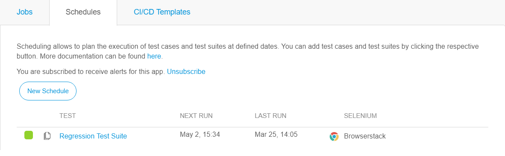

## 1 Schedule

Scheduling allows you to plan the execution of test cases and test suites at defined dates. You can also choose to send alerts when a scheduled run is done.

If you want to edit the schedule, click the pencil icon to the right of the schedule. Clicking the "X" icon will delete the schedule. To activate/deactivate a schedule, click the box in front of the schedule.

## 2 New/Edit Schedule

The following schedule settings are available:

| Field              | Description                              |
| ------------------ | ---------------------------------------- |
| Active             | Activate/deactivate the schedule.         |
| Repeat             | Check to repeat the schedule after a set amount of time. |
| After              | Set the time when the schedule should be executed. |
| Every              | Set the interval for the schedule repetition. |
| Environment        | Set the environment on which the test should run. |
| Selenium Hub       | Set the Selenium hub on which the test is executed. |
| Browser            | Set the browser in which the test is run (Chrome or Mozilla Firefox). |
| Send alerts        | Whether or not to send email alerts when a schedule run is done. Off by default. |
| Send alerts when passed | Whether or not to send alerts when a schedule run is passed. Off by default. |

## 3 Platform

{}

This option is only available for supported Selenium hubs.

{}

If you have selected a Selenium hub from a supported Selenium hub provider (SauceLabs, or Browserstack), you will get access to the platform settings. Here you can set the operating system on which the test case will be run.

For more information on the different supported operating systems, see [Supported Selenium Hub Providers](supported-selenium-hub-provider).

## 4 Resolution

{}

This option is only available for supported Selenium hubs.

{}

With this option, you can specify the screen resolution for your test run. A list of all the supported screen resolutions can be found in [Supported Selenium Hub Providers](supported-selenium-hub-provider).

## 5 Alerts

To subscribe to alerts click the *Subscribe* link under the **Schedules** tab. Then you will receive an email with a one time subscription link. After clicking the link you will be subscribed to receive alerts for the current app. 

{}

Make sure to check your spam folder.

{}

By default existing schedules do not send alerts. Click *Edit* (pencil icon) next to a schedule to change this. Similarly for newly created schedules.

If you want to stop receiving alerts, click the *Unsubscribe* link under the **Schedules** tab. Alternatively, click the unsubscribe link which is included in every alert email.

Important information:  
* By default alerts are disabled
* In order to avoid spam the maximum number of emails that can be sent per app per day is limited to **40**.
* Alerts are sent only to users who have subscribed to receive them using the email from your Mendix account.
* Subscription is per app, so that you can decide to subscribe only to certain apps that you are interested in.
* If you enable alerts for a schedule then by default an alert will only be sent if the scheduled run is not passed. You can change this behavior per schedule so that an alert is sent always regardless of the result.
