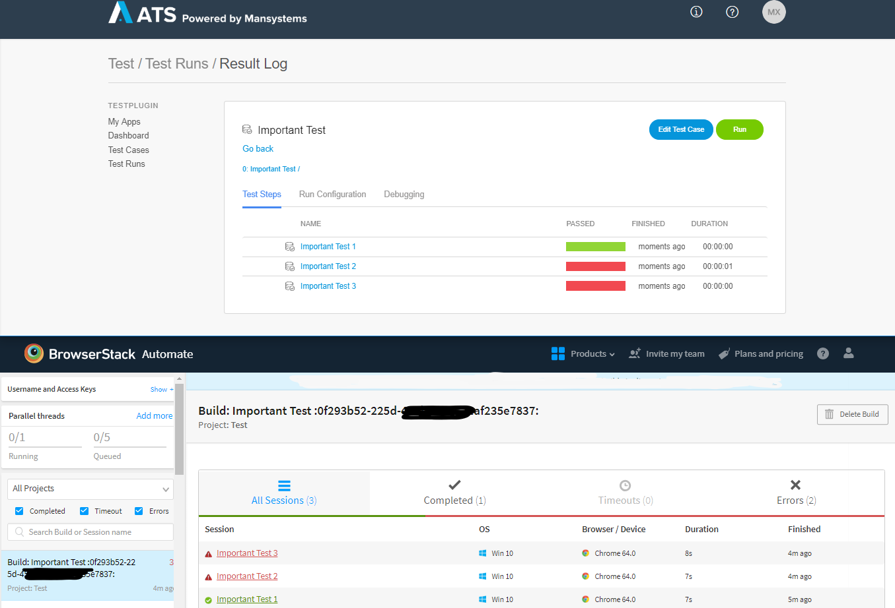

## 2.10

**Release date: April 23th 2019**

### Added numbering of data set records in test cases

We added the index of a data set record for each test case execution so that you immedietely know which records are passing/failing.

### Better integration with Browserstack

After the great reception of the recording tab in ATS we decided to invest more time on integrating Browserstack and ATS by adding the following features:

On the side of Browserstack:
1. Different apps in ATS show up as different *Projects* in Browserstack. This is usefull, if you use the same Browserstack account to test multiple apps.
2. When multiple testcases are executed in ATS as part of a test suite they are now also grouped in Browserstack under a *Build*. The build name consists of the name as the test suite/test case followed by the ATS job id between two colons. 
3. Individual test case executions in Browserstack, i.e. *Sessions* now correctly display the test case name instead of the job name. For test cases with an attached dataset, the test case name is suffixed with the index of the dataset record.
4. Test cases executions in Browserstack now show the result from ATS.

<!-- Please comment the next line when moving to Mendix Docs -->
  

On the ATS side:

5. We added a link to the selenium session in Browserstack for each test case that was executed in Browserstack. You can use this in case the recording video does not load in ATS or if you want to see the Browserstack logs. You can find the link under the *Recording* tab.
6. To make it easier to navigate from Browserstack to ATS we added options to look up a) jobs by the job GUID, and b) individual test case logs by the Browserstack session id. Both can be found on the *Test Runs* page under the *Jobs* tab.

<!-- Please comment the next line when moving to Mendix Docs -->

Nomenclature:

| ATS              | Browserstack |
| ---              | ---          |
| App              | Project      |
| Job              | Build        |
| Single test case | Session      |

### Fixes
