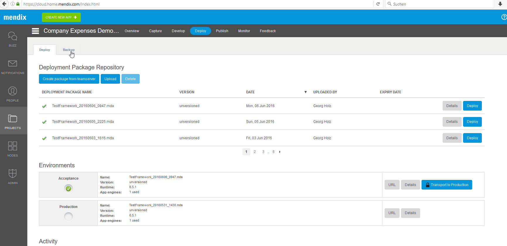
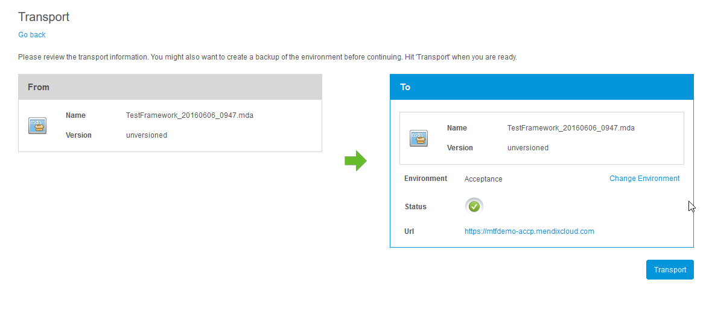
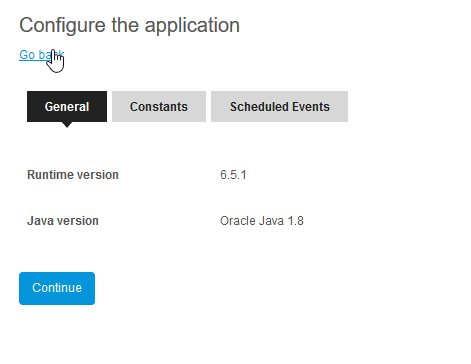
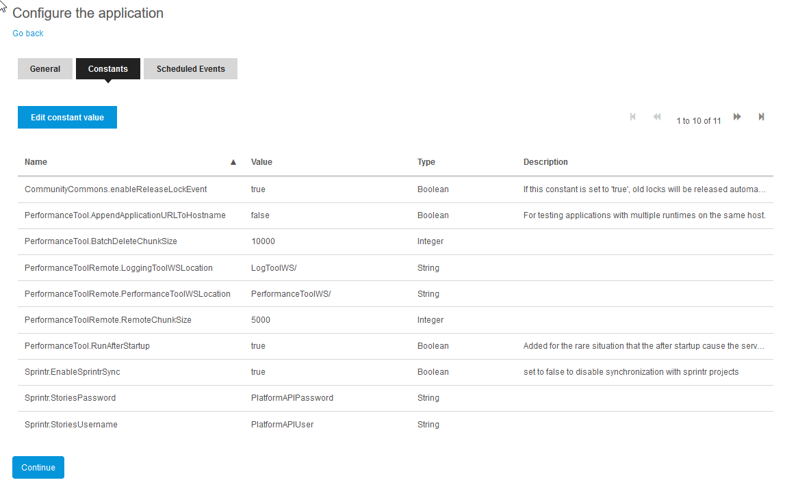
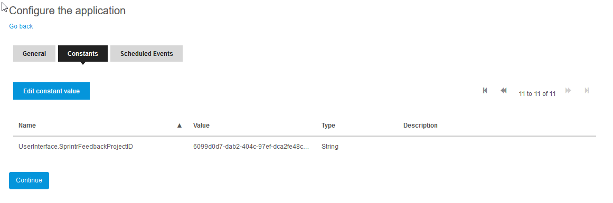
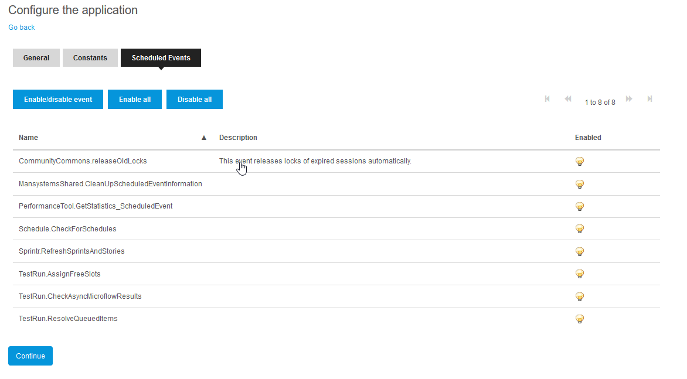
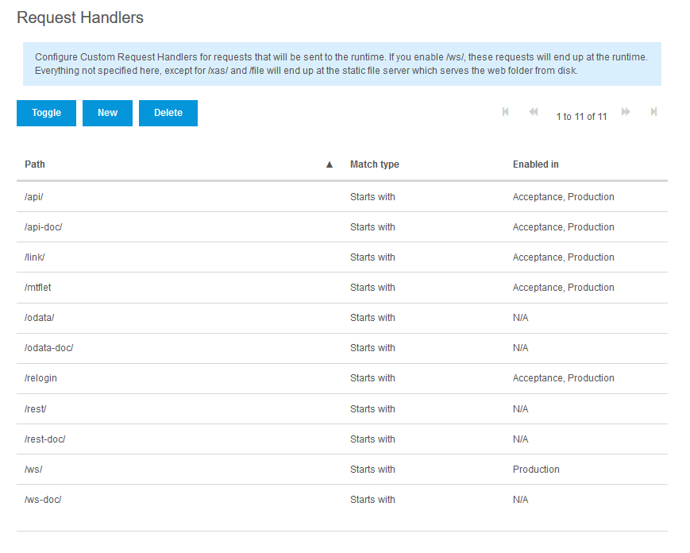
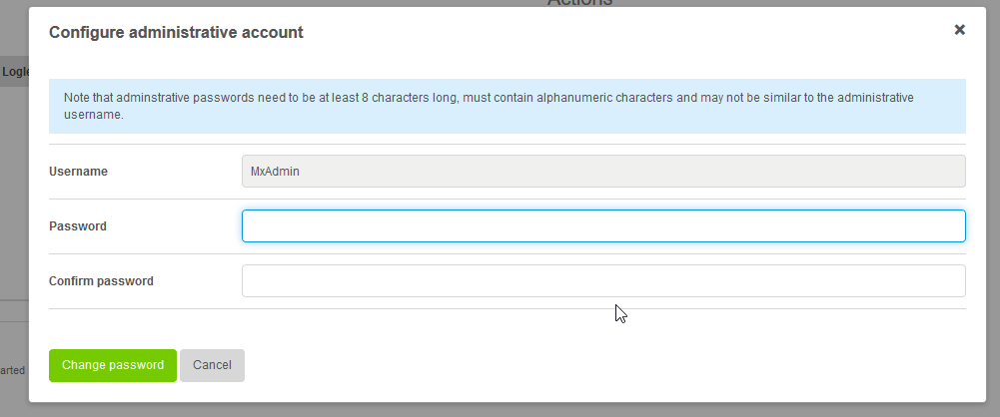

ATS can be installed in a Mendix cloud slot or on premise.

# Mendix Cloud
* Open the `Mendix cloud portal <https://sprintr.home.mendix.com/>`__
* If you have a brand new cloud slot, you need to create a new project for it
  * Navigate to 'Nodes' and check if your node requires a project (you will see a button called 'Select project')
  * Click the 'CREATE NEW APP' button in the topbar and create a new, empty project. Name it '<CustomerName> ATS'.
  * Navigate back to 'Nodes' and connect your node to the new project via the 'Select project' button.
* Open your project and go to the 'Deploy' section



* Upload the new deployment package (mda file)
* Open the environment details by clicking the 'Details' button
* Check that there are no logged in users ('Show Logged in Users') and then 'Stop Application'
* Go back
* Write down the project ID. You can find it in the project settings (click the gear icon in the top right corner).
* Deploy the uploaded deployment package by clicking the 'Deploy' button
* Confirm the transport



* Configure the 'General' settings. Set 'Java version' to 'Oracle Java 1.8'.



* Configure the 'Constants' as below. Default settings should already be ok.

```java
APMAgent.BatchDeleteChunkSize: "10000"
APMAgent.ExcludedMicroflows: "APMAgent.;"
APMAgent.InstanceIndex: "0"
APMAgent.MaxRunningMicroflowsInDialog: 10
APMAgent.PerformanceToolWaitTimeForMicroflowToFinish: 5
APMAgent.PrintAllOnStartup: "False"
APMAgent.RunAfterStartup: "True"
APMAgent.CompanyName: "Mansystems"
CommunityCommons.enableReleaseLockEvent: "True"
Sprintr.EnableSprintrSync: "True"
Sprintr.StoriesPassword: PlatformAPIPassword
Sprintr.StoriesUsername: PlatformAPIUser
UserInterface.SprintrFeedbackProjectID: ""
```




* Set the constant *UserInterface.SprintrFeedbackProjectID* to the project ID that you've noted before. This will make sure that the feedback is redirected to your own project.
* Enable all scheduled events



* Start the application and synchronize the database
* Navigate to 'Deploy' and open the environment details
* Under 'Network' add the following request handler and enable it with a doubleclick

| Path | Match type |
|------|------------|
| /mtflet | Starts with |



* Set an administrator password by clicking the 'Change Admin Password' in the environment details (same page)



Now proceed with the Selenium installation.

# On Premise

Add the following Java options:
```java
-Dfile.encoding=UTF-8
```
Set the following application constants:
```java
APMAgent.BatchDeleteChunkSize: "10000"
APMAgent.ExcludedMicroflows: "APMAgent.;"
APMAgent.InstanceIndex: "0"
APMAgent.MaxRunningMicroflowsInDialog: 10
APMAgent.PerformanceToolWaitTimeForMicroflowToFinish: 5
APMAgent.PrintAllOnStartup: "False"
APMAgent.RunAfterStartup: "True"
APMAgent.CompanyName: "Mansystems"
CommunityCommons.enableReleaseLockEvent: "True"
Sprintr.EnableSprintrSync: "True"
Sprintr.StoriesPassword: PlatformAPIPassword
Sprintr.StoriesUsername: PlatformAPIUser
UserInterface.SprintrFeedbackProjectID: ""
```
Also do not forget to set the public application root URL. This is required for proper working of ATS the ATSlet plugin (ATS Helper).

## Domain Whitelisting for Recorder
If ATS is deployed on premise it is required to whitelist the domainname of the customer network in the recorder plugin. Please contact R&D to do this.
Without a whitelist record the recorder will not be able to connect to this ATS instance.
The following domains are whitelisted by default: localhost, mendix.com, mendixcloud.com, mxapps.io, mansystems.nl

## Web Server
A web server can be used to serve static content and proxy the dynamic content. A web server can be used to encrypt the communication using https.

Mansystems does not support web servers other than ad hoc assistance in getting the web server up and running and based on documented installations by Mendix. See the Mendix documentation for instructions on setting up the web server:
* [Internet Information Services (IIS)](https://docs.mendix.com/howto50/Deploying+Mendix+on+Microsoft+Windows#configuring-microsoft-internet-information-server)
* [Nginx](https://docs.mendix.com)

When using Nginx, we recommend to change the following settings in the server section:
```javascript
keepalive_timeout 65000;
client_max_body_size 64M;
proxy_read_timeout 180s;
```
# Selenium
There are currently two options: either install a local Selenium server using our client deployment package or signing up with a Selenium provider.

## Local Selenium with Binaries (deprecated)
ATS ships with a client deployment package that contains all required Selenium components that you need to execute test cases.
Always use this deployment package and don’t upgrade any of the components as this might break functionality.

### Browsers
Install Firefox or Chrome. Make sure the executable is available in the PATH variable. Please check the compatibility matrix for supported version.

### Windows/Linux
Unzip the ClientDeployment.zip and follow the instructions in README.txt. There are executables for Windows (32 bit) and Ubuntu Linux (both 32 and 64 bit).

## Local Selenium with Docker
For local Selenium deployments we now recommend to use Docker containers.
Please make sure that your server has internet access to download the container images.

### Installation
1. Install Docker on your server as described [here](https://docs.docker.com/engine/installation/).
1. Install Docker Compose as described [here](https://docs.docker.com/compose/install/).
1. Create a folder _selenium_ in the user's home directory.
1. Change to the folder and create a file _docker-compose.yml_ with this content:
  ```yaml
  seleniumhub:
    image: selenium/hub:2.53.0
    ports:
      - 4444:4444

  firefoxnode:
    image: selenium/node-firefox:2.53.0
    ports:
      - 5900
    links:
      - seleniumhub:hub

  chromenode:
    image: selenium/node-chrome:2.53.0
    ports:
      - 5900
    links:
      - seleniumhub:hub
  ```
1. Start up the Selenium grid with this command:
  ```sh
  docker-compose up -d
  ```
1. You now have a grid running on _http://myserver:4444/wd/hub_. Attached to this grid are two nodes, one for Chrome and one for Firefox. You can easiliy scale by starting new nodes with a simple command:
```sh
docker-compose scale firefoxnode=2 chromenode=2
```
This will start up a second node for both Firefox and Chrome.

## Selenium Cloud Provider
Some providers you can use:
* http://www.browserstack.com
* http://www.saucelabs.com
* http://www.gridlastic.com
