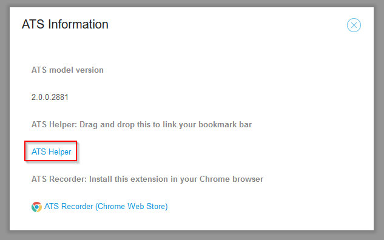
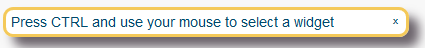
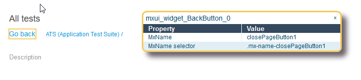

## Introduction

The **ATS Helper** is an inspection tool. It provides needed information to create test steps in your test cases or actions. With the helper you can identify widgets in the running application. It can determine the Mx Name of a widget and saves you from diving into the HTML source code or application model.

## Installation

You can install the **ATS Helper** by creating a bookmark in your browser. This bookmark will load the latest version of the helper from ATS and start it.

Follow these steps to set the bookmark:

1. Open your ATS instance in the browser
1. Login with your account
1. Open the information dialog by clicking  in the top right corner of the screen
1. Find the link that says *ATS Helper*

1. Create a browser bookmark for this link with one of these methods:
   1. Drag and drop the link to your browser's bookmark bar
   1. Right-click the link and select *Add bookmark for this link*

### Compatibility
The ATS Helper works in _Firefox_, _Chrome_, _Edge_ and _Internet Explorer 11_.

## Usage

### Starting the ATS Helper
Use the ATS Helper within the application under test. Follow these steps to load the helper in your application:

1. Open your application
1. Click the *ATS Helper* bookmark that you created before.

The following dialog will pop up on top of your application's UI:

### Inspecting widgets

To inspect a widget, keep your *CTRL* key pressed and move your mouse cursor to a UI element. 

The helper will highlight the selected widget with a yellow border. The ATS Helper dialog shows you the Mx Name as well as the Mx Name Selector properties.

If you release the *CTRL*, the widget will remain selected.

The properties shown by the ATS Helper are:

| Property        | Description                              |
| --------------- | ---------------------------------------- |
| MxName          | The name of the widget. Required input for many actions |
| MxName Selector | The full CSS selector for the widget. Used for advanced test steps or custom actions. |

### Moving and Closing
You can drag and drop this dialog with your mouse. To close the helper press the *x* icon in the top right corner. 
