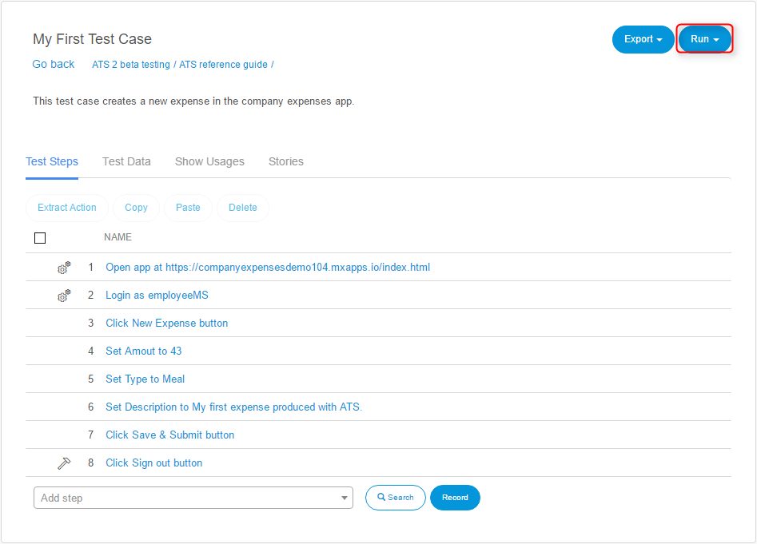
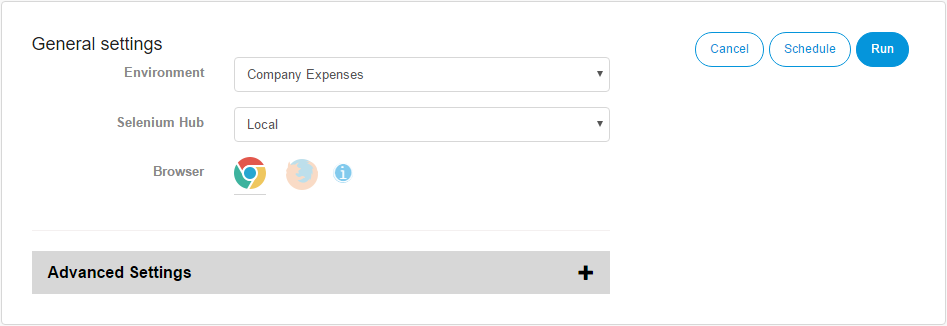
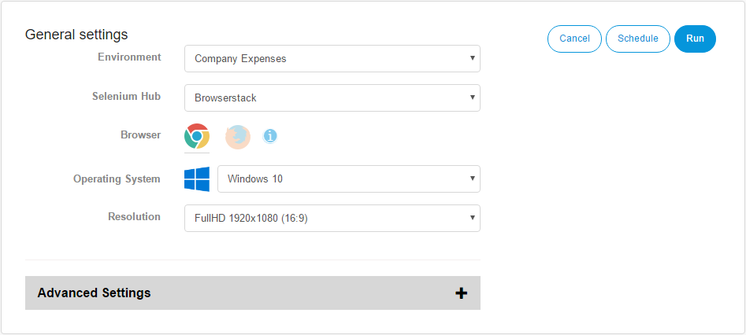

## Test Run Configuration

To run an existing test, you have to open the test case or test suite by clicking its name in the repository.

The test case (or test suite) details page will open. On this page, you can see all the test steps and for the test suite the containing test case of your test. If you want to execute your test case, click **Run**.

The _Select Run Configuration_ page will open. On this page, you can set the run configuration for the test case (or test suite) you want to execute.

If you have selected a selenium hub from a supported selenium hub provider (TestingBot, SauceLabs or Browserstack), you will get access to the operating system and screen resolution selection.

The following options are available:

**Environment**

The environment on which ATS executes the test case. 

**Selenium Hub**

The Selenium hub ATS uses to execute the test case. 

**Browser**

The browser ATS uses to execute the test case in. 

**Operating System**

If you have selected a selenium hub from a supported selenium hub provider, you will get access to the operating system selection. ATS uses this selection to execute your test case on that operating system.

This option is only available for supported Selenium hubs.

If you want to read more about the different supported operating system, read the [Supported selenium hub provider section](supported-selenium-hub-provider) of this documentation.
**Resolution**

This option is only available, if you have selected a selenium hub from a supported selenium hub provider and a valid operating system. With this option, you can set the screen resolution of the operating system you have selected earlier. The available screen resolutions are the supported resolutions for the operating system given by the selenium hub provider.

This option is only available for supported Selenium hubs.

If you want to read more about the different supported screen resolutions, read the [Supported selenium hub provider section](supported-selenium-hub-provider) of this documentation.

**Enable Screenshots**

Enable the taking of screenshots during the test run.

**Action Log Depth**

Set the depth of the error logging.

After you set the run configuration, you can execute the test case by clicking _Run_ or you can schedule the test case by clicking _Schedule_. 
If you want to know more about scheduling test cases in ATS, visit the [Scheduling section](scheduling).

